# Assignment-01: Load Balancer & Auto Scaling Group

---

## Objective

The objective of this assignment is to design and implement a highly available and scalable AWS infrastructure for deploying the **Spring 3 Hibernate application**.

The infrastructure is designed with:

- A custom VPC
- Public and private subnets across multiple Availability Zones
- Internet-facing Application Load Balancer (ALB)
- Auto Scaling Group (ASG)
- Private EC2 application instances
- NAT Gateway for outbound internet access from private subnets
- Internet Gateway
- Public and private Route Tables
- Security Groups
- Launch Template
- Custom AMI containing the application runtime and deployed WAR
- Target Group and ALB health checks

The application used for this assignment:

`https://github.com/opstree/spring3hibernate`

---

## Infrastructure Diagram

> Add the architecture diagram image here.

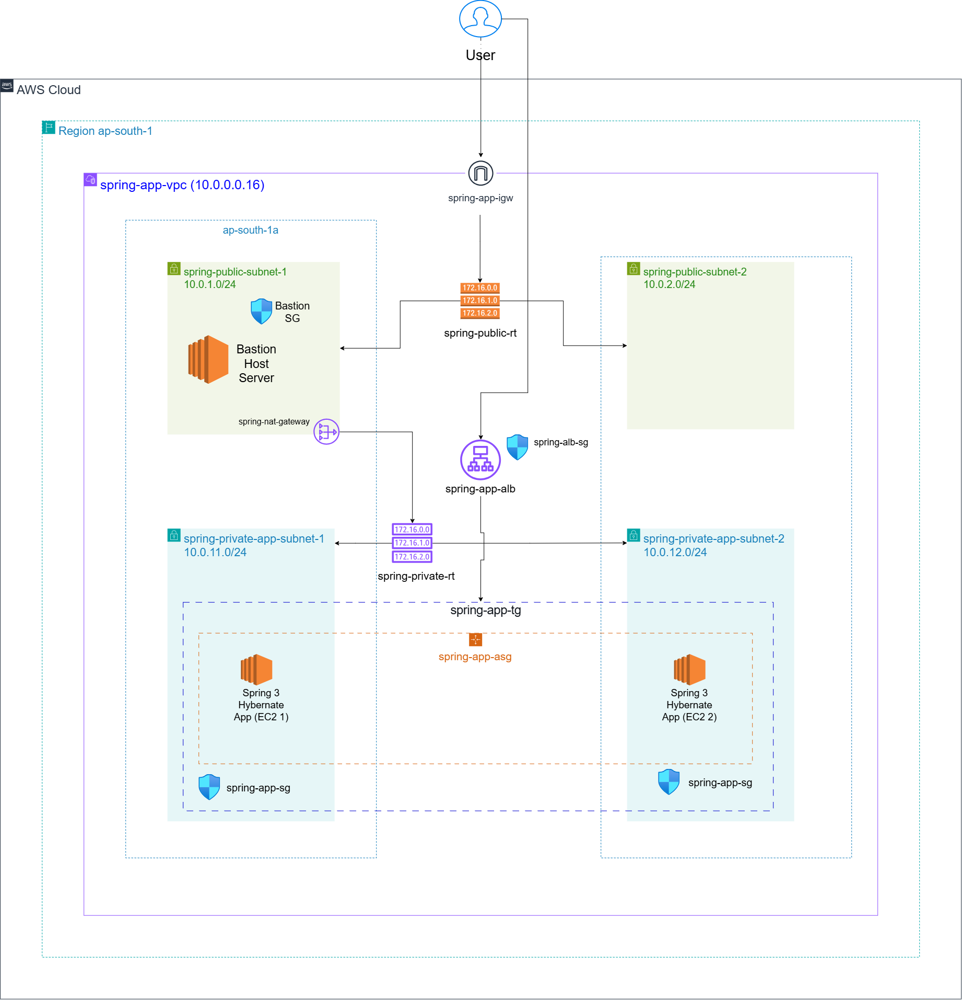

---

# AWS Resources Used

## 1. VPC

A custom VPC was created for the application infrastructure.

**VPC Name:**

`spring-app-vpc`

**CIDR:**

`10.0.0.0/16`

The VPC provides an isolated network environment for all application resources.

### Screenshot

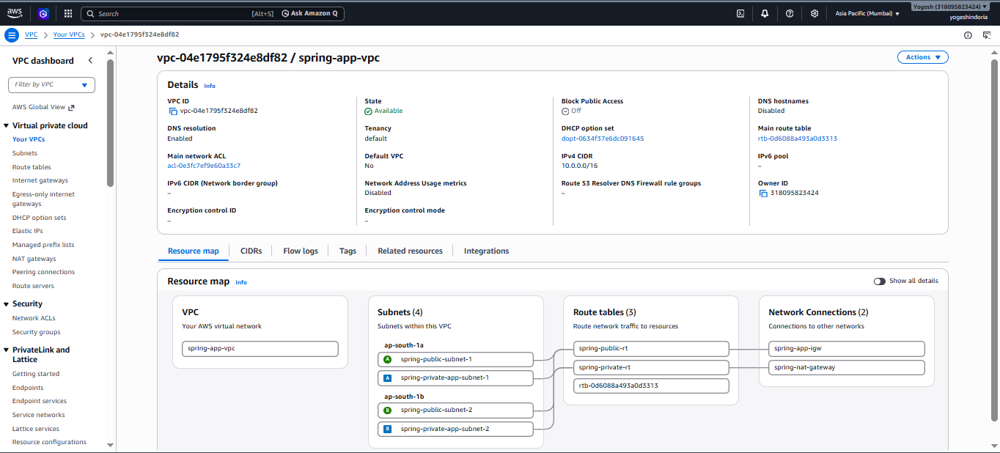

---

## 2. Availability Zones

Two Availability Zones were used to improve availability:

- `ap-south-1a`
- `ap-south-1b`

Application resources are distributed across both Availability Zones.

### 

---

## 3. Public Subnets

Two public subnets were created.

| Subnet | CIDR | Availability Zone |
|---|---|---|
| spring-public-subnet-1 | `10.0.1.0/24` | `ap-south-1a` |
| spring-public-subnet-2 | `10.0.2.0/24` | `ap-south-1b` |

Public subnets are used for resources that need direct internet connectivity, such as the internet-facing ALB and NAT Gateway.

### Screenshot

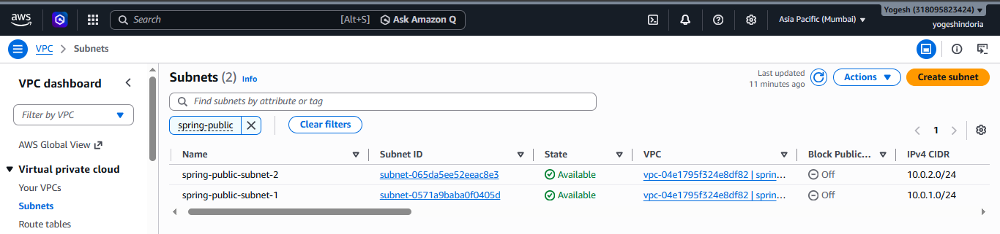

---

## 4. Private Application Subnets

Two private application subnets were created.

| Subnet | CIDR | Availability Zone |
|---|---|---|
| spring-private-app-subnet-1 | `10.0.11.0/24` | `ap-south-1a` |
| spring-private-app-subnet-2 | `10.0.12.0/24` | `ap-south-1b` |

The application EC2 instances are launched inside these private subnets.

The application servers do not have public IP addresses.

### Screenshot

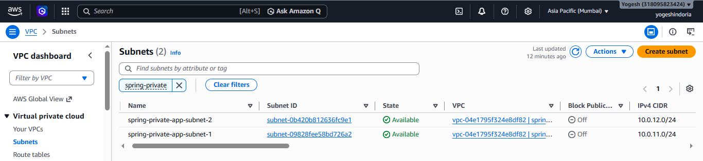

---

# 5. Internet Gateway

An Internet Gateway was created and attached to the VPC.

**Name:**

`spring-app-igw`

The Internet Gateway provides internet connectivity for the public subnets.

### Screenshot

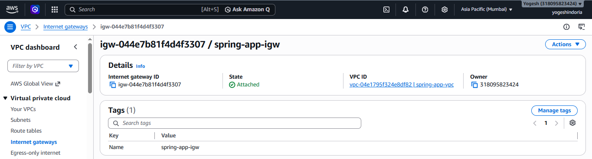

---

# 6. Public Route Table

A public route table was created for the public subnets.

**Route Table:**

`spring-public-rt`

Route:

```text
Destination: 0.0.0.0/0
Target: Internet Gateway
```

The route table is associated with both public subnets.

### Screenshot

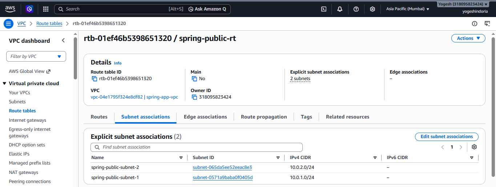

---

# 7. NAT Gateway

A NAT Gateway was created inside the public subnet.

**Name:**

`spring-nat-gateway`

The NAT Gateway allows resources in private subnets to access the internet for outbound operations without exposing the private EC2 instances directly to the internet.

For example, private instances can use the NAT Gateway for:

- Package installation
- Software updates
- External API access
- Downloading required dependencies

### Screenshot

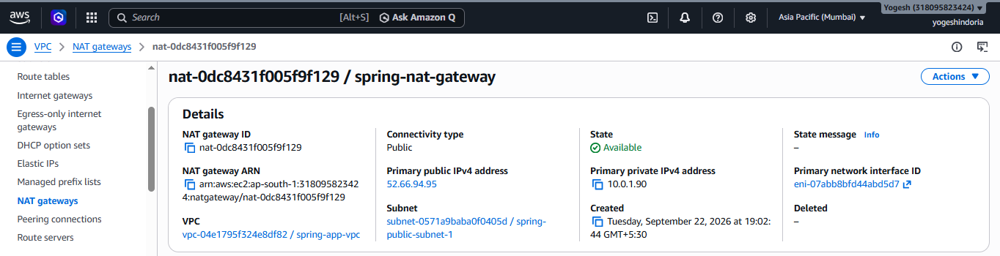

---

# 8. Private Route Table

A private route table was created for the private application subnets.

**Route Table:**

`spring-private-rt`

Route:

```text
Destination: 0.0.0.0/0
Target: NAT Gateway
```

Both private application subnets are associated with this route table.

### Screenshot

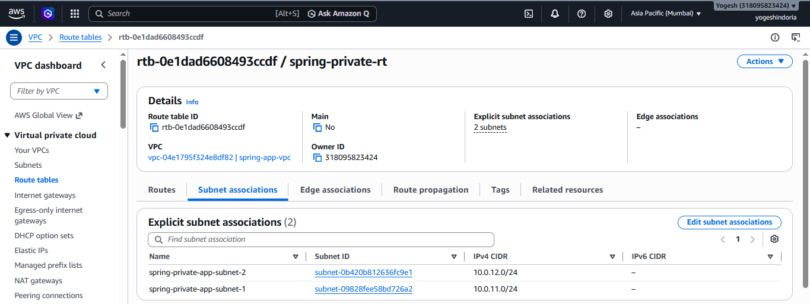

---

# 9. Security Groups

Two Security Groups were used.

## ALB Security Group

**Name:**

`spring-alb-sg`

Inbound:

```text
HTTP
Port: 80
Source: 0.0.0.0/0
```

The ALB accepts HTTP traffic from the internet.

## Application Security Group

**Name:**

`spring-app-sg`

Inbound:

```text
TCP
Port: 8080
Source: spring-alb-sg
```

This allows application traffic only from the ALB Security Group.

The application EC2 instances are not directly exposed to the internet.

### Screenshot

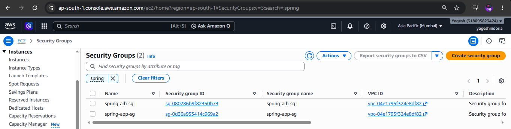

---

# 10. Application Load Balancer

An internet-facing Application Load Balancer was created.

**Name:**

`spring-app-alb`

Configuration:

```text
Scheme: Internet-facing
IP address type: IPv4
Listener: HTTP :80
```

The ALB is deployed across both public subnets.

### Traffic Flow

```text
Internet
   |
   v
ALB :80
   |
   v
Target Group :8080
   |
   v
Private EC2 instances
```

### Screenshot

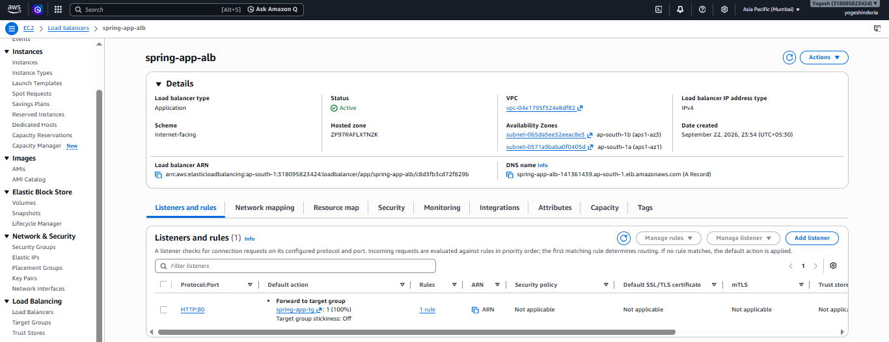

---

# 11. Target Group

A Target Group was created for the application EC2 instances.

**Name:**

`spring-app-tg`

Configuration:

```text
Target type: Instances
Protocol: HTTP
Port: 8080
Health Check Path: /
Success Code: 200
```

The Target Group performs health checks against the application running on Tomcat port `8080`.

Only healthy targets receive traffic from the ALB.

### Screenshot

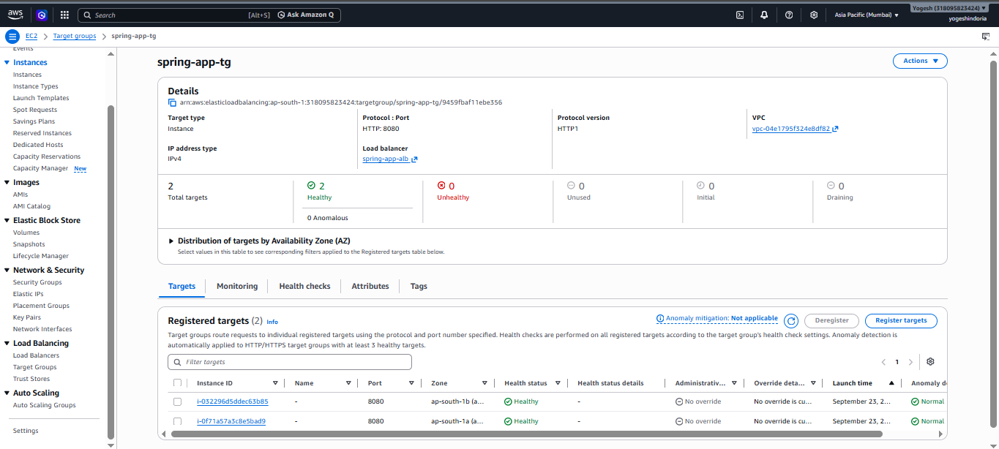

---

# 12. EC2 Application Instances

The application servers run inside the private application subnets.

Configuration:

```text
Instance Type: t3.micro
Public IP: Disabled
Application Port: 8080
```

The EC2 instances run:

- Ubuntu
- Java 8
- Maven
- Git
- Apache Tomcat 7
- Spring 3 Hibernate WAR application

### Screenshot

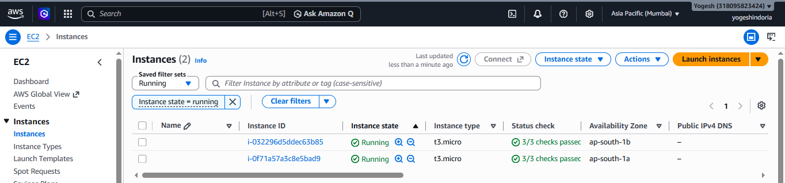

---

# 13. Application Deployment

The Spring 3 Hibernate project was cloned from GitHub.

```bash
git clone https://github.com/opstree/spring3hibernate.git
```

The project originally contained Java compiler configuration using source/target `1.6`.

It was updated to Java 8 compatibility:

```xml
<source>1.8</source>
<target>1.8</target>
```

The application was then built using:

```bash
mvn clean package -DskipTests
```

The build generated:

```text
target/Spring3HibernateApp.war
```

The WAR file was deployed to Tomcat as:

```text
/opt/tomcat/webapps/ROOT.war
```

The application was successfully tested on:

```text
http://localhost:8080/
```

### Screenshot

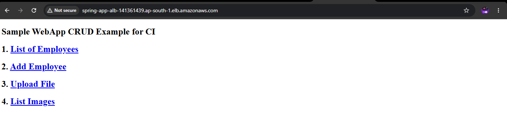

---

# 14. Apache Tomcat

Apache Tomcat `7.0.109` was used as the application server.

Tomcat listens on:

```text
Port: 8080
```

The application was configured as the ROOT application:

```text
/opt/tomcat/webapps/ROOT.war
```

Tomcat was configured as a systemd service so that it starts automatically when the EC2 instance boots.

Service:

```text
/etc/systemd/system/tomcat.service
```

### 

---

# 15. Launch Template

A Launch Template was created to define the configuration used by the Auto Scaling Group.

**Name:**

`spring-app-launch-template`

The final Launch Template uses a custom AMI containing the tested application environment.

The Launch Template contains:

- Custom AMI
- `t3.micro`
- `spring-app-key`
- `spring-app-sg`
- No hardcoded subnet
- No public IP
- No build/deployment User Data

The subnet is selected by the Auto Scaling Group so that instances can be distributed across Availability Zones.

### Screenshot

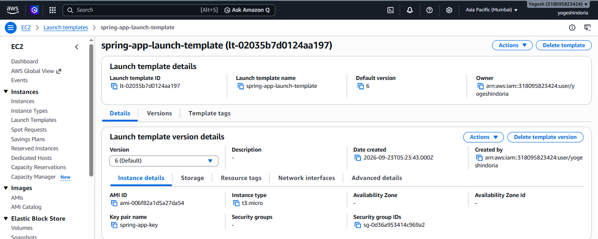

---

# 16. Custom AMI

After testing the application successfully on a standalone EC2 instance, a custom AMI was created.

The AMI contains the tested environment:

- Ubuntu
- Java 8
- Maven
- Git
- Tomcat 7
- Deployed Spring3Hibernate WAR
- Tomcat systemd service

**Final AMI:**

`spring-app-working-v2`

This approach avoids performing the complete Maven build and application setup every time an Auto Scaling instance launches.

### Screenshot

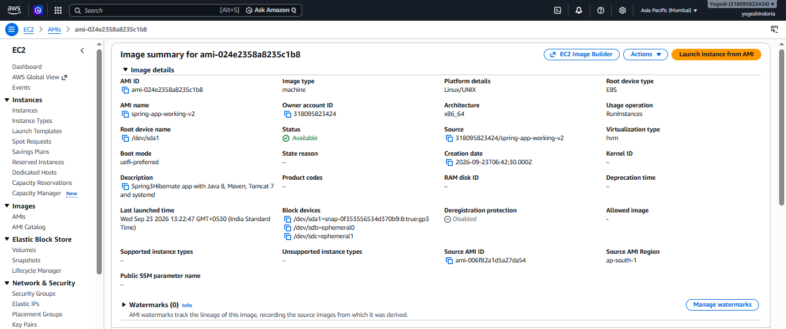

---

# 17. Auto Scaling Group

An Auto Scaling Group was created to provide application scalability and high availability.

**Name:**

`spring-app-asg`

Configuration:

```text
Minimum capacity: 2
Desired capacity: 2
Maximum capacity: 4
```

The ASG uses:

- Private application subnets
- Launch Template
- Target Group
- ELB health checks
- CPU target tracking

The instances are distributed across multiple Availability Zones.

### Screenshot

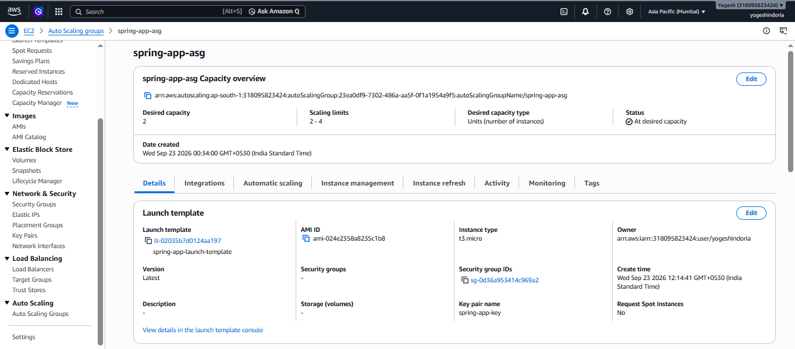

---

# 18. Auto Scaling Policy

A Target Tracking scaling policy was configured.

```text
Metric: Average CPU Utilization
Target Value: 50%
```

The ASG can automatically add or remove instances based on the workload.

```text
High CPU
   |
   v
Scale Out
   |
   v
More EC2 Instances

Low CPU
   |
   v
Scale In
   |
   v
Fewer EC2 Instances
```

### Screenshot

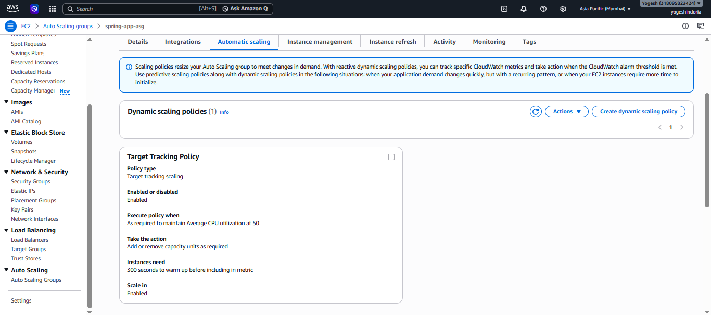

---

# 19. Instance Refresh

Instance Refresh was used to replace old instances with instances created from the updated Launch Template/AMI.

This allows the Auto Scaling Group to gradually move from an older application image to the updated application image.

### 

---

# 20. Health Check

The ALB performs health checks against the application.

Configuration:

```text
Protocol: HTTP
Port: 8080
Path: /
Success Code: 200
```

The flow is:

```text
ALB
 |
 | HTTP :8080
 v
EC2 / Tomcat
 |
 | GET /
 v
Spring Application
 |
 | HTTP 200
 v
Target becomes Healthy
```

### Screenshot

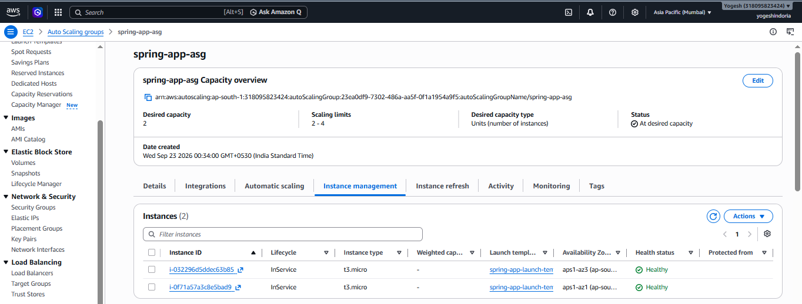

---

# 21. End-to-End Request Flow

The final request flow is:

```text
                         Internet
                            |
                            | HTTP :80
                            v
                +-----------------------+
                | Application Load      |
                | Balancer              |
                | spring-app-alb        |
                +-----------------------+
                            |
                            | HTTP :8080
                            v
                +-----------------------+
                | Target Group          |
                | spring-app-tg         |
                +-----------------------+
                     /             \
                    /               \
                   v                 v
        +----------------+   +----------------+
        | Private EC2    |   | Private EC2    |
        | AZ 1           |   | AZ 2           |
        | Tomcat :8080   |   | Tomcat :8080   |
        +----------------+   +----------------+
                   \               /
                    \             /
                     +-----------+
                         ASG
```

---

# 22. Outbound Internet Flow from Private EC2

Private instances do not have public IP addresses.

When a private EC2 instance needs outbound internet access:

```text
Private EC2
    |
    v
Private Route Table
    |
    v
NAT Gateway
    |
    v
Internet Gateway
    |
    v
Internet
```

This keeps the application servers private while still allowing outbound connectivity.

---

# 23. High Availability

The infrastructure uses two Availability Zones:

```text
ap-south-1a
    |
    +-- Private App Subnet
    +-- Application Instance

ap-south-1b
    |
    +-- Private App Subnet
    +-- Application Instance
```

If an application instance becomes unhealthy, the Auto Scaling Group can replace it.

The ALB routes traffic only to healthy targets.

---

# 24. Scalability

The Auto Scaling Group is configured with:

```text
Min:     2
Desired: 2
Max:     4
```

This allows the infrastructure to scale horizontally based on application workload.

Example:

```text
Normal Load
    ↓
2 Instances

High Load
    ↓
ASG scales out
    ↓
3 or 4 Instances

Low Load
    ↓
ASG scales in
```

---

# 25. Final Architecture Components

| Component | Name / Configuration |
|---|---|
| VPC | `spring-app-vpc` |
| VPC CIDR | `10.0.0.0/16` |
| Public Subnet 1 | `10.0.1.0/24` |
| Public Subnet 2 | `10.0.2.0/24` |
| Private Subnet 1 | `10.0.11.0/24` |
| Private Subnet 2 | `10.0.12.0/24` |
| Internet Gateway | `spring-app-igw` |
| NAT Gateway | `spring-nat-gateway` |
| Public Route Table | `spring-public-rt` |
| Private Route Table | `spring-private-rt` |
| ALB | `spring-app-alb` |
| Target Group | `spring-app-tg` |
| ALB Security Group | `spring-alb-sg` |
| App Security Group | `spring-app-sg` |
| Launch Template | `spring-app-launch-template` |
| Auto Scaling Group | `spring-app-asg` |
| Instance Type | `t3.micro` |
| Application Port | `8080` |
| ALB Port | `80` |
| Minimum Instances | `2` |
| Desired Instances | `2` |
| Maximum Instances | `4` |
| Scaling Target | CPU 50% |
| Application Server | Apache Tomcat 7.0.109 |
| Java | OpenJDK 8 |
| Build Tool | Maven 3.8.7 |

---

# 26. Security Design

The application servers are placed in private subnets and do not receive public IP addresses.

Traffic is controlled using Security Groups:

```text
Internet
   |
   | HTTP :80
   v
ALB Security Group
   |
   | TCP :8080
   v
Application Security Group
   |
   v
Private EC2
```

This prevents direct internet access to the application instances.

---

# 27. Validation

The infrastructure and application were validated through the following checks:

- VPC and subnet configuration verified
- Public and private routing verified
- NAT Gateway connectivity configured
- ALB created and active
- Target Group health checks configured
- Application successfully built using Maven
- WAR successfully generated
- Tomcat successfully started
- Application successfully responded on port 8080
- ALB successfully routes traffic to the application
- Auto Scaling Group configured with minimum 2 instances
- Multiple Availability Zones used
- Instance Refresh tested with the updated AMI

---

# 28. Conclusion

This assignment demonstrates the deployment of a scalable and highly available web application architecture on AWS.

The final infrastructure separates public and private resources, exposes the application through an internet-facing Application Load Balancer, keeps application EC2 instances in private subnets, provides outbound connectivity through a NAT Gateway, and uses Auto Scaling for availability and scalability.

The application environment was tested independently before being packaged into a custom AMI and used through the Launch Template and Auto Scaling Group.

---

## Author

**Yogesh Indoria**

