# AWS Assignment 2 --- Deployment Strategies

**Author:** Yogesh Indoria

## Objective

The objective of this assignment is to understand and implement AWS
deployment strategies using Amazon S3, EC2, IAM, AMI, Launch Templates,
Auto Scaling Groups and Instance Refresh.

This README documents two implemented deployment models:

1.  **Recreate Deployment**
2.  **Rolling Deployment**

Other strategies --- Blue-Green, Canary and A/B --- are also explained
for comparison.

------------------------------------------------------------------------

## 1. Application Overview

A simple static AWS/deployment-themed web application was created for
this assignment and served using **NGINX** on Amazon EC2.

Application files:

``` text
index.html
style.css
app.js
assets/
└── deployment-bg.png
```

### S3 Release Structure

``` text
yogesh-aws-assignment-2/
├── assets/
│   └── deployment-bg.png
└── releases/
    ├── v1.0/
    │   ├── index.html
    │   ├── style.css
    │   └── app.js
    └── v2.0/
        ├── index.html
        ├── style.css
        └── app.js
```


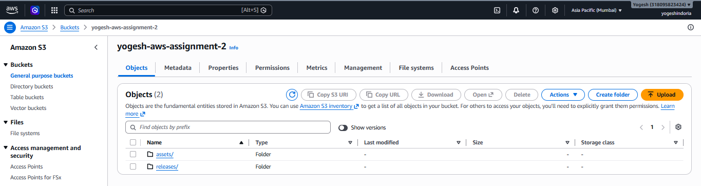

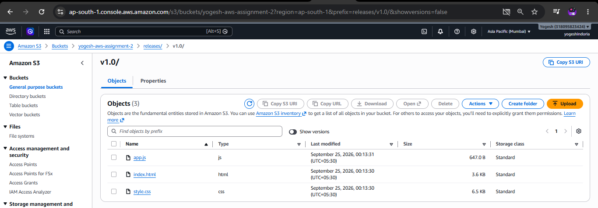

------------------------------------------------------------------------

## 2. AWS Services Used

  Component            Purpose
  -------------------- --------------------------------------------
  Amazon EC2           Application server
  Amazon S3            Release/artifact storage
  IAM Role             Allows EC2 to read S3
  AMI                  Captures a working EC2 environment
  Launch Template      Defines EC2 launch configuration
  Auto Scaling Group   Maintains the required number of instances
  Instance Refresh     Gradually replaces ASG instances
  NGINX                Web server

------------------------------------------------------------------------

# Deployment Model 1 --- Recreate

## 3. What is Recreate Deployment?

In a Recreate deployment, the old application environment is removed or
stopped before the new version is deployed.

``` text
Old Version
    │
    ▼
Remove / Stop Old Environment
    │
    ▼
Deploy New Version
    │
    ▼
New Version Running
```

Recreate is simple to understand and implement, but it can cause
downtime during the replacement.

------------------------------------------------------------------------

## 4. Recreate Implementation

### Step 1 --- Launch EC2

An Ubuntu 24.04 LTS EC2 instance was launched with a `t3.micro` instance
type.

NGINX was installed and used as the web server.

``

### Step 2 --- Download v1.0 from S3

The v1.0 application was stored in:

``` text
s3://yogesh-aws-assignment-2/releases/v1.0/
```

The release was downloaded to NGINX:

``` bash
aws s3 cp s3://yogesh-aws-assignment-2/releases/v1.0/ /var/www/html/ --recursive
```

### Recreate Deployment Flow

``` text
Amazon S3
   │
   │ v1.0 artifacts
   ▼
Amazon EC2
   │
   ▼
/var/www/html
   │
   ▼
NGINX
   │
   ▼
Browser
```


> **Screenshot:** v1.0 application running.

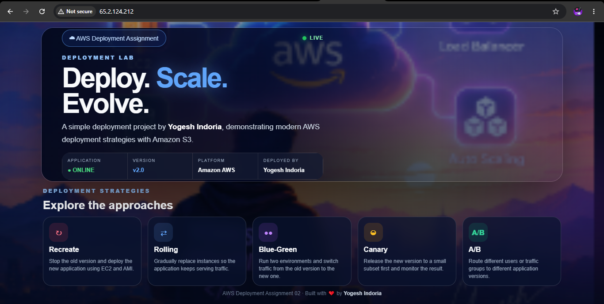

------------------------------------------------------------------------

## 5. AMI-Based Recreation

After confirming that the v1.0 application was working, an AMI was
created:

``` text
AWS-Assignment-2-v1-AMI
```

### AMI Flow

``` text
Working EC2 v1.0
       │
       ▼
Create AMI
       │
       ▼
AWS-Assignment-2-v1-AMI
       │
       ▼
Launch New EC2
       │
       ▼
Recreated Application
```

> **Screenshot:** AMI showing `Available`.

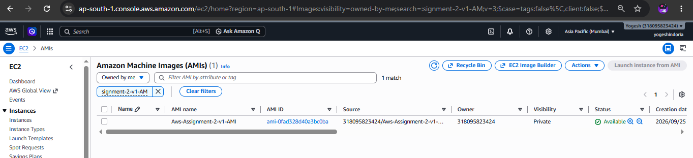

A new EC2 instance was then launched from the AMI:

``` text
Yogesh-Deployment-v1-Recreated
```

> **Screenshot:** Recreated EC2.

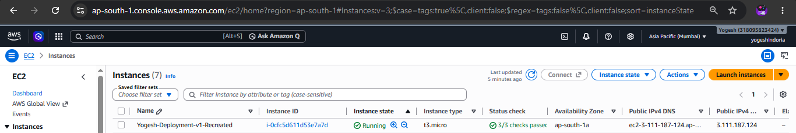

> **Screenshot:** Recreated application running.

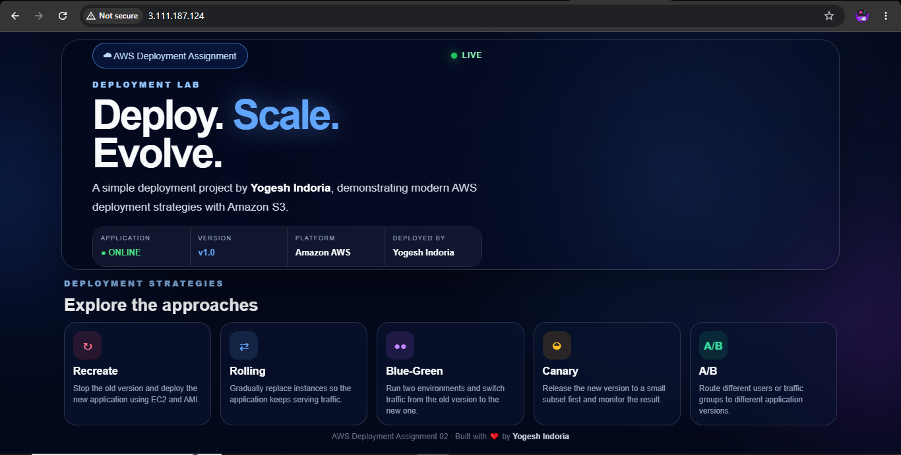

### Important Note

An AMI is a snapshot of the environment at the time it is created.

Uploading a new release to S3 does **not** automatically modify the AMI.

For example:

``` text
AMI
└── v1.0 environment

S3
├── v1.0
└── v2.0
```

The EC2 instance must explicitly download the required release from S3
if a newer application version is required.

------------------------------------------------------------------------

# Deployment Model 2 --- Rolling Deployment

## 6. What is Rolling Deployment?

In a rolling deployment, application instances are replaced gradually
instead of replacing the complete environment at once.

``` text
v1.0 Instances
      │
      ▼
Replace Some Instances
      │
      ▼
New Version Instances
      │
      ▼
Replace Remaining Instances
      │
      ▼
All Instances on New Version
```

This allows old and new instances to coexist temporarily during the
deployment.

------------------------------------------------------------------------

## 7. Rolling Deployment Architecture

``` text
                    Amazon S3
                       │
             ┌─────────┴─────────┐
             │                   │
           v1.0                v2.0
             │                   │
             └─────────┬─────────┘
                       │
                       ▼
                Launch Template
                       │
                       ▼
              Auto Scaling Group
                  ┌────┴────┐
                  │         │
               EC2 #1    EC2 #2
                  │         │
                  └────┬────┘
                       │
                     NGINX
                       │
                       ▼
                   Application
```

------------------------------------------------------------------------

## 8. v2.0 Release

A new release was uploaded to:

``` text
s3://yogesh-aws-assignment-2/releases/v2.0/
```

Files:

``` text
index.html
style.css
app.js
```

The application version was changed to make v2.0 visually identifiable.

> **Screenshot:** S3 showing both v1.0 and v2.0.

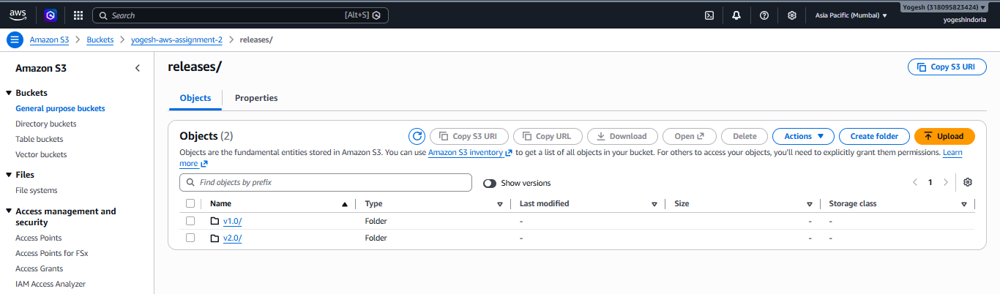

------------------------------------------------------------------------

## 9. Launch Template

A Launch Template was created:

``` text
Yogesh-Rolling-v1
```

It contains the common EC2 configuration:

-   AMI
-   Instance type
-   Key pair
-   Security group
-   IAM instance profile

The EC2 IAM role:

``` text
Yogesh-Deployment-S3-ReadRole
```

allows the instance to read release artifacts from S3.

### User Data

The instance can automatically retrieve a release from S3 during boot.

Example:

``` bash
#!/bin/bash

rm -rf /var/www/html/*

aws s3 cp s3://yogesh-aws-assignment-2/releases/v2.0/ /var/www/html/ --recursive

mkdir -p /var/www/html/assets
aws s3 cp s3://yogesh-aws-assignment-2/assets/ /var/www/html/assets/ --recursive

systemctl restart nginx
```

### User Data Flow

``` text
EC2 Launch
    │
    ▼
User Data executes
    │
    ▼
Download release from S3
    │
    ▼
Copy files to /var/www/html
    │
    ▼
Restart NGINX
    │
    ▼
Application Ready
```

> **Screenshot:** Launch Template configuration.

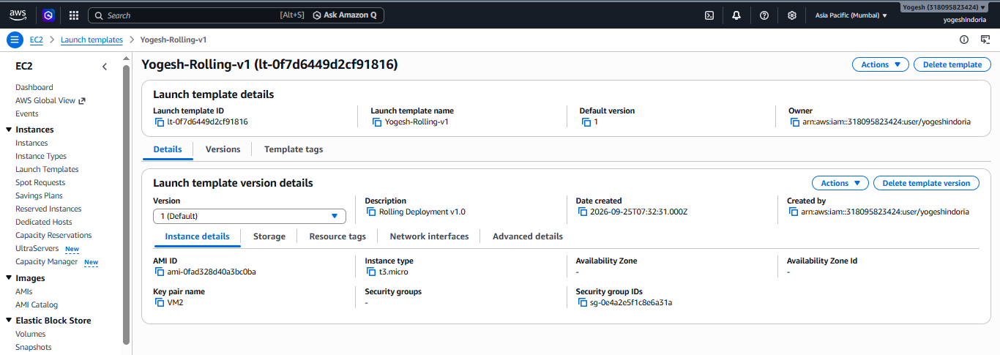

------------------------------------------------------------------------

## 10. Auto Scaling Group

The Auto Scaling Group was created as:

``` text
Yogesh-Rolling-ASG
```

Capacity:

``` text
Minimum capacity : 2
Desired capacity : 2
Maximum capacity : 4
```

### ASG Flow

``` text
             Auto Scaling Group
                    │
              Desired = 2
               ┌────┴────┐
               ▼         ▼
             EC2 #1    EC2 #2
```

When one instance was terminated, the ASG automatically launched a
replacement to maintain the desired capacity.

``` text
Before:

EC2 #1 ─── Running
EC2 #2 ─── Running

EC2 #1 terminated
       │
       ▼
ASG detects capacity = 1
       │
       ▼
New EC2 launched
       │
       ▼
Desired capacity = 2
```

> **Screenshot:** ASG configuration.

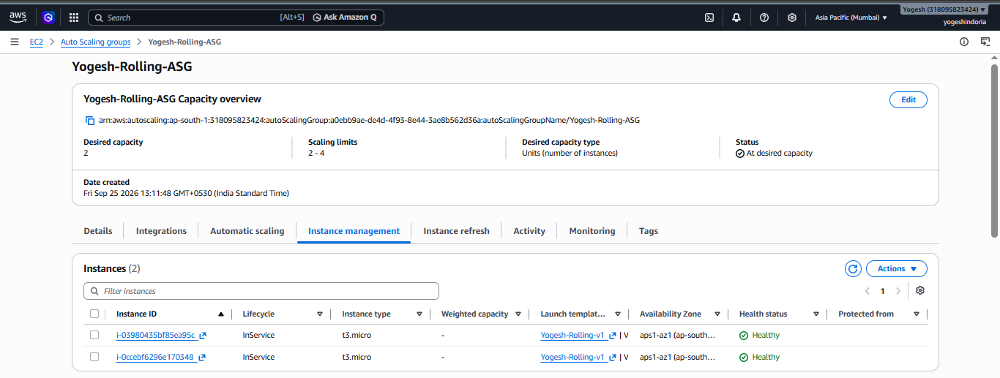

> **Screenshot:** ASG instances.

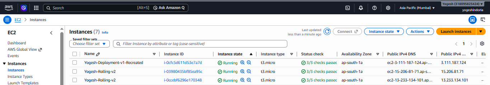

------------------------------------------------------------------------

# 11. Instance Refresh

AWS Auto Scaling **Instance Refresh** is used to replace instances in an
Auto Scaling Group according to the selected refresh settings.

### Rolling Replacement

``` text
Before

ASG
├── v1.0
└── v1.0

        │
        │ Instance Refresh
        ▼

ASG
├── v2.0
└── v1.0

        │
        │ Continue Refresh
        ▼

ASG
├── v2.0
└── v2.0
```

The key idea is that instances are replaced progressively rather than
deleting the entire fleet at once.

> **Screenshot:** Instance Refresh in progress.

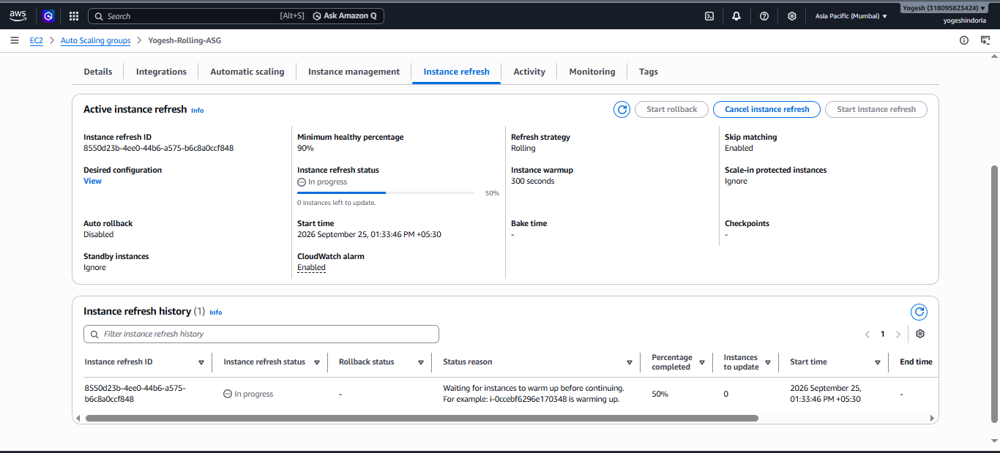

> **Screenshot:** Final v2.0 application.


------------------------------------------------------------------------

# 12. Recreate vs Rolling

  -----------------------------------------------------------------------
  Feature                 Recreate                Rolling
  ----------------------- ----------------------- -----------------------
  Old version             Removed/replaced        Gradually replaced

  New version             Deployed after old      Deployed while old
                          environment is removed  instances may still
                                                  exist

  Downtime                Possible                Can be minimized

  Main AWS components     EC2 + AMI               ASG + Launch Template +
                                                  Instance Refresh

  S3 role                 Stores application      Stores application
                          artifacts               artifacts

  Complexity              Lower                   Higher

  Main purpose            Replace environment     Gradual application
                                                  update
  -----------------------------------------------------------------------

------------------------------------------------------------------------

# 13. Role of S3

S3 acts as the central storage location for application release
artifacts.

``` text
                  Amazon S3
                     │
          ┌──────────┴──────────┐
          │                     │
      releases/               assets/
          │                     │
     ┌────┴────┐                │
     ▼         ▼                ▼
   v1.0       v2.0        Background Image
     │         │
     └────┬────┘
          │
          ▼
         EC2
          │
          ▼
        NGINX
          │
          ▼
      Application
```

S3 does not automatically update an AMI.

The release is downloaded by EC2 using AWS CLI/User Data and the
permissions provided through the IAM role.

------------------------------------------------------------------------

# 14. Other Deployment Strategies

## Blue-Green

Two separate environments are maintained:

``` text
                  ALB
                   │
          ┌────────┴────────┐
          │                 │
       Blue TG           Green TG
          │                 │
        v1.0              v2.0
```

Traffic can be switched from Blue to Green after the new environment is
validated.

## Canary

Only a small portion of the environment receives the new release first.

``` text
             Traffic
                │
        ┌───────┴───────┐
        │               │
      90% v1          10% v2
        │               │
        └───────┬───────┘
                │
             Monitor
                │
                ▼
        Gradually increase v2
```

## A/B Testing

Different users or request groups can receive different versions.

``` text
Users
  │
  ▼
Routing Layer
  │
  ├── Group A → v1.0
  │
  └── Group B → v2.0
```

------------------------------------------------------------------------

# 15. Evidence / Screenshot Checklist

The following screenshots can be added between the sections above:

-   [ ] S3 bucket structure
-   [ ] IAM role
-   [ ] Original EC2
-   [ ] v1.0 application
-   [ ] AMI available
-   [ ] Recreated EC2
-   [ ] Recreated application
-   [ ] S3 v1.0 and v2.0 releases
-   [ ] Launch Template
-   [ ] ASG capacity configuration
-   [ ] ASG running instances
-   [ ] Instance Refresh in progress
-   [ ] Instance Refresh completed
-   [ ] Final v2.0 application

------------------------------------------------------------------------

# 16. Final Flow

## Recreate

``` text
S3 v1.0
   │
   ▼
EC2
   │
   ▼
NGINX
   │
   ▼
Working Application
   │
   ▼
Create AMI
   │
   ▼
New EC2 from AMI
   │
   ▼
Recreated Application
```

## Rolling

``` text
S3
│
├── v1.0
└── v2.0
     │
     ▼
Launch Template
     │
     ▼
Auto Scaling Group
     │
     ▼
Instance Refresh
     │
     ▼
Gradual Instance Replacement
     │
     ▼
v2.0 Running
```

------------------------------------------------------------------------

# 17. Conclusion

This assignment demonstrates how AWS services can be combined to
implement different deployment strategies.

The **Recreate deployment** demonstrated an EC2-based deployment and
AMI-based recreation of a working environment.

The **Rolling deployment** demonstrated the use of S3 release artifacts,
IAM permissions, Launch Templates, Auto Scaling Groups and Instance
Refresh to gradually replace application instances.

The same release structure can be extended to Blue-Green, Canary and A/B
deployment strategies.

------------------------------------------------------------------------

## Author

**Yogesh Indoria**

**AWS / DevOps Assignment 2**
