# AWS Assignment 3 — Nginx High Availability, Auto Scaling & Deployment

**Author:** Yogesh Indoria

---

## Project Overview

This assignment focuses on designing and implementing a highly
available, scalable, secure, and version-controlled Nginx-based
infrastructure on AWS.

The implementation covers Nginx reverse proxy setup, AMI-based
versioning, Auto Scaling, Application Load Balancer, load testing,
rolling deployment, rollback, S3-based asset management, IAM
security, self-healing infrastructure, path-based routing, and
CloudFront CDN integration.

The complete implementation is performed incrementally, starting
with manual AWS operations and later extending the setup towards
deployment automation.

---

## Overall Objective

The main objective of this assignment is to design and implement
a production-oriented AWS infrastructure for an Nginx middleware
layer that can:

- Handle increased application traffic.
- Provide high availability across multiple Availability Zones.
- Automatically scale based on workload.
- Automatically replace unhealthy instances.
- Support Nginx version upgrades and rollback.
- Implement AMI-based version management.
- Use Application Load Balancer for traffic distribution.
- Implement rolling deployment strategy.
- Implement Blue-Green deployment as an extended activity.
- Host webpages using Nginx.
- Store webpage assets/images in Amazon S3.
- Secure AWS resources using IAM roles and policies.
- Implement path-based routing using ALB.
- Use Bastion Host for secure administration of private instances.
- Use CloudFront for CDN-based content delivery.
- Maintain proper evidence and documentation for each implementation phase.

---

## High-Level Architecture

```text
                         Internet
                            |
                       CloudFront
                            |
                           ALB
                    /                 \
                   /                   \
            Target Group 1        Target Group 2
                 |                     |
             Nginx EC2             Nginx EC2
             Private Subnet        Private Subnet
                 |                     |
                 +----------+----------+
                            |
                       Application


        Git Repository
              |
              v
             EC2
              |
          AWS CLI
              |
              v
             S3
          /       \
       prod      nonprod


              ASG
               |
       +-------+-------+
       |       |       |
     Nginx   Nginx   Nginx
       |
   Health Check
       |
   Self Healing
````

## Phase 1 — Nginx AMI Versioning

### Objective

Create and maintain versioned Nginx AMIs for deployment and rollback.

### 1. Nginx Installation

An Ubuntu EC2 instance was launched and Nginx was installed.

The Nginx service was verified and the default webpage was accessible
through the EC2 public IP.

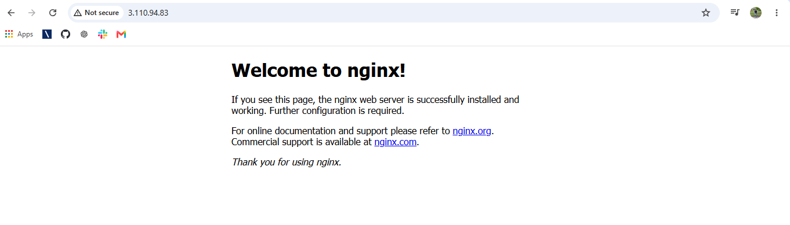

---

### 2. Nginx Version 1

The default Nginx page was replaced with a custom Version 1 webpage.

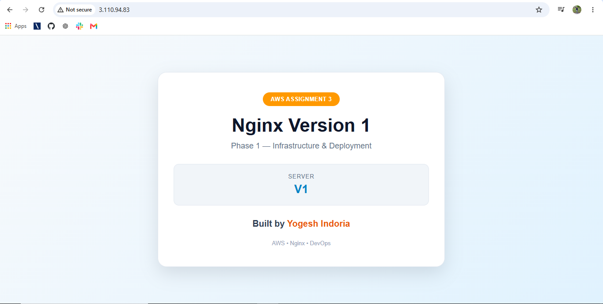

---

### 3. AMI-1 Creation

An AMI was created from the configured Nginx Version 1 instance.

**AMI Name:** `a3-nginx-v1-ami`

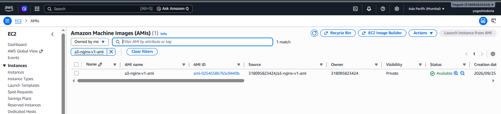

---

### 4. Launch V1 from AMI-1

A new EC2 instance was launched using AMI-1 and the Version 1
webpage was successfully verified.

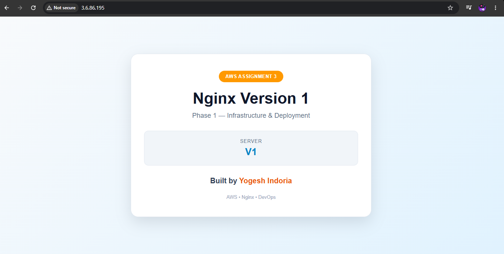

---

### 5. Nginx Version 2

The V1 instance was modified to create Nginx Version 2.

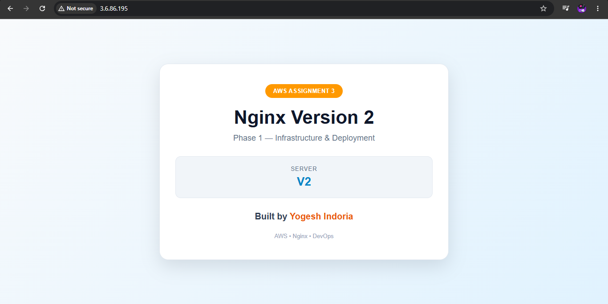

---

### 6. AMI-2 Creation

An AMI was created from the modified Nginx Version 2 instance.

**AMI Name:** `a3-nginx-v2-ami`

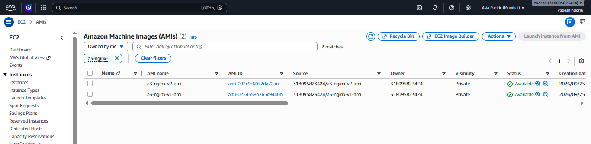

---

### 7. Launch V2 from AMI-2

A fresh EC2 instance was launched using AMI-2 and Nginx Version 2
was successfully verified.

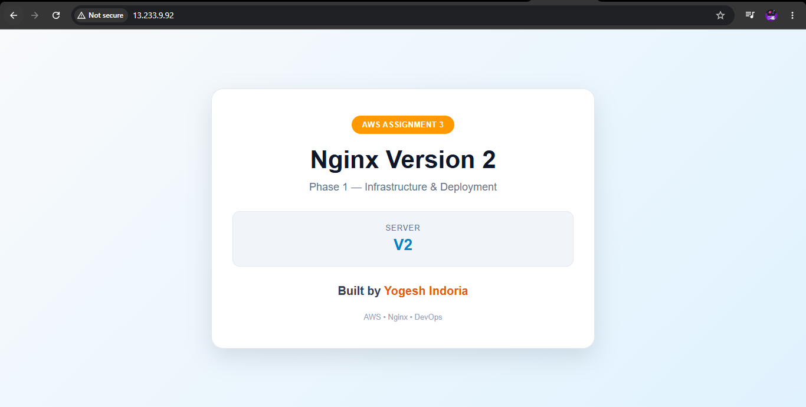

---

### 8. Launch Template Creation

An EC2 Launch Template was created using the Nginx Version 1 AMI.

The Launch Template provides a reusable configuration for launching
Nginx instances through the Auto Scaling Group.

**Launch Template Name:** `a3-nginx-v1-lt`

**AMI:** `a3-nginx-v1-ami`

The subnet was not specified in the Launch Template so that the
Auto Scaling Group could distribute instances across the required
subnets.

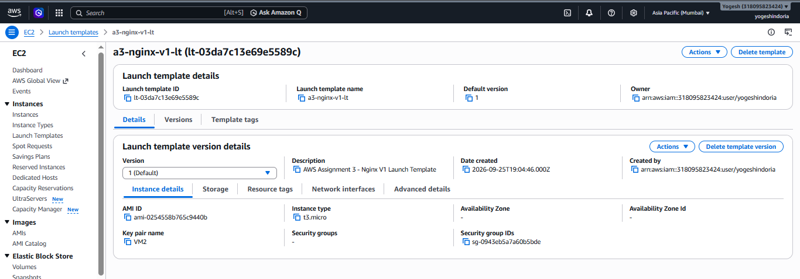

---

### 9. Target Group Creation

An Application Load Balancer Target Group was created to register
and monitor the Nginx instances.

**Target Group Name:** `a3-nginx-tg`

**Protocol:** HTTP

**Port:** 80

**Health Check Path:** `/`

The target group was configured to perform HTTP health checks on
the Nginx application.

No instances were manually registered because the Auto Scaling Group
was configured to automatically register its instances with the
Target Group.

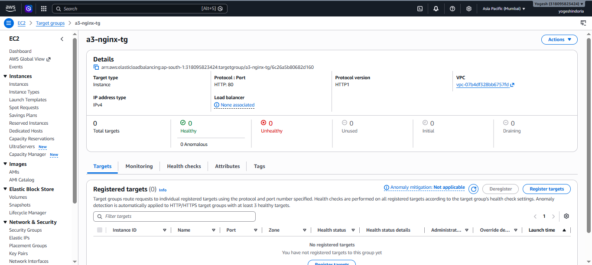

---

### 10. Application Load Balancer

An internet-facing Application Load Balancer was created to distribute
incoming HTTP traffic across the Nginx instances.

**Load Balancer Name:** `a3-nginx-alb`

**Scheme:** Internet-facing

**Listener:** HTTP : 80

The ALB was configured to forward incoming requests to the
`a3-nginx-tg` Target Group.

The ALB was deployed across two public subnets in different
Availability Zones.

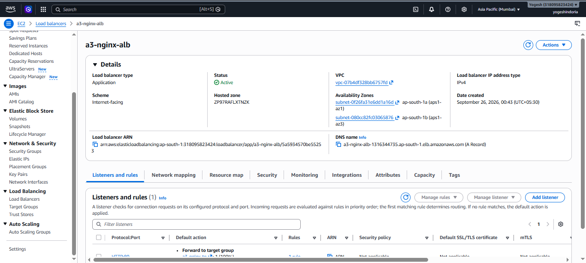

---

### 11. Auto Scaling Group

An Auto Scaling Group was created using the Nginx Version 1
Launch Template.

**ASG Name:** `a3-nginx-asg`

The ASG was configured with:

- Desired capacity: 2
- Minimum capacity: 2
- Maximum capacity: 5
- Two Availability Zones
- Existing Target Group: `a3-nginx-tg`
- Elastic Load Balancing health checks enabled

The instances were distributed across the two private subnets
to provide high availability.

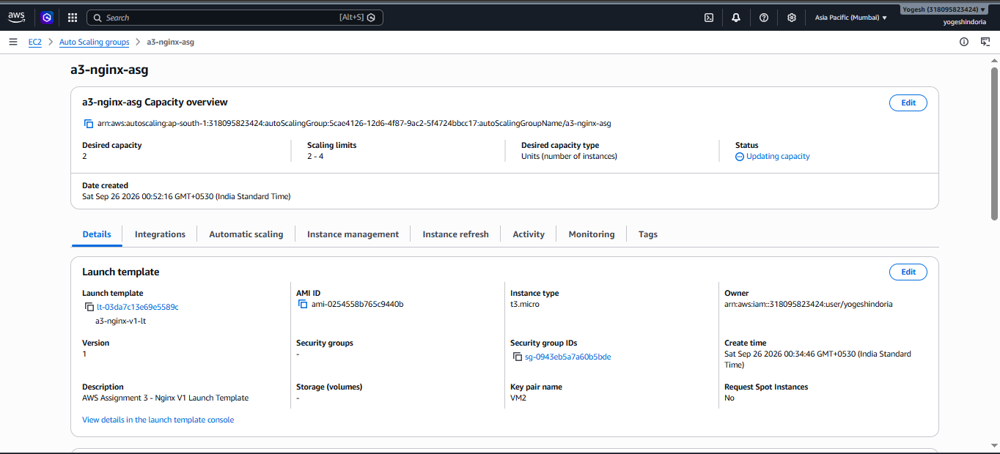

---

### 12. Target Group Health Verification

After the Auto Scaling Group was created, two Nginx instances were
automatically launched and registered with the Target Group.

Both instances successfully passed the HTTP health check.

**Healthy Targets:** 2

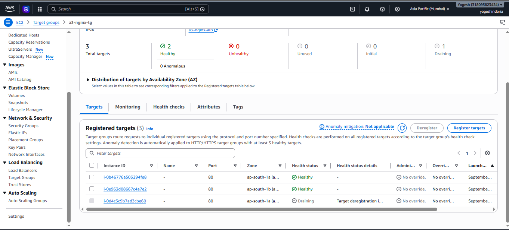

---

### 13. Verify Nginx Version 1 Through ALB

The Application Load Balancer DNS name was accessed from a browser.

The request was successfully forwarded through:

ALB → Target Group → Nginx Instance

The Nginx Version 1 webpage was successfully displayed through
the ALB.

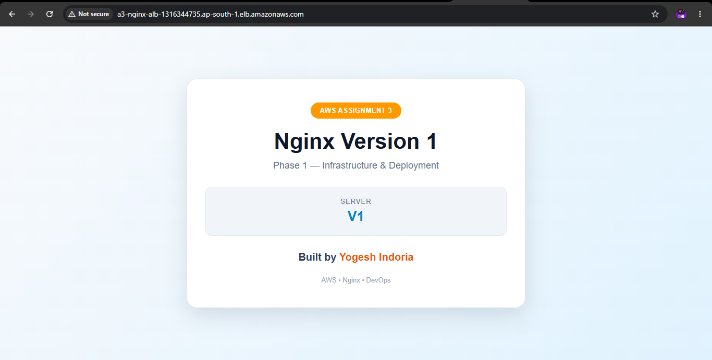

---

### 14. Launch Template Version 2

A new version of the existing Launch Template was created using
the Nginx Version 2 AMI.

**Launch Template:** `a3-nginx-v1-lt`

**Version:** 2

**AMI:** `a3-nginx-v2-ami`

The remaining launch configuration was kept consistent with
Version 1.

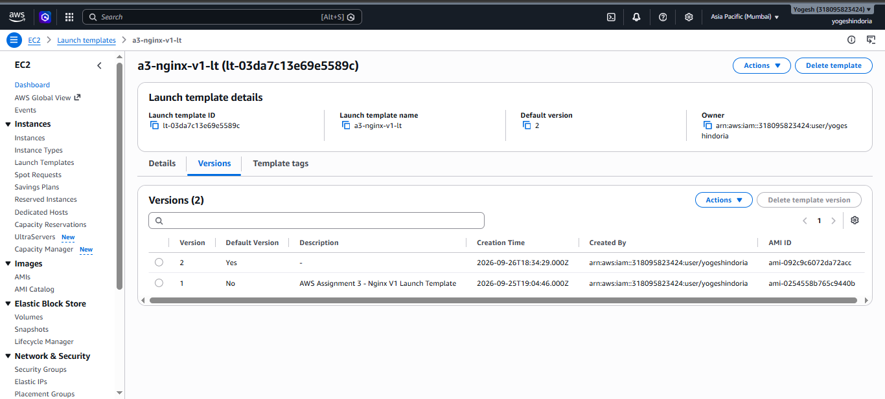

---

---

### 15. Rollback to Nginx Version 1

To verify the rollback mechanism, the Auto Scaling Group was reverted
to Launch Template Version 1.

**Launch Template:** `a3-nginx-v1-lt`

**Version:** 1

Another Instance Refresh was started to replace the Version 2
instances with Version 1 instances.

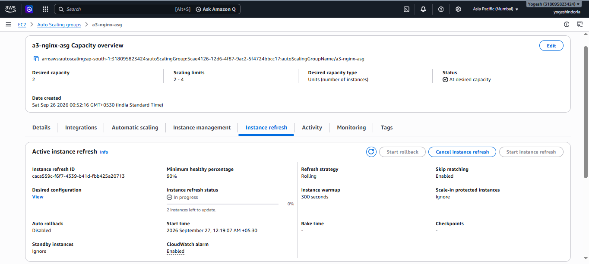

---

### 16. Verify Rollback Through ALB

After the rollback Instance Refresh completed, the ALB DNS name
was accessed again.

The Nginx Version 1 webpage was successfully displayed.

This confirmed that the infrastructure could be rolled back from
Version 2 to Version 1 using the previous Launch Template version.

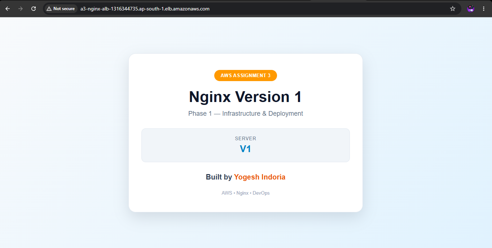

---

# Phase 2 — Git, Private EC2, IAM Role & S3 Integration

## 1. Configure Bastion Host

The existing base EC2 was reused as the Bastion Host.

Configuration:

```text
Subnet: Public
Public IP: Enabled
Security Group: a3-bastion-sg
SSH: Allowed only from My IP
```

The Bastion Host acts as the controlled entry point into the private subnet.

---

## 2. Launch Private Application EC2

Created:

`a3-nginx-s3-app`

Configuration:

```text
AMI: Ubuntu 24.04 LTS
Instance Type: t3.micro
Subnet: aws-a3-private-subnet-1
Public IP: Disabled
```

The instance uses:

`a3-nginx-s3-app-sg`

---

## 3. Configure IAM Role

Attached IAM Role:

`Yogesh-Deployment-S3-ReadRole`

The role allows the EC2 instance to communicate with AWS services without storing AWS Access Keys or Secret Keys on the server.

---

## 4. Verify IAM Role

Checked the IAM identity from the private EC2:

```bash
aws sts get-caller-identity
```

The command confirmed that the EC2 instance was using the IAM Role.

### Screenshot

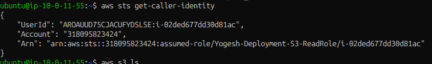

---

## 5. Verify S3 Access

Verified S3 access:

```bash
aws s3 ls
```

The S3 bucket was visible from the EC2 instance.

Bucket:

`a3-nginx-assets-yogi-2026`

### Screenshot

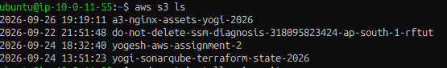

---

## 6. Install AWS CLI, Nginx and Git

Installed AWS CLI:

```bash
curl "https://awscli.amazonaws.com/awscli-exe-linux-x86_64.zip" -o "awscliv2.zip"

sudo apt install unzip -y

unzip awscliv2.zip

sudo ./aws/install
```

Installed Nginx and Git:

```bash
sudo apt clean
sudo rm -rf /var/lib/apt/lists/*

sudo apt update

sudo apt install nginx git -y
```

---

## 7. Clone Application From GitHub

Repository:

```text
https://github.com/yogiindoria/aws-assignment3.git
```

Clone:

```bash
git clone https://github.com/yogiindoria/aws-assignment3.git
```

### Screenshot

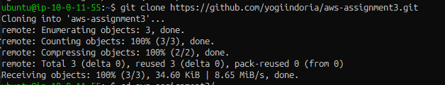

---

## 8. Deploy Git Repository Content to Nginx

Removed the default Nginx content:

```bash
sudo rm -rf /var/www/html/*
```

Copied the repository content:

```bash
sudo cp -r ~/aws-assignment3/* /var/www/html/
```

Restarted Nginx:

```bash
sudo systemctl restart nginx
```

Verified:

```bash
curl localhost
```

### Screenshot

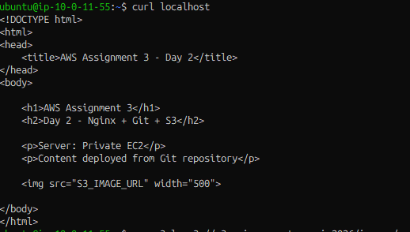

---

## 9. Upload Image From EC2 to S3

Uploaded the image directly from the EC2 instance:

```bash
aws s3 cp aws.jpg s3://a3-nginx-assets-yogi-2026/images/aws.jpg
```

The EC2 instance uses the IAM Role instead of hardcoded AWS credentials.

### Screenshot

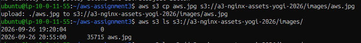

---

## 10. Verify Image in S3

Verified the uploaded object:

```bash
aws s3 ls s3://a3-nginx-assets-yogi-2026/images/
```

### Screenshot

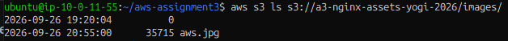

---

## 11. Configure S3 Image Access

For the Day 2 implementation, read access for the `images/*` objects was enabled so the Nginx webpage could directly load the image from S3.

Example object URL:

```text
https://a3-nginx-assets-yogi-2026.s3.ap-south-1.amazonaws.com/images/aws.jpg
```

> Note: This is a Day 2 implementation. The S3 access model will be redesigned in later phases using IAM policies and CloudFront.

---

## 12. Connect Private EC2 With ALB

The private application EC2 was registered with the Target Group.

Initially the target was unhealthy because HTTP traffic was not allowed from the ALB Security Group.

The Security Group was updated to allow:

```text
HTTP 80 -> Source: a3-alb-sg
```

The target then became healthy.

### Screenshot

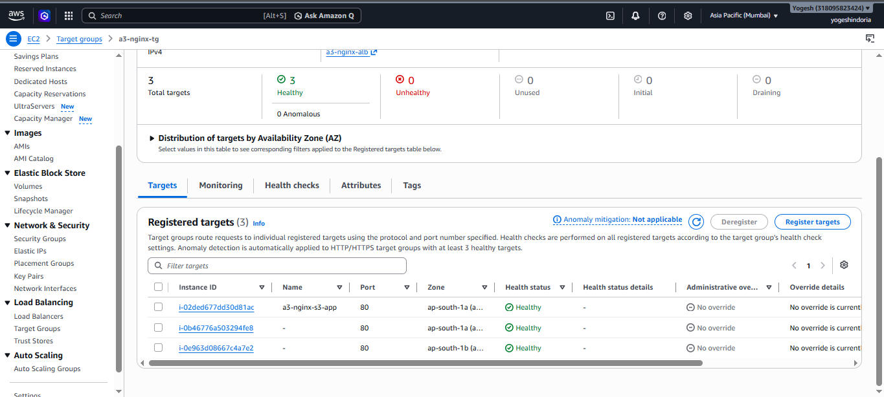

---

## 13. Verify Application Through ALB

Accessed the application using the existing ALB DNS.

The application was successfully served from the private EC2.

### Screenshot

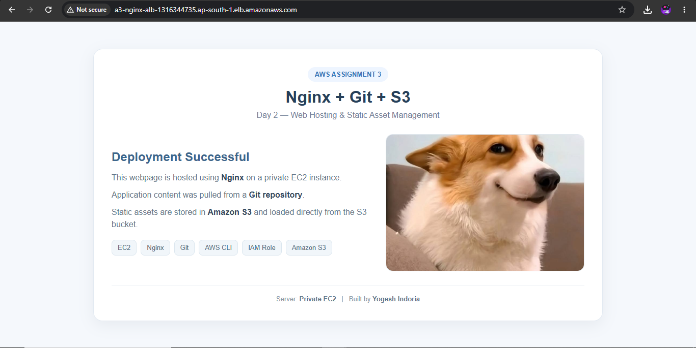

---

## 14. Final Webpage

The final webpage contains:

- AWS Assignment 3
- Nginx
- Git
- AWS CLI
- IAM Role
- Amazon S3
- Private EC2
- S3-hosted image

### Screenshot


---

## Phase 2 Result

The following flow was successfully implemented:

```text
User
  |
  v
Application Load Balancer
  |
  v
Private EC2
  |
  +----> GitHub
  |
  +----> AWS CLI
  |
  +----> IAM Role
  |
  +----> Amazon S3
           |
           +----> Images
```

---

# Phase 3 — ASG Self-Healing

##  Objective

The objective of this phase is to verify the self-healing capability of the AWS Auto Scaling Group.

An ASG-managed Nginx instance will be intentionally made unhealthy. The Application Load Balancer health check will detect the failure, and the Auto Scaling Group will automatically terminate the unhealthy instance and launch a replacement instance.

---

## 1. Identify ASG Instances

Auto Scaling Group:

```text
a3-nginx-asg
```

Configuration:

```text
Desired Capacity: 2
Minimum Capacity: 2
Maximum Capacity: 5
```

The ASG was managing two Nginx instances.

Example:

```text
i-0b46776a503294fe8
i-0e963d08667c4a7e2
```

Both instances were initially in:

```text
Lifecycle: InService
Health Status: Healthy
```

---

## 2. Connect to ASG Instance Through Bastion

Selected the ASG-managed instance:

```text
Private IP: 10.0.11.40
```

The instance was accessed through the Bastion Host because the application server is located inside the private subnet.

SSH command:

```bash
ssh -i VM2.pem ubuntu@10.0.11.40
```

Verified the hostname:

```bash
hostname
```

Output:

```text
ip-10-0-11-40
```

---

## 3. Verify Nginx Is Running

Before creating the failure condition, verified that Nginx was running:

```bash
sudo systemctl status nginx
```

The service was in:

```text
Active: active (running)
```

This confirmed that the server was healthy before the test.

---

## 4. Intentionally Stop Nginx

Stopped the Nginx service:

```bash
sudo systemctl stop nginx
```

Then verified the service:

```bash
sudo systemctl status nginx
```

The service changed to:

```text
Active: inactive (dead)
```

This intentionally made the application unhealthy from the ALB health-check perspective.

### Screenshot

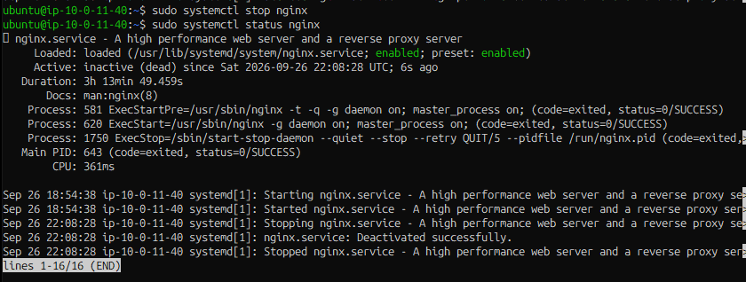

---

## 5. ALB Health Check Detects Failure

The Application Load Balancer continuously performs health checks against the Target Group.

After Nginx was stopped, the health check for the affected instance failed.

Expected flow:

```text
Nginx stopped
      |
      v
ALB Health Check fails
      |
      v
Target becomes Unhealthy
```

The other healthy targets continued serving traffic.

### Screenshot

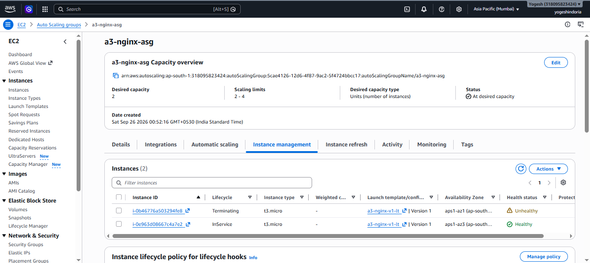

---

## 6. Auto Scaling Group Detects Unhealthy Instance

Because the Auto Scaling Group was configured with ELB health checks, it detected that the affected instance was unhealthy.

The ASG started terminating the unhealthy instance.

During the replacement process, the ASG showed:

```text
Old Instance -> Terminating
New Instance -> Launching
```

### Screenshot

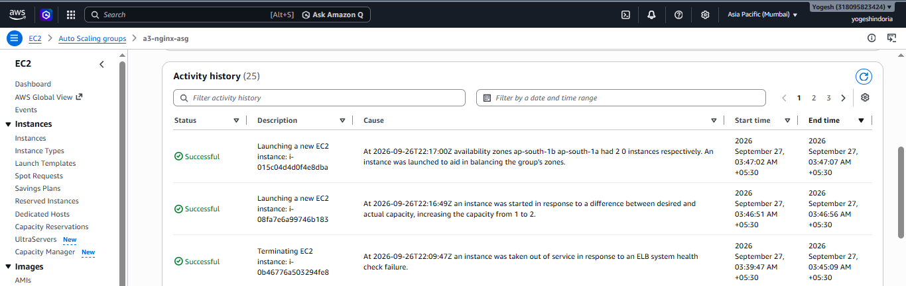

---

## 7. Replacement Instance Launched

The Auto Scaling Group automatically launched a new instance using the configured Launch Template.

Launch Template:

```text
a3-nginx-v1-lt
```

The replacement instance was launched in the configured private subnet/AZ configuration.

The ASG maintained the desired capacity:

```text
Desired Capacity: 2
```

---

## 8. Verify Replacement Instance

After the replacement instance was launched, it became:

```text
Lifecycle: InService
Health Status: Healthy
```

The new instance successfully registered with the Target Group.

### Screenshot

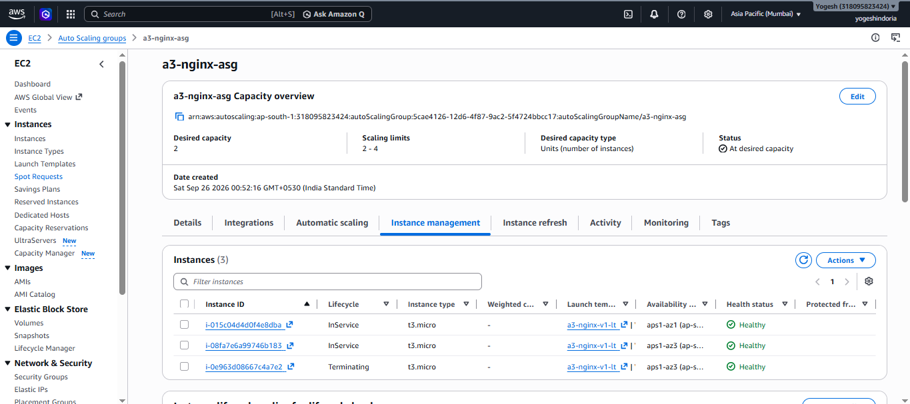

---

## 9. Verify Final ASG State

Final ASG state:

```text
Desired Capacity: 2
Instances: 2
Healthy Instances: 2
```

The unhealthy instance was replaced automatically without manually launching a new server.

---

## 10. Self-Healing Architecture

The complete self-healing flow:

```text
                    Application Load Balancer
                              |
                              v
                         Target Group
                              |
                    Health Check "/"
                              |
                 +------------+------------+
                 |                         |
                 v                         v
          Nginx Instance 1          Nginx Instance 2
                 |
                 X
          Nginx stopped
                 |
                 v
          Health Check Failed
                 |
                 v
             ASG detects
              unhealthy
                 |
                 v
        Old instance terminated
                 |
                 v
        Replacement instance
             launched
                 |
                 v
          Nginx starts
                 |
                 v
          Target Healthy
```

---

##  Phase 3 Result

The ASG self-healing mechanism was successfully tested.

The test demonstrated that:

- Nginx was intentionally stopped on an ASG-managed instance.
- ALB health checks detected the application failure.
- The instance became unhealthy.
- Auto Scaling Group detected the unhealthy instance.
- The unhealthy instance was automatically terminated.
- A replacement instance was automatically launched.
- The replacement instance became healthy.
- Desired capacity was maintained at 2 instances.

This demonstrates **automatic failure detection and self-healing using AWS Auto Scaling Group and Application Load Balancer health checks**.


---

# Phase 4 — Path-Based Routing, Private EC2 & S3 Integration

##  Objective

Implement path-based routing using one Application Load Balancer with two Target Groups and two private Nginx application servers.

```text
/ninja1 → Target Group 1 → Ninja 1
/ninja2 → Target Group 2 → Ninja 2
```

Application images are served from Amazon S3.

---

## 1. Create Second Target Group

Created:

```text
a3-nginx-ninja2-tg
```

Configuration:

```text
Target Type: Instance
Protocol: HTTP
Port: 80
VPC: aws-a3-vpc
Health Check Path: /
```

### Screenshot

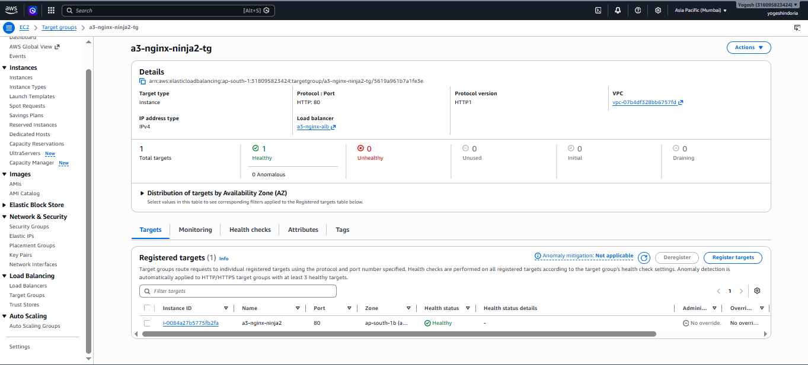

---

## 2. Launch Ninja 2 Private EC2

Created:

```text
Name: a3-nginx-ninja2
AMI: a3-nginx-v2-ami
Instance Type: t3.micro
VPC: aws-a3-vpc
Subnet: aws-a3-private-subnet-2
Public IP: Disabled
IAM Role: Yogesh-Deployment-S3-ReadRole
```

Private IP:

```text
10.0.12.230
```

Availability Zone:

```text
ap-south-1b
```

The instance was accessed through the Bastion Host.

---

## 3. Configure Security Group

The Ninja 2 instance uses:

```text
a3-nginx-s3-app-sg
```

Expected rules:

```text
SSH 22  → Bastion Security Group
HTTP 80 → ALB Security Group
Outbound → All Traffic
```

The application server has no public IP.

---

## 4. Configure Ninja 2 Nginx Page

Configured a separate Ninja 2 page containing:

```text
AWS Assignment 3
Nginx - Ninja 2
Phase 4 - Path Based Routing
Server: NINJA 2
Private Subnet: 10.0.12.0/24
```

The page also loads an image directly from Amazon S3.

---

## 5. Register Ninja 2 Target

Registered:

```text
a3-nginx-ninja2
```

with:

```text
a3-nginx-ninja2-tg
```

Port:

```text
80
```

After attaching the Target Group to the ALB, the target became:

```text
Healthy ✅
```

### Screenshot


---

## 6. Configure ALB Path-Based Routing

Existing ALB:

```text
a3-nginx-alb
```

HTTP listener:

```text
HTTP :80
```

### Rule 1

```text
Priority: 1
IF Path = /ninja1*
THEN Forward to a3-nginx-tg
```

### Rule 2

```text
Priority: 2
IF Path = /ninja2*
THEN Forward to a3-nginx-ninja2-tg
```

### Screenshot

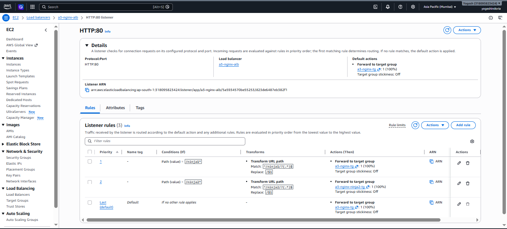

---

## 7. Configure ALB URL Rewrite

Initially, `/ninja1` returned `404 Not Found` because Nginx had `index.html` at `/`.

ALB URL rewrite was therefore configured.

### Ninja 1

```text
Regex:
^/ninja1/?(.*)$

Replacement:
/$1
```

### Ninja 2

```text
Regex:
^/ninja2/?(.*)$

Replacement:
/$1
```

This converts:

```text
/ninja1 → /
/ninja2 → /
```

before forwarding the request to Nginx.

---

## 8. Verify Ninja 1

URL:

```text
http://a3-nginx-alb-1316344735.ap-south-1.elb.amazonaws.com/ninja1
```

Routing:

```text
/ninja1
   ↓
ALB
   ↓
a3-nginx-tg
   ↓
Private Nginx / Ninja 1
```

The Ninja 1 page was successfully displayed.

### Screenshot

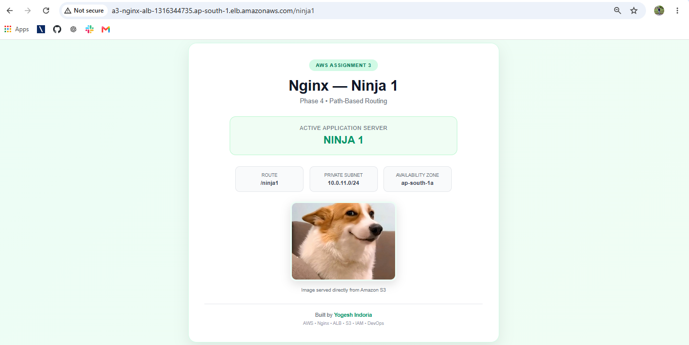

---

## 9. Verify Ninja 2

URL:

```text
http://a3-nginx-alb-1316344735.ap-south-1.elb.amazonaws.com/ninja2
```

Routing:

```text
/ninja2
   ↓
ALB
   ↓
a3-nginx-ninja2-tg
   ↓
Private Nginx / Ninja 2
```

The Ninja 2 page was successfully displayed.

The S3 image was also successfully loaded.

### Screenshot

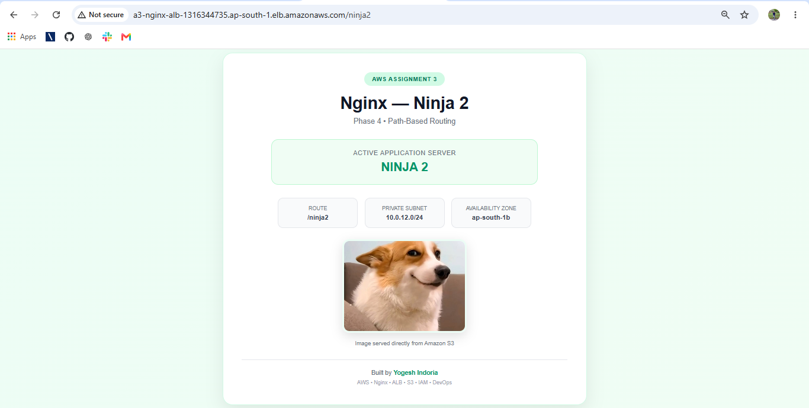

---

## 10. S3 Image Integration

The Ninja 2 webpage loads the image directly from Amazon S3.

Example:

```html

```

S3 object:

```text
Bucket: a3-nginx-assets-yogi-2026
Object: images/aws.jpg
```

The S3 access model used here is part of the earlier Day 2 implementation. It will be redesigned with tighter access controls in Phase 5 and CloudFront in Phase 6.

---

## 11. Final Architecture

```text
                              Internet
                                  |
                                  v
                       Application Load Balancer
                              a3-nginx-alb
                                  |
                           HTTP :80 Listener
                                  |
                 +----------------+----------------+
                 |                                 |
             /ninja1*                           /ninja2*
                 |                                 |
                 v                                 v
          a3-nginx-tg                    a3-nginx-ninja2-tg
                 |                                 |
                 v                                 v
        Private Nginx EC2                  Private Nginx EC2
          Subnet 1                           Subnet 2
        ap-south-1a                        ap-south-1b
                 |                                 |
                 +----------------+----------------+
                                  |
                                  v
                              Amazon S3
                                Images
```

---

## 12. Security Architecture

```text
Internet
   |
   v
ALB
   |
   | HTTP 80
   v
Private EC2
```

SSH:

```text
User
 |
 v
Bastion Host
 |
 | SSH 22
 v
Private EC2
```

Security Groups:

```text
Bastion SG
    |
    +---- SSH 22 ← My IP

Private App SG
    |
    +---- SSH 22 ← Bastion SG
    |
    +---- HTTP 80 ← ALB SG
```

---

## Phase 4 Result

Phase 4 was successfully completed.

Implemented:

- Two private Nginx application servers
- Two Target Groups
- One Application Load Balancer
- Path-based routing
- `/ninja1*` routing
- `/ninja2*` routing
- ALB URL rewriting
- Private subnet architecture
- Bastion-based SSH access
- ALB-to-private-EC2 HTTP access
- S3-based image delivery
- Healthy Target Groups
- Successful Ninja 1 verification
- Successful Ninja 2 verification

Final routing:

```text
/ninja1 → a3-nginx-tg → Ninja 1
/ninja2 → a3-nginx-ninja2-tg → Ninja 2
```

---
# Phase 5 — S3 Security, IAM User & Access Control

##  Objective

The objective of this phase is to implement secure Amazon S3 storage with IAM-based access control.

The S3 bucket is configured in the required `us-east-1` region with separate `prod` and `nonprod` folders.

```text
IAM User
   |
   ├── nonprod/ → Read + Write ✅
   |
   └── prod/    → Access Denied ❌

EC2 IAM Role
   |
   ├── prod/    → Read ✅
   └── nonprod/ → Read ✅
```

---

## 1. Create Secure S3 Bucket

Created:

```text
Bucket Name: a3-nginx-secure-yogi-2026
Region: US East (N. Virginia) — us-east-1
```

A separate bucket was created so the secure IAM-based access model could be implemented without disturbing the earlier Day 2 application bucket.

### Screenshot

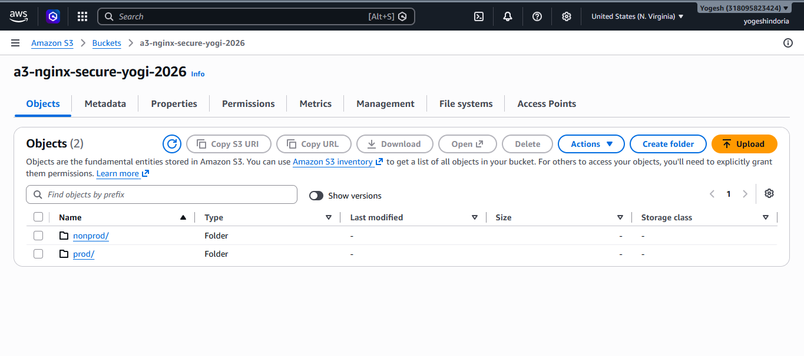

---

## 2. Create S3 Folder Structure

Created:

```text
a3-nginx-secure-yogi-2026
│
├── prod/
│   └── images/
│
└── nonprod/
    ├── images/
    └── test.txt
```
---

## 3. ble Bucket Versioning

Bucket Versioning was enabled:

```text
Bucket Versioning: Enabled
```

Versioning preserves previous object versions when objects are replaced or updated.

###

---

## 4. Enable Block Public Access

The secure bucket was configured with:

```text
Block all public access: ON
```

This keeps the bucket private and prevents public Internet access.

### 

---

## 5. Create IAM User

Created a dedicated IAM user:

```text
a3-nonprod-user
```

Console access was not enabled because testing was performed through AWS CLI using a separate access-key profile.

---

## 6. Create IAM Policy for Non-Production Access

Created inline policy:

```text
a3-nonprod-s3-access
```

Policy:

```json
{
  "Version": "2012-10-17",
  "Statement": [
    {
      "Sid": "ListBucket",
      "Effect": "Allow",
      "Action": "s3:ListBucket",
      "Resource": "arn:aws:s3:::a3-nginx-secure-yogi-2026",
      "Condition": {
        "StringLike": {
          "s3:prefix": [
            "nonprod",
            "nonprod/*"
          ]
        }
      }
    },
    {
      "Sid": "NonProdObjectAccess",
      "Effect": "Allow",
      "Action": [
        "s3:GetObject",
        "s3:PutObject",
        "s3:DeleteObject"
      ],
      "Resource": "arn:aws:s3:::a3-nginx-secure-yogi-2026/nonprod/*"
    }
  ]
}
```

The policy grants access only under:

```text
nonprod/*
```

No object-level permission was granted for:

```text
prod/*
```

---

## 7. Configure AWS CLI Profile

Configured a separate AWS CLI profile:

```text
a3-nonprod
```

Command:

```bash
aws configure --profile a3-nonprod
```

The existing default AWS CLI profile was not overwritten.

---

## 8. Test Non-Production Access

Tested:

```bash
aws s3 ls s3://a3-nginx-secure-yogi-2026/nonprod/ --profile a3-nonprod
```

Created and uploaded a test object:

```bash
echo "Nonprod test - Day 5" > test.txt

aws s3 cp test.txt s3://a3-nginx-secure-yogi-2026/nonprod/test.txt --profile a3-nonprod
```

The upload succeeded.

### Screenshot

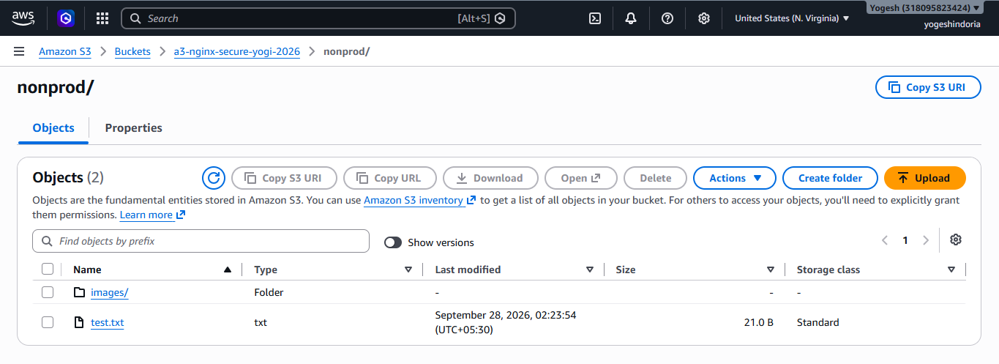

---

## 9. Test Production Access Denial

Attempted to upload the same object to production:

```bash
aws s3 cp test.txt s3://a3-nginx-secure-yogi-2026/prod/test.txt --profile a3-nonprod
```

The operation returned:

```text
AccessDenied
```

This confirmed that `a3-nonprod-user` does not have `s3:PutObject` permission on `prod/*`.

### Screenshot

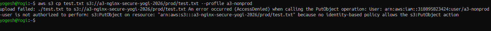

---

## 10. Upload Production and Non-Production Images

Using an authorized account, images were uploaded to:

```text
prod/images/aws.jpg
nonprod/images/aws.jpg
```

Final structure:

```text
a3-nginx-secure-yogi-2026
│
├── prod/
│   └── images/
│       └── aws.jpg
│
└── nonprod/
    ├── images/
    │   └── aws.jpg
    └── test.txt
```

---

## 11. Configure EC2 IAM Role

Updated the existing role:

```text
Yogesh-Deployment-S3-ReadRole
```

with inline policy:

```text
a3-secure-s3-read-access
```

Policy:

```json
{
  "Version": "2012-10-17",
  "Statement": [
    {
      "Sid": "ListSecureBucket",
      "Effect": "Allow",
      "Action": "s3:ListBucket",
      "Resource": "arn:aws:s3:::a3-nginx-secure-yogi-2026"
    },
    {
      "Sid": "ReadSecureBucketObjects",
      "Effect": "Allow",
      "Action": [
        "s3:GetObject"
      ],
      "Resource": "arn:aws:s3:::a3-nginx-secure-yogi-2026/*"
    }
  ]
}
```

The EC2 role provides read-only access to objects in the secure bucket.

No AWS access keys are stored on the EC2 server.

---

## 12. Verify EC2 IAM Role

The private EC2 instance was configured with:

```text
IAM Role:
Yogesh-Deployment-S3-ReadRole
```

The AWS CLI was installed and the role was verified using:

```bash
aws sts get-caller-identity
```

The returned identity confirmed the EC2 instance was using:

```text
Yogesh-Deployment-S3-ReadRole
```

### Screenshot

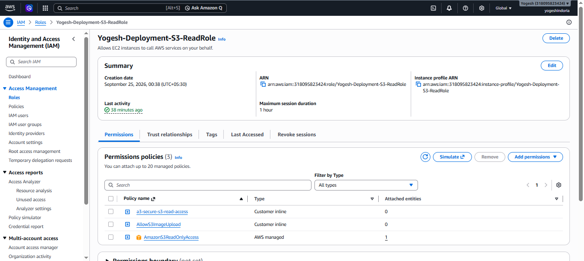

---

## 13. Verify EC2 Read Access to S3

From the private EC2 instance:

```bash
aws s3 ls s3://a3-nginx-secure-yogi-2026/
```

The secure bucket was accessible.

The image objects were also listed:

```bash
aws s3 ls s3://a3-nginx-secure-yogi-2026/nonprod/images/
```

```bash
aws s3 ls s3://a3-nginx-secure-yogi-2026/prod/images/
```

The `aws.jpg` object was visible in both locations.

### Result

```text
EC2
 ↓
IAM Role
 ↓
Secure S3 Bucket
 ↓
prod/images/aws.jpg      ✅ Read
nonprod/images/aws.jpg   ✅ Read
```

### Screenshot

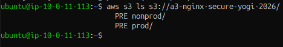

---

## 14. Verify IAM User Non-Production Download

From WSL using the `a3-nonprod` profile:

```bash
aws s3 cp s3://a3-nginx-secure-yogi-2026/nonprod/images/aws.jpg ./aws-day5-test.jpg --profile a3-nonprod
```

The image was successfully downloaded.

### Screenshot

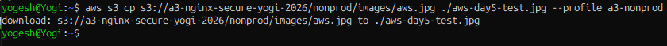

---

## 15. Verify IAM User Production Access Denial

The same IAM user attempted to download the production image:

```bash
aws s3 cp s3://a3-nginx-secure-yogi-2026/prod/images/aws.jpg ./prod-test.jpg --profile a3-nonprod
```

The request returned:

```text
403 Forbidden
```

This confirmed that the IAM user cannot access production objects.

### Screenshot

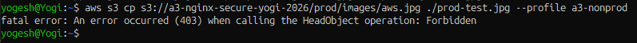

---

## 16. Bucket Policy and Public Access

The secure bucket does not require a bucket policy for the implemented access model.

Current configuration:

```text
Block all public access: ON
Bucket Policy: None
```

Permissions are provided through IAM identity-based policies.

### Screenshot

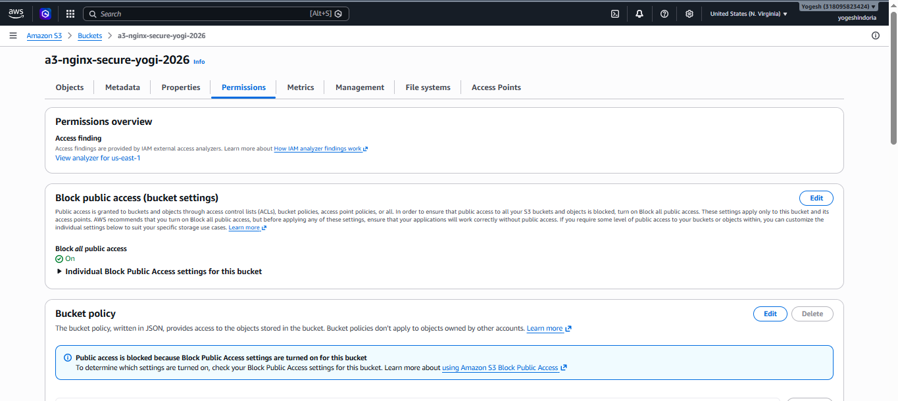

---

## 17. Final IAM Access Model

```text
                         S3 Bucket
                  a3-nginx-secure-yogi-2026
                              |
             +----------------+----------------+
             |                                 |
        a3-nonprod-user              EC2 IAM Role
             |                       Yogesh-Deployment-
             |                       S3-ReadRole
             |                                 |
       +-----+-----+                     +-----+-----+
       |           |                     |           |
   nonprod       prod                  nonprod      prod
       |           |                     |           |
       ✅           ❌                     ✅           ✅
    Read/Write    Denied                 Read        Read
```

---

## 18. Final Security Architecture

```text
                         Internet
                            |
                            X
                    Public S3 Access
                         BLOCKED
                            |
                            v
                  Private S3 Bucket
              a3-nginx-secure-yogi-2026
                            |
              +-------------+-------------+
              |                           |
              v                           v
        IAM User                    EC2 IAM Role
     a3-nonprod-user          Yogesh-Deployment-S3-ReadRole
              |                           |
       +------+-----+                 Read Only
       |            |                     |
   nonprod        prod                    |
      ✅            ❌                 S3 Objects
   Read/Write      Denied
```

---

#  Phase 5 Result

Phase 5 was successfully completed.

Implemented:

- Secure S3 bucket in `us-east-1` ✅
- `prod/` and `nonprod/` structure ✅
- `images/` folders ✅
- S3 Versioning enabled ✅
- Block Public Access enabled ✅
- IAM user `a3-nonprod-user` created ✅
- Custom non-production access policy created ✅
- Non-production upload tested successfully ✅
- Production upload denied successfully ✅
- EC2 IAM role configured for secure S3 read access ✅
- EC2 role access verified ✅
- Non-production image download verified ✅
- Production image access denied for IAM user ✅
- No public bucket access configured ✅

Final access model:

```text
a3-nonprod-user
    ↓
nonprod/* → Read + Write
prod/*    → Denied

EC2 IAM Role
    ↓
prod/*    → Read
nonprod/* → Read

Public Internet
    ↓
S3 → Blocked
```

---


