# SonarQube on AWS using Terraform (Static IaC)

**Author:** Yogesh Indoria
**Assignment:** AWS / Terraform Assignment 04
**Region:** ap-south-1 (Mumbai)

---

## Table of Contents

1. [Objective](#1-objective)
2. [Architecture](#2-architecture)
3. [Technology Stack](#3-technology-stack)
4. [Project Structure](#4-project-structure)
5. [Resources Created](#5-resources-created)
6. [Prerequisites](#6-prerequisites)
7. [Deployment Steps](#7-deployment-steps)
   - [Step 1: Create the S3 bucket for remote state](#step-1-create-the-s3-bucket-for-remote-state)
   - [Step 2: Configure variables](#step-2-configure-variables)
   - [Step 3: Initialize Terraform](#step-3-initialize-terraform)
   - [Step 4: Validate and plan](#step-4-validate-and-plan)
   - [Step 5: Apply](#step-5-apply)
   - [Step 6: Verify the infrastructure in AWS Console](#step-6-verify-the-infrastructure-in-aws-console)
   - [Step 7: Access SonarQube](#step-7-access-sonarqube)
8. [Terraform Outputs](#8-terraform-outputs)
9. [Design Decisions](#9-design-decisions)
10. [Issues Faced and Fixes](#10-issues-faced-and-fixes)
11. [Cleanup](#11-cleanup)
12. [Conclusion](#12-conclusion)

---

## 1. Objective

The objective of this project is to design and implement the infrastructure for **SonarQube** (a code quality and security analysis tool) using **Terraform Infrastructure as Code (IaC)**, based on an approved architecture diagram.

The project follows these goals:

- Design an architecture covering networking, servers, load balancer, auto scaling and database.
- Provision the complete infrastructure with **static Terraform code** (no modules, no loops, every resource written explicitly).
- Keep **provider versioning consistent** by pinning the AWS provider and Terraform version.
- Store the Terraform **state file remotely in an S3 bucket** (with encryption and state locking).
- Follow security best practices: private subnets for application and database, security-group chaining, and SSH access only through a bastion host.

---

## 2. Architecture


```
Internet
   │
[ Internet Gateway ]
   │
┌──────────────── VPC 10.0.0.0/16 (ap-south-1) ────────────────┐
│  Public subnets (1a, 1b)                                      │
│   ├─ Application Load Balancer (port 80)                      │
│   ├─ Bastion Host (SSH, my IP only)                           │
│   └─ NAT Gateway                                              │
│                          │                                    │
│                          ▼  port 9000                         │
│  Private app subnets (1a, 1b)                                 │
│   └─ Auto Scaling Group (1/1/1) → SonarQube EC2 (Docker)      │
│                          │                                    │
│                          ▼  port 5432                         │
│  Private DB subnets (1a, 1b)                                  │
│   └─ RDS PostgreSQL 15                                        │
└───────────────────────────────────────────────────────────────┘
S3 bucket  →  Terraform remote state (tfstate)
```

### Traffic flow

1. A user opens the ALB DNS name in the browser (HTTP, port 80).
2. The ALB forwards the request to the SonarQube instance in the private subnet (port 9000).
3. SonarQube stores its data in the RDS PostgreSQL database (port 5432).
4. The private instance reaches the internet (for pulling the Docker image) through the NAT Gateway.
5. Administrators connect to private instances only via the bastion host.

---

## 3. Technology Stack

| Component | Details |
|---|---|
| IaC Tool | Terraform `>= 1.10.0` |
| Cloud Provider | AWS (`hashicorp/aws ~> 5.70.0`) |
| Application | SonarQube Community Edition (Docker) |
| Compute | EC2 (`c7i-flex.large` for SonarQube, `t3.micro` for bastion) |
| Database | Amazon RDS PostgreSQL 15 (`db.t3.micro`) |
| Load Balancer | Application Load Balancer |
| Remote State | Amazon S3 with encryption and lockfile |

---

## 4. Project Structure

```
sonarqube-terraform/
├── provider.tf                # Terraform + AWS provider version pinning
├── backend.tf                 # S3 remote state configuration
├── variables.tf               # Input variables (IP, key pair, DB password)
├── network.tf                 # VPC, subnets, IGW, NAT, route tables
├── security.tf                # Security groups (ALB, bastion, app, RDS)
├── database.tf                # RDS subnet group and PostgreSQL instance
├── compute.tf                 # Bastion, launch template, ALB, target group, ASG
├── outputs.tf                 # ALB URL, bastion IP, RDS endpoint, VPC ID
├── terraform.tfvars.example   # Sample variable values
├── .gitignore
├── README.md
└── screenshots/
```

---

## 5. Resources Created

| Category | Resources |
|---|---|
| Networking | 1 VPC, 1 Internet Gateway, 1 NAT Gateway + EIP, 6 subnets (2 public, 2 private-app, 2 private-db), 3 route tables |
| Security | 4 security groups: ALB, Bastion, App, RDS |
| Compute | 1 bastion EC2, 1 launch template, 1 Auto Scaling Group |
| Load Balancing | 1 ALB, 1 target group, 1 HTTP listener |
| Database | 1 RDS subnet group, 1 RDS PostgreSQL instance |

### Security group rules

| Security Group | Inbound |
|---|---|
| ALB | TCP 80 from `0.0.0.0/0` |
| Bastion | TCP 22 from my IP only |
| App (SonarQube) | TCP 9000 from ALB SG, TCP 22 from Bastion SG |
| RDS | TCP 5432 from App SG only |

---

## 6. Prerequisites

- AWS account with an IAM user/credentials configured (`aws configure`)
- Terraform `>= 1.10.0` installed
- AWS CLI installed
- An EC2 **key pair** created in `ap-south-1` (use the key pair name **without** `.pem`)
- Your public IP address (for bastion SSH access)

---

## 7. Deployment Steps

### Step 1: Create the S3 bucket for remote state

```bash
aws s3api create-bucket --bucket <your-unique-bucket-name> \
  --region ap-south-1 \
  --create-bucket-configuration LocationConstraint=ap-south-1

aws s3api put-bucket-versioning --bucket <your-unique-bucket-name> \
  --versioning-configuration Status=Enabled
```

Update the bucket name in `backend.tf`.

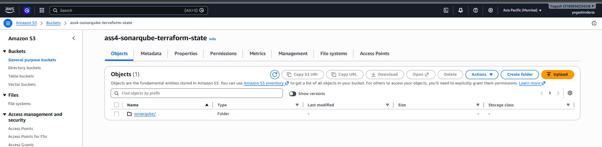

### Step 2: Configure variables

Copy the example file and fill in your values:

```bash
cp terraform.tfvars.example terraform.tfvars
```

```hcl
my_ip_cidr    = "x.x.x.x/32"
key_pair_name = "VM2"              # key pair name, without .pem
db_password   = "Alphanumeric123"  # letters and numbers only, 12+ chars
```

### Step 3: Initialize Terraform

```bash
terraform init
```

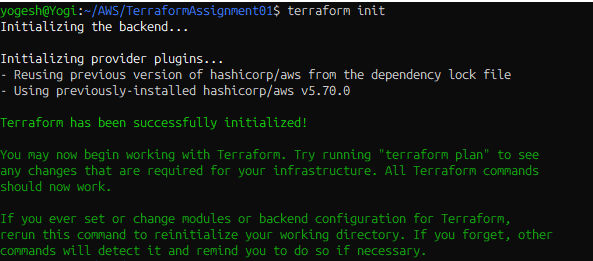

### Step 4: Validate and plan

```bash
terraform fmt
terraform validate
terraform plan
```

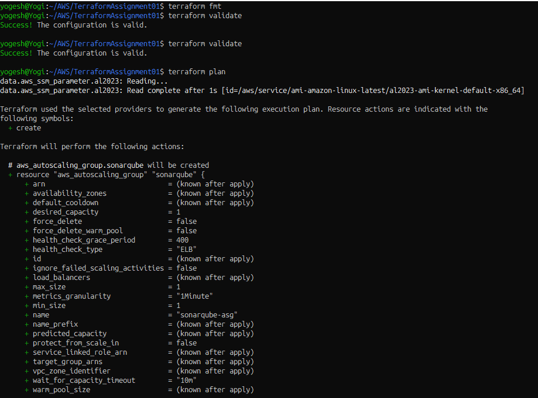
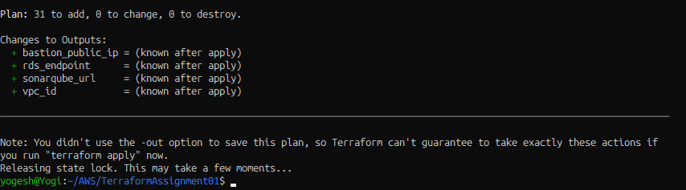

### Step 5: Apply

```bash
terraform apply
```

Type `yes` to confirm. The full apply takes around 10 minutes (RDS takes the longest).

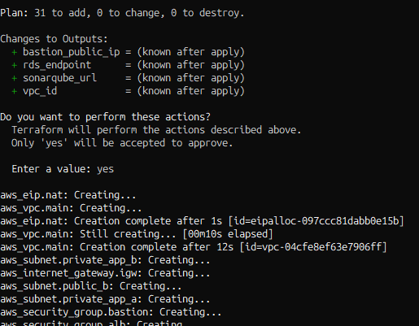

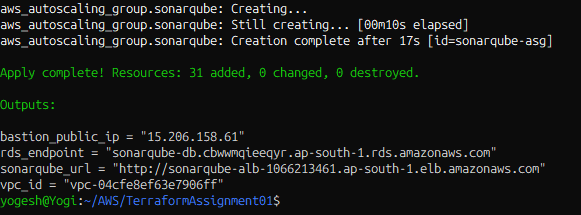

### Step 6: Verify the infrastructure in AWS Console

**VPC and subnets**

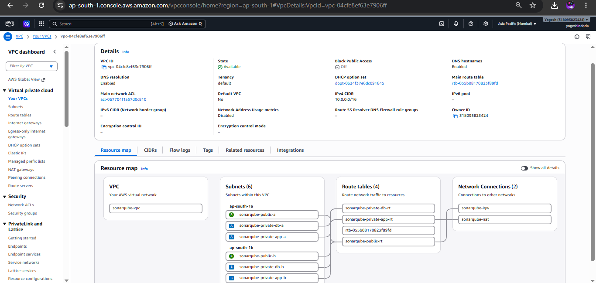

**EC2 instances (bastion + SonarQube)**

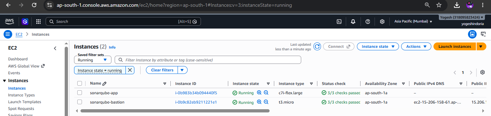

**Application Load Balancer**

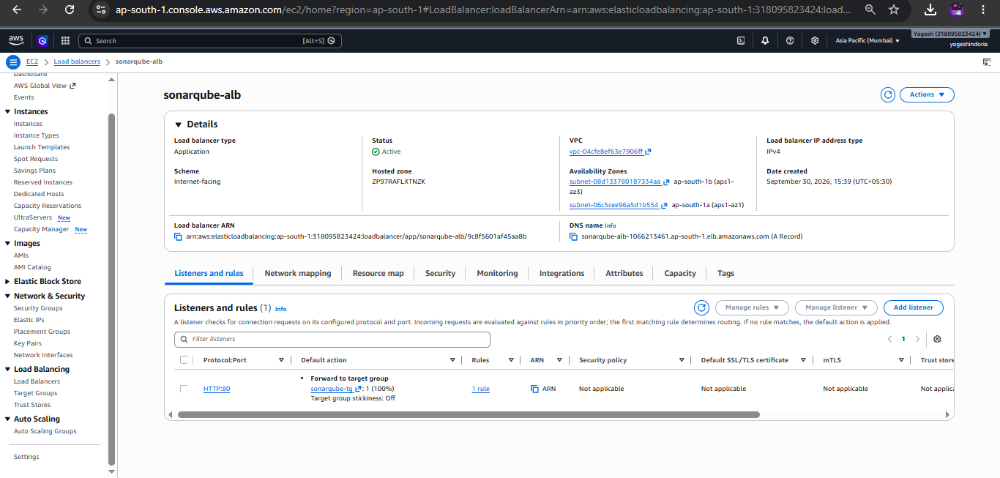

**Target group health (healthy)**

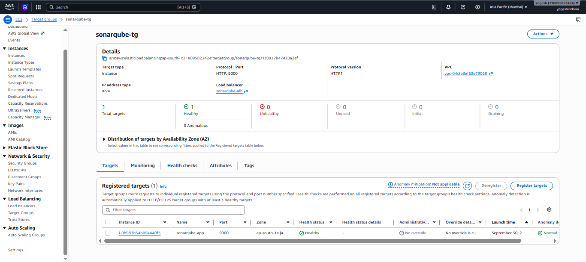

**Auto Scaling Group**

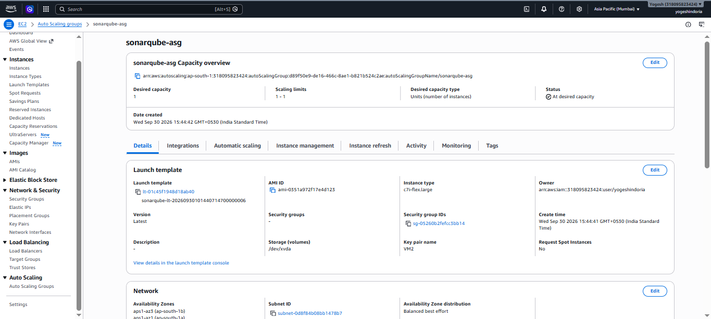

**RDS PostgreSQL**

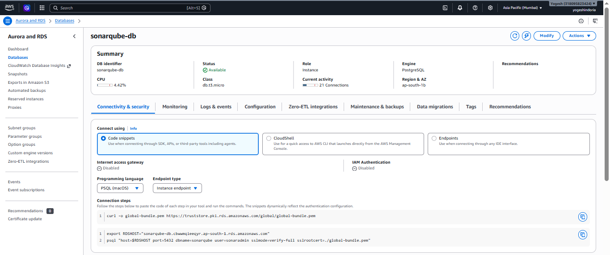

**Terraform state file in S3**

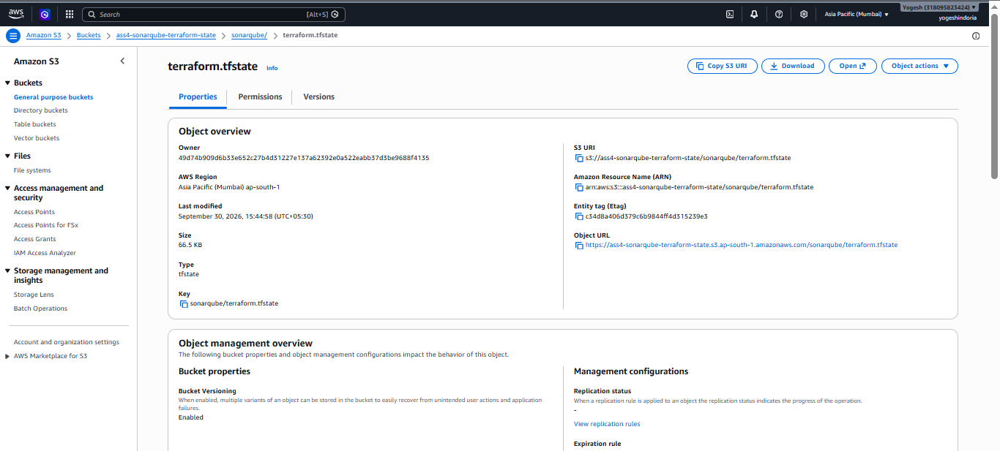

### Step 7: Access SonarQube

Wait 5 to 7 minutes after apply for the instance to boot and SonarQube to start, then open:

```
http://sonarqube-alb-1066213461.ap-south-1.elb.amazonaws.com
```

Default credentials are `admin` / `admin`. SonarQube asks you to set a new password on first login.

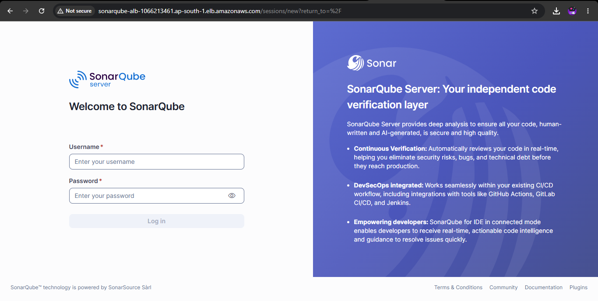

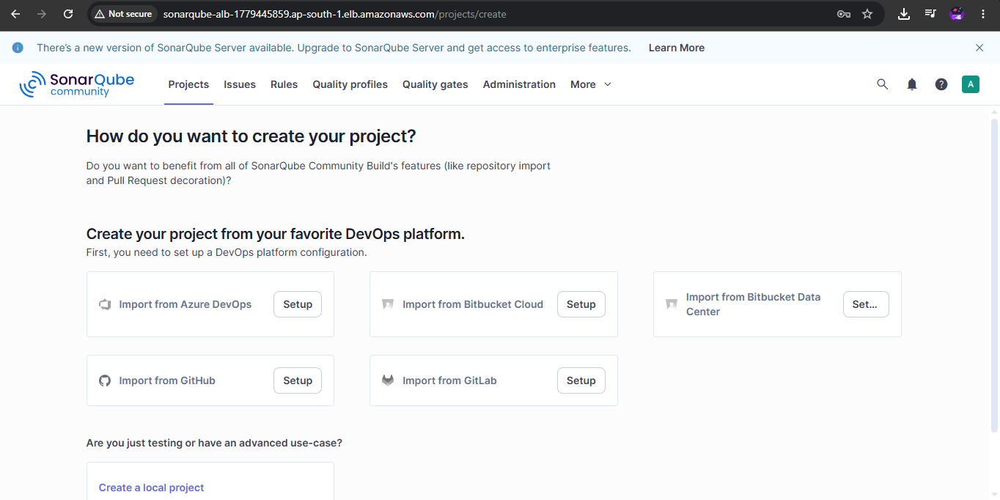

---

## 8. Terraform Outputs

| Output | Description |
|---|---|
| `sonarqube_url` | Public URL of the ALB to access SonarQube |
| `bastion_public_ip` | Public IP of the bastion host |
| `rds_endpoint` | RDS PostgreSQL endpoint |
| `vpc_id` | ID of the created VPC |

---

## 9. Design Decisions

- **Auto Scaling Group with 1/1/1 capacity:** SonarQube Community Edition does not support multi-node clustering (that requires the Data Center Edition). The ASG is used for **self-healing**: if the instance fails a health check, a new one is launched automatically.
- **Private subnets for app and database:** SonarQube and RDS are never directly exposed to the internet. Only the ALB and bastion are public.
- **Separate DB subnets with no internet route:** The database tier has no route to the internet at all.
- **Security group chaining:** Each tier accepts traffic only from the tier in front of it.
- **Instance size:** SonarQube (with its embedded Elasticsearch) needs at least 4 GB of RAM, so a 4 GB instance is used.
- **Kernel settings:** `vm.max_map_count` and `fs.file-max` are configured in the user data script, as required by SonarQube.
- **Remote state with locking:** State is stored in S3 with encryption and `use_lockfile` to prevent concurrent modifications.
- **Version pinning:** Both Terraform and the AWS provider versions are pinned for consistent, repeatable runs.

---

## 10. Issues Faced and Fixes

| Issue | Cause | Fix |
|---|---|---|
| `InvalidKeyPair.NotFound` | Key pair name was given with `.pem` extension | Use the key pair name only, e.g. `VM2` |
| RDS `MasterUserPassword is not a valid password` | Password contained `/`, `@`, `"` or space | Use an alphanumeric password |
| ASG failed: instance type not eligible for Free Tier | `t3.medium` is not allowed on a Free Tier plan account | Listed eligible types with `describe-instance-types` and switched to `c7i-flex.large` (x86, 4 GB RAM) |

---

## 11. Cleanup

To avoid ongoing charges (NAT Gateway, ALB, RDS and EC2 are billed while running), destroy everything after the demo:

```bash
terraform destroy
```

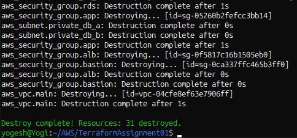

---

## 12. Conclusion

The complete SonarQube infrastructure was provisioned on AWS using static Terraform code, following the approved architecture: a multi-AZ VPC with public, private-app and private-db tiers, an ALB in front of an Auto Scaling Group running SonarQube, a private RDS PostgreSQL database, a bastion host for secure administration, and the Terraform state stored remotely in S3.

---

**Author:** Yogesh Indoria
