# Ansible Assignment 1 — User & Project Management System

## 📌 Project Overview

This assignment automates **Linux User & Project Management** using **Ansible Ad-Hoc commands**, covering:

- User & Group management (custom UID, shells, password aging, sudo)
- Directory structure for teams, projects, shared resources, archive, admin
- Permissions via `chmod`, `chown`, and ACL (`setfacl` / `getfacl`)

---

## 🏗️ Environment

| Node | Details |
|---|---|
| **Control Node** | WSL (Ubuntu) — Ansible installed here |
| **Managed Node** | AWS EC2 (Ubuntu) |

```
Control Node (WSL) --SSH/Ansible--> Managed Node (EC2)
```

---

## 📁 Project Structure

```
assignment-1/
├── ansible.cfg
├── inventory
└── README.md
```

---

## ⚙️ Inventory

```ini
[servers]
VM1 ansible_host=15.252.180.13

[servers:vars]
ansible_user=ubuntu
ansible_ssh_private_key_file=/home/yogesh/***.pem
```

- `[servers]` → group of managed nodes
- `ansible_host` → IP of managed server
- `ansible_user` / `ansible_ssh_private_key_file` → SSH auth details

**Test connectivity:**
```bash
ansible servers -m ping
```
Expected: `VM1 | SUCCESS`

---

## 1️⃣ Group Management

Required groups: `dev-team`, `devops-team`, `admin-group`

```bash
ansible servers -b -m ansible.builtin.group -a "name=dev-team state=present"
ansible servers -b -m ansible.builtin.group -a "name=devops-team state=present"
ansible servers -b -m ansible.builtin.group -a "name=admin-group state=present"
```
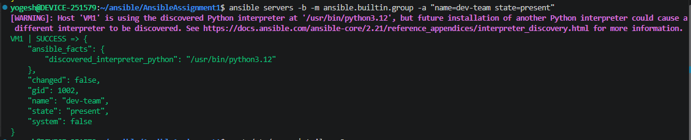
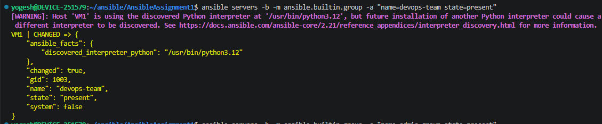
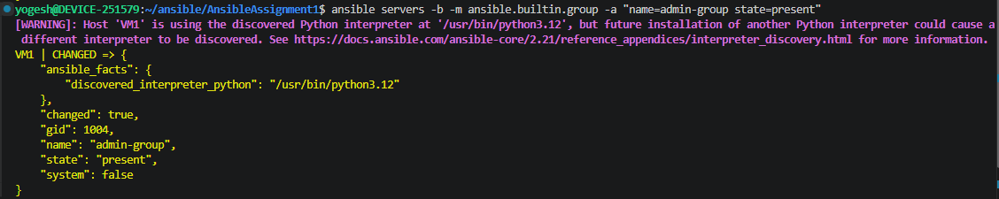

**Flags:** `-b` = sudo escalation · `-m` = module used · `-a` = module arguments · `state=present` = ensure it exists.

**Verify:**
```bash
ansible servers -b -m command -a "getent group dev-team"
ansible servers -b -m command -a "getent group devops-team"
ansible servers -b -m command -a "getent group admin-group"
```
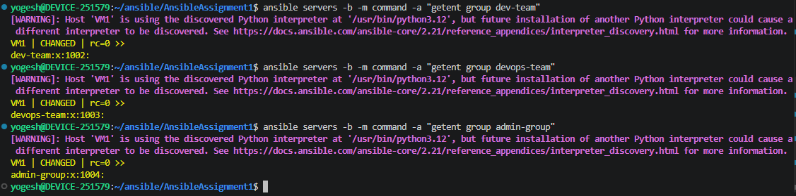

---

## 2️⃣ User Management

**9 users total**, custom UIDs starting at 2000, one shell per team:

| User | UID | Team | Shell |
|---|---:|---|---|
| dev01 | 2000 | dev-team | /bin/bash |
| dev02 | 2001 | dev-team | /bin/bash |
| dev03 | 2002 | dev-team | /bin/bash |
| devops01 | 2003 | devops-team | /bin/zsh |
| devops02 | 2004 | devops-team | /bin/zsh |
| devops03 | 2005 | devops-team | /bin/zsh |
| admin01 | 2006 | admin-group | /bin/sh |
| admin02 | 2007 | admin-group | /bin/sh |
| admin03 | 2008 | admin-group | /bin/sh |

**Create users** (same pattern for all 9, changing name/uid/group/shell):
```bash
 ansible servers -b -m ansible.builtin.user -a "name=dev01 uid=2000 group=dev-team shell=/bin/bash create_home=true state=present"
 ansible servers -b -m ansible.builtin.user -a "name=dev02 uid=2001 group=dev-team shell=/bin/bash create_home=true state=present"
 ansible servers -b -m ansible.builtin.user -a "name=dev03 uid=2002 group=dev-team shell=/bin/zsh create_home=true state=present"
```

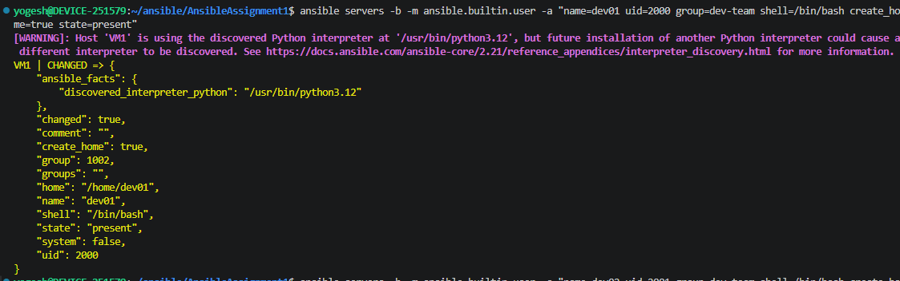
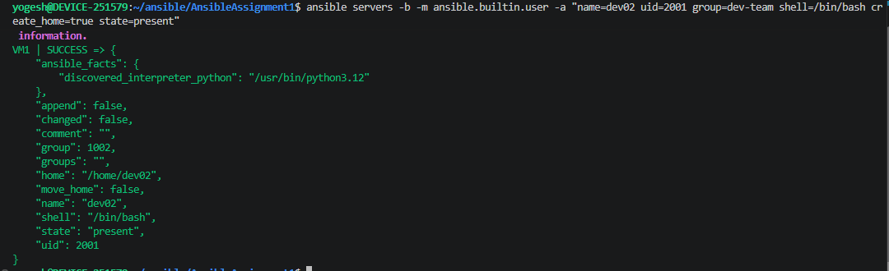
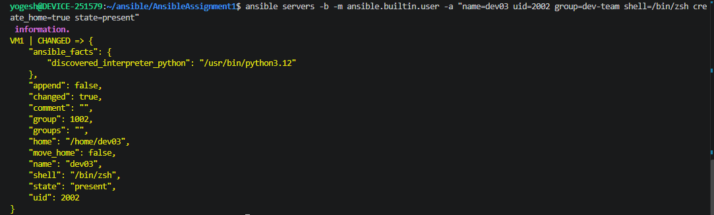

```bash
 ansible servers -b -m ansible.builtin.user -a "name=devops01 uid=2003 group=devops-team shell=/bin/zsh create_home=true state=present"
 ansible servers -b -m ansible.builtin.user -a "name=devops02 uid=2004 group=devops-team shell=/bin/zsh create_home=true state=present"
 ansible servers -b -m ansible.builtin.user -a "name=devops03 uid=2005 group=devops-team shell=/bin/zsh create_home=true state=present"
```
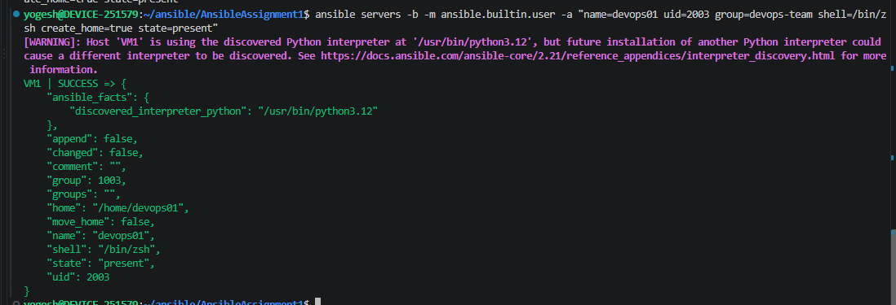
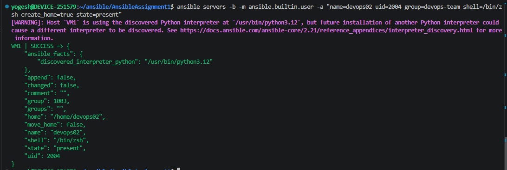
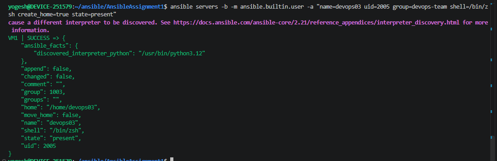

```bash
 ansible servers -b -m ansible.builtin.user -a "name=admin01 uid=2006 group=admin-group shell=/bin/sh create_home=true state=present"
 ansible servers -b -m ansible.builtin.user -a "name=admin02 uid=2007 group=admin-group shell=/bin/sh create_home=true state=present"
 ansible servers -b -m ansible.builtin.user -a "name=admin03 uid=2008 group=admin-group shell=/bin/sh create_home=true state=present"
```
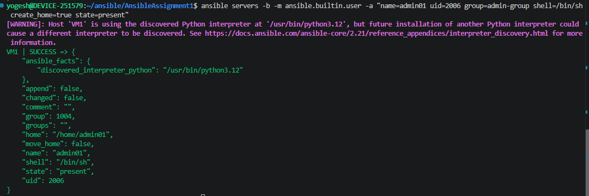
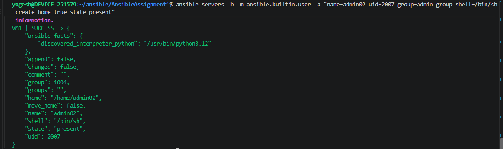
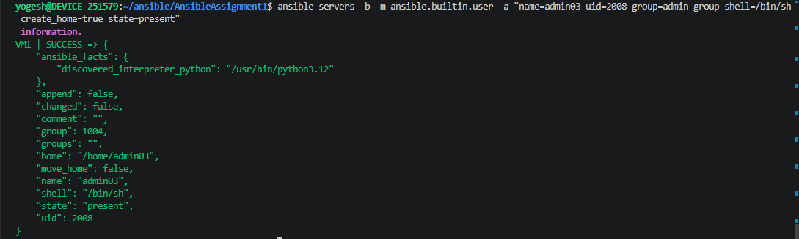

---

## 3️⃣ Password Policy

Policy: **Max age 90 days · Min age 1 day · Warning 7 days before expiry**, applied via `chage`.

```bash
ansible servers -b -m ansible.builtin.command -a "chage -M 90 -m 1 -W 7 dev01"
ansible servers -b -m ansible.builtin.command -a "chage -M 90 -m 1 -W 7 dev02"
ansible servers -b -m ansible.builtin.command -a "chage -M 90 -m 1 -W 7 dev03"
```

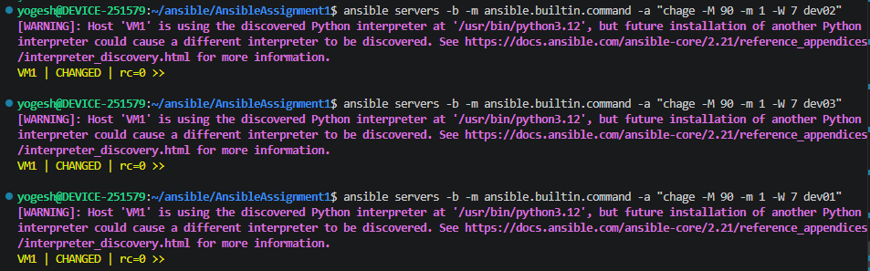

```bash
ansible servers -b -m ansible.builtin.command -a "chage -M 90 -m 1 -W 7 devops01"
ansible servers -b -m ansible.builtin.command -a "chage -M 90 -m 1 -W 7 devops02"
ansible servers -b -m ansible.builtin.command -a "chage -M 90 -m 1 -W 7 devops03"
```

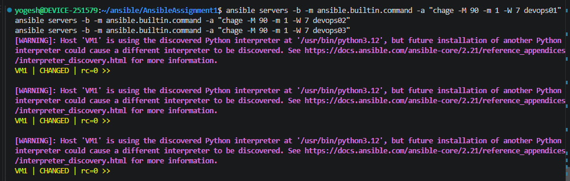

```bash
ansible servers -b -m ansible.builtin.command -a "chage -M 90 -m 1 -W 7 admin01"
ansible servers -b -m ansible.builtin.command -a "chage -M 90 -m 1 -W 7 admin02"
ansible servers -b -m ansible.builtin.command -a "chage -M 90 -m 1 -W 7 admin03"
```

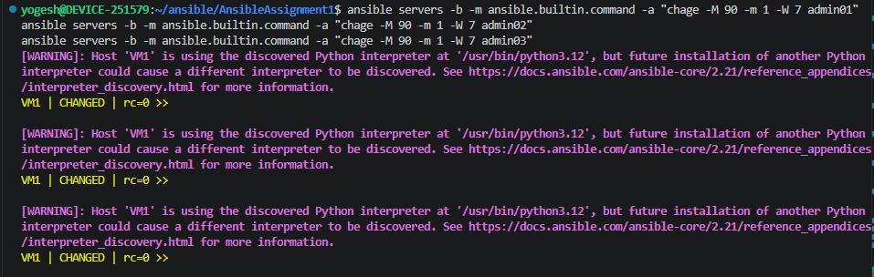

---

## 4️⃣ Sudo Access

Applied at **group level**, not per-user — anyone added to an authorized group automatically inherits sudo.

| Group | Access |
|---|---|
| dev-team | ❌ No sudo |
| devops-team | ✅ Full sudo |
| admin-group | ✅ Full sudo |

Instead of editing `/etc/sudoers` directly, a dedicated file per group goes in `/etc/sudoers.d/`:

```bash
ansible servers -b -m ansible.builtin.copy -a 'content="%devops-team ALL=(ALL) ALL\n" dest=/etc/sudoers.d/devops-team owner=root group=root mode=0440'
ansible servers -b -m ansible.builtin.copy -a 'content="%admin-group ALL=(ALL) ALL\n" dest=/etc/sudoers.d/admin-group owner=root group=root mode=0440'
```
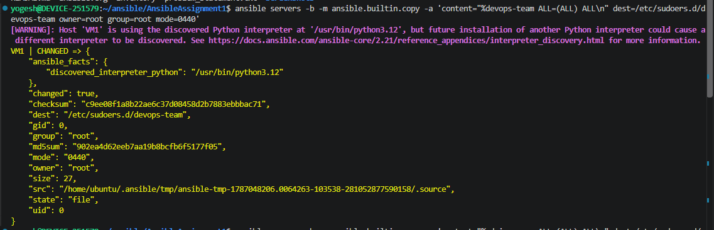
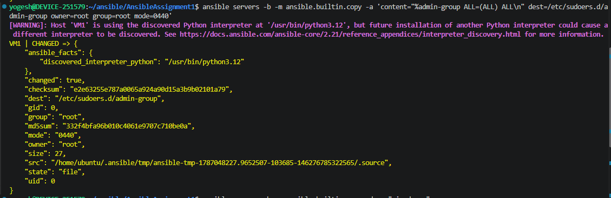

**Rule breakdown:** `%devops-team ALL=(ALL) ALL` → `%` = group (not user) · `ALL=` all hosts · `(ALL)` run as any user · trailing `ALL` = run any command.

**File permissions `0440`** → owner: read, group: read, others: none (security-sensitive file).

**Verify:**
```bash
ansible servers -b -m ansible.builtin.command -a "sudo -l -U devops01"
ansible servers -b -m ansible.builtin.command -a "sudo -l -U admin01"
ansible servers -b -m ansible.builtin.command -a "sudo -l -U dev01"
```
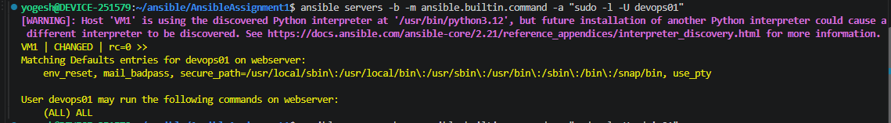
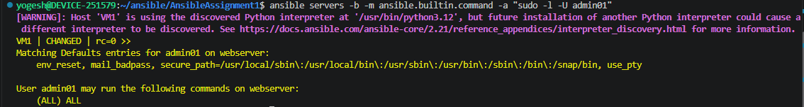
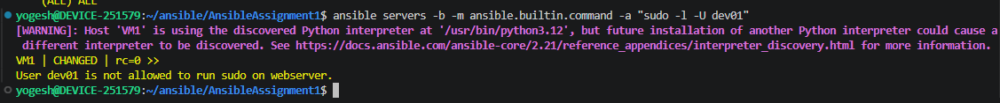

---

## 5️⃣ Directory Structure

```
/
├── home/          → 9 personal user directories (auto-created)
├── team/
│   ├── dev/
│   └── devops/
├── projects/
│   ├── WebApp/
│   ├── API/
│   └── Mobile/
├── shared/
│   └── resources/
├── archive/
│   ├── WebApp/
│   ├── API/
│   └── Mobile/
└── admin/
```

### Personal Workspace
Auto-created by `create_home=true` during user creation (Section 2).
```bash
ansible servers -b -m ansible.builtin.command -a "ls -l /home"
```
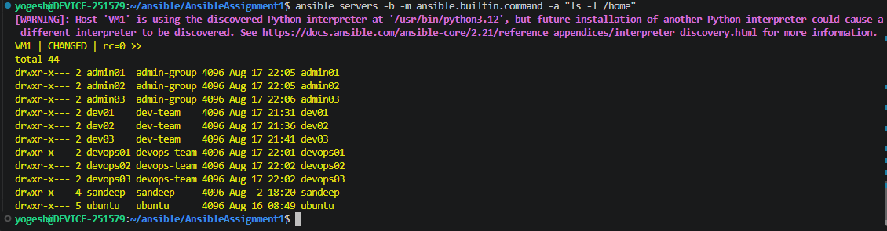

### Team Directories
```bash
ansible servers -b -m ansible.builtin.file -a "path=/team state=directory"
ansible servers -b -m ansible.builtin.file -a "path=/team/dev state=directory"
ansible servers -b -m ansible.builtin.file -a "path=/team/devops state=directory"
```
**Verify:**
```bash
ansible servers -b -m ansible.builtin.command -a "find /team -type d"
```
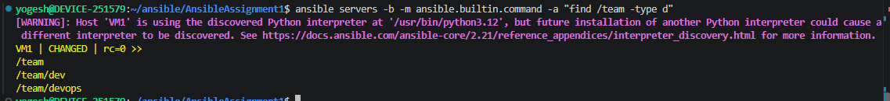

### Project Directories
```bash
ansible servers -b -m ansible.builtin.file -a "path=/projects state=directory"
ansible servers -b -m ansible.builtin.file -a "path=/projects/WebApp state=directory"
ansible servers -b -m ansible.builtin.file -a "path=/projects/API state=directory"
ansible servers -b -m ansible.builtin.file -a "path=/projects/Mobile state=directory"
```
**Verify:**
```bash
ansible servers -b -m ansible.builtin.command -a "find /projects -type d"
```
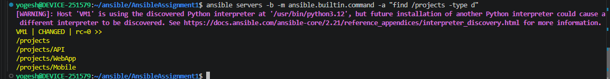

### Archive Directory
```bash
ansible servers -b -m ansible.builtin.file -a "path=/archive state=directory"
ansible servers -b -m ansible.builtin.file -a "path=/archive/WebApp state=directory"
ansible servers -b -m ansible.builtin.file -a "path=/archive/API state=directory"
ansible servers -b -m ansible.builtin.file -a "path=/archive/Mobile state=directory"
```
**Verify:**
```bash
ansible servers -b -m ansible.builtin.command -a "find /archive -type d"
```
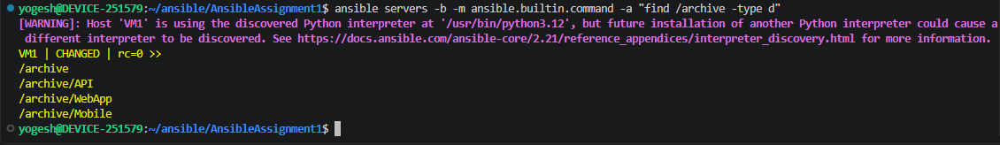

### Shared Resources Directory
```bash
ansible servers -b -m ansible.builtin.file -a "path=/shared state=directory"
ansible servers -b -m ansible.builtin.file -a "path=/shared/resources state=directory"
```
**Verify:**
```bash
ansible servers -b -m ansible.builtin.command -a "ls -ld /shared /shared/resources"
```
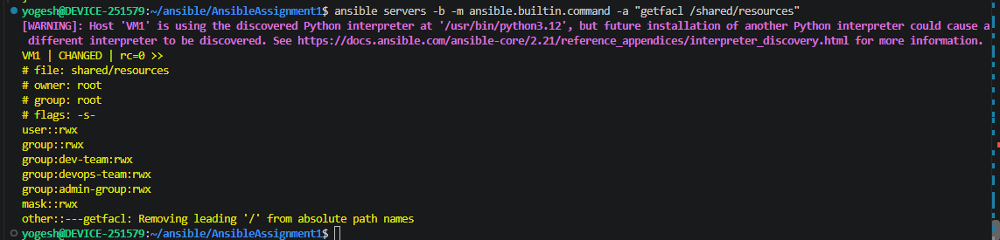

### Admin Directory
```bash
ansible servers -b -m ansible.builtin.file -a "path=/admin state=directory"
```

---

## 🔐 Why ACL Instead of Plain `chmod`?

Standard Linux permissions only give **Owner | Group | Others** — three buckets. But projects here need independent access for **multiple groups** at once (e.g. `dev-team`, `devops-team`, `admin-group` on the same folder). `chmod` can't do that; **ACL** (`setfacl`/`getfacl`) can.

```
chmod   → base permissions (owner/group/others)
setfacl → add permissions for extra groups/users
getfacl → view the full ACL
```

---

## 6️⃣ Project Permissions (WebApp / API / Mobile)

Same pattern for all three — set owner + base group, `chmod 0770`, then ACL for the remaining teams.

### WebApp — lead: dev01, team: dev-team
```bash
ansible servers -b -m ansible.builtin.file -a "path=/projects/WebApp owner=dev01 group=dev-team mode=0770"
ansible servers -b -m ansible.builtin.command -a "setfacl -m g:devops-team:r-x /projects/WebApp"
ansible servers -b -m ansible.builtin.command -a "setfacl -m g:admin-group:rwx /projects/WebApp"
```

### API — lead: devops01, team: devops-team
```bash
ansible servers -b -m ansible.builtin.file -a "path=/projects/API owner=devops01 group=devops-team mode=0770"
ansible servers -b -m ansible.builtin.command -a "setfacl -m g:dev-team:r-x /projects/API"
ansible servers -b -m ansible.builtin.command -a "setfacl -m g:admin-group:rwx /projects/API"
```

### Mobile — lead: dev02, team: dev-team
```bash
ansible servers -b -m ansible.builtin.file -a "path=/projects/Mobile owner=dev02 group=dev-team mode=0770"
ansible servers -b -m ansible.builtin.command -a "setfacl -m g:devops-team:r-x /projects/Mobile"
ansible servers -b -m ansible.builtin.command -a "setfacl -m g:admin-group:rwx /projects/Mobile"
```

**Verify (all three):**
```bash
ansible servers -b -m ansible.builtin.command -a "getfacl /projects/WebApp"
ansible servers -b -m ansible.builtin.command -a "getfacl /projects/API"
ansible servers -b -m ansible.builtin.command -a "getfacl /projects/Mobile"
```
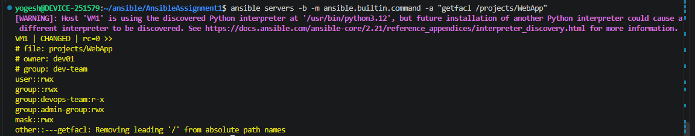
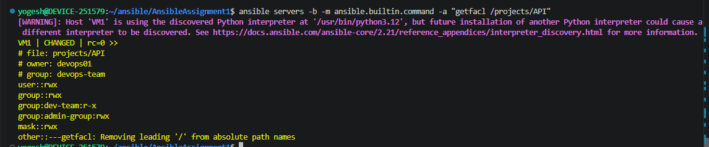
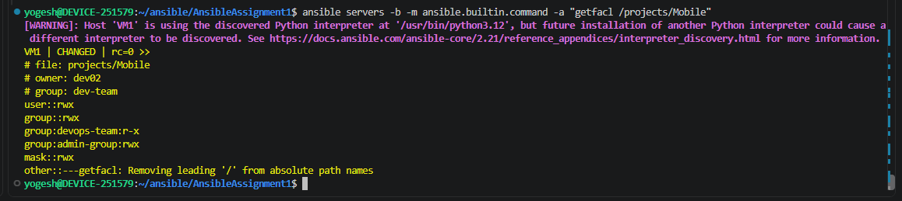

### 📊 Project Permission Matrix

| Project | Lead | Full Access | Read-Only |
|---|---|---|---|
| WebApp | dev01 | dev-team, admin-group | devops-team |
| API | devops01 | devops-team, admin-group | dev-team |
| Mobile | dev02 | dev-team, admin-group | devops-team |

---

## 7️⃣ Shared Resources — Read/Write for All Teams

```bash
ansible servers -b -m ansible.builtin.file -a "path=/shared/resources owner=root group=root mode=0770"
ansible servers -b -m ansible.builtin.command -a "setfacl -m g:dev-team:rwx /shared/resources"
ansible servers -b -m ansible.builtin.command -a "setfacl -m g:devops-team:rwx /shared/resources"
ansible servers -b -m ansible.builtin.command -a "setfacl -m g:admin-group:rwx /shared/resources"
```

**SGID** so new files inherit the directory's group automatically:
```bash
ansible servers -b -m ansible.builtin.file -a "path=/shared/resources mode=2770"
```

**Verify:**
```bash
ansible servers -b -m ansible.builtin.command -a "getfacl /shared/resources"
```
Expected:
```
user::rwx
group::rwx
group:dev-team:rwx
group:devops-team:rwx
group:admin-group:rwx
mask::rwx
other::---
```

---

## 8️⃣ Security & Permission Matrix (Final)

This is the summary section — Personal Workspace, Team Dirs, and Admin Area are configured here; Projects, Shared, and Archive were already handled above (Sections 6 & 7).

### 📊 Required Matrix

| Area | Rule |
|---|---|
| Personal Workspace | Owner: full · Team: read-only |
| Team Directories | Own team: full · Other teams: read-only |
| Project Directories | Lead: full · Assigned team: read/write · Others: read-only ✅ (done) |
| Shared Resources | All teams: read/write ✅ (done) |
| Archive | All users: read-only |
| Admin Areas | Only admin-group: full access |

### a) Personal Workspace — Owner full, team read-only

```bash
ansible servers -b -m ansible.builtin.file -a "path=/home/dev01 mode=0750"
ansible servers -b -m ansible.builtin.file -a "path=/home/devops01 mode=0750"
ansible servers -b -m ansible.builtin.file -a "path=/home/admin01 mode=0750"
```
`0750` → Owner: rwx · Group (own team, set at user creation): r-x · Others: none.
*(repeat for all 9 users)*

**Verify:**
```bash
ansible servers -b -m ansible.builtin.command -a "ls -ld /home/dev01 /home/devops01 /home/admin01"
```

### b) Team Directories — own team full, other teams read-only

```bash
ansible servers -b -m ansible.builtin.file -a "path=/team/dev owner=root group=dev-team mode=0750"
ansible servers -b -m ansible.builtin.command -a "setfacl -m g:devops-team:r-x /team/dev"
ansible servers -b -m ansible.builtin.command -a "setfacl -m g:admin-group:rwx /team/dev"

ansible servers -b -m ansible.builtin.file -a "path=/team/devops owner=root group=devops-team mode=0750"
ansible servers -b -m ansible.builtin.command -a "setfacl -m g:dev-team:r-x /team/devops"
ansible servers -b -m ansible.builtin.command -a "setfacl -m g:admin-group:rwx /team/devops"
```

**Verify:**
```bash
ansible servers -b -m ansible.builtin.command -a "getfacl /team/dev"
ansible servers -b -m ansible.builtin.command -a "getfacl /team/devops"
```

### c) Archive — read-only for everyone

```bash
ansible servers -b -m ansible.builtin.file -a "path=/archive owner=root group=root mode=0755" recurse=yes
ansible servers -b -m ansible.builtin.command -a "setfacl -R -m g:dev-team:r-x,g:devops-team:r-x,g:admin-group:r-x /archive"
```
`0755` → Owner: rwx · Group/Others: r-x (no write = nobody can modify completed projects).

**Verify:**
```bash
ansible servers -b -m ansible.builtin.command -a "ls -ld /archive /archive/WebApp /archive/API /archive/Mobile"
ansible servers -b -m ansible.builtin.command -a "getfacl /archive"
```

### d) Admin Area — admin-group only

```bash
ansible servers -b -m ansible.builtin.file -a "path=/admin owner=root group=admin-group mode=0770"
```
`0770` → Owner (root): rwx · Group (admin-group): rwx · Others: none — dev-team and devops-team get **zero** access, no ACL needed.

**Verify:**
```bash
ansible servers -b -m ansible.builtin.command -a "ls -ld /admin"
ansible servers -b -m ansible.builtin.command -a "sudo -u dev01 ls /admin"
```
The last command should fail with **Permission denied** for a non-admin user — confirming the restriction works.

### 🔎 Full Verification Pass

```bash
# groups
getent group dev-team devops-team admin-group

# users, uid, shell
id dev01 dev02 dev03 devops01 devops02 devops03 admin01 admin02 admin03
getent passwd dev01

# password policy
chage -l dev01

# permissions
ls -ld /home/dev01 /team/dev /team/devops /projects/WebApp /shared/resources /archive /admin

# ACL
getfacl /team/dev
getfacl /projects/WebApp
getfacl /shared/resources
getfacl /archive
```

---

## 🧠 Ansible Concepts Practiced

```
✔ Inventory & Ad-Hoc commands   ✔ become/sudo         ✔ ACL (setfacl/getfacl)
✔ user & group modules          ✔ UID/GID assignment  ✔ Password aging (chage)
✔ file module (dirs & perms)    ✔ Sudoers config       ✔ Idempotency
```

## 🎯 Learning Approach

```
Linux Concept → Manual Command → Ansible Module → Run Ad-Hoc → Verify on Node
```

Goal: understand **what** Ansible does, **why**, and **how Linux handles it underneath** — not just complete the assignment.