# Ansible Assignment 2

## Objective

To use Ansible **ad-hoc commands** to install and configure Nginx and Apache across two servers (worker nodes), manage log file sizes, host rotating team member websites, set up a reverse proxy, and apply different Ansible execution strategies (rolling/serial updates) instead of updating all servers at once.

---

## Problem Statement

1. Install Nginx on the servers and ensure the Nginx log files do not exceed 1 GB of space on each server.
2. Create one website per team member. Each website should be displayed on `<team>.opstree.com` for 2 hours, after which the next member's website should automatically start displaying (rotating every 2 hours).
   - First 2 hours → `<team>.opstree.com` shows **Tanya's** website
   - Next 2 hours → `<team>.opstree.com` shows **Heena's** website
3. Install Apache on the same nodes.
4. Configure Nginx as a reverse proxy in front of Apache.
5. Run all Ansible commands so that servers are updated **one by one** (not all at once), demonstrating the use of different Ansible strategies (`linear`, `free`, `serial`).

---

## Reverse Proxy Flow


```mermaid
flowchart LR
    User[User Browser] -->|"team1.opstree.com :80"| Nginx[Nginx :80]
    Nginx -->|proxy_pass| Apache[Apache :8080]
    Apache -->|response| Nginx --> User
```

---

## Prerequisites

- A control node with Ansible installed (`ansible --version` to confirm)
- 2 servers (EC2 instances / VMs) reachable via SSH
- SSH key-based access configured from control node to both servers
- Python installed on both servers (required by Ansible)
- Servers added to the inventory file under a `servers` group (default: `/etc/ansible/hosts`, or a custom inventory file passed with `-i`):
  ```ini
  [servers]
  server1 ansible_host=<IP-1>
  server2 ansible_host=<IP-2>
  ```
- Passwordless `sudo` (or `become` password available) on both servers for privileged tasks
- Ports 80 (Nginx) and 8080 (Apache) open in the security group / firewall of both servers
- Basic connectivity check passed:
  ```bash
  ansible all -m ping
  ```

---

## Approach

This assignment is done entirely using **ad-hoc commands** (`ansible <host-pattern> -m <module> -a "<args>"`), not playbooks. Every module is referenced using its **fully qualified collection name (FQCN)** — e.g. `ansible.builtin.apt` instead of just `apt` — which is the recommended practice in modern Ansible. Each command below performs one discrete task, and screenshots are attached to show the command and its output.

---

## Commands & Screenshots

### 1. Verify connectivity to both servers
```bash
ansible all -m .ping
```
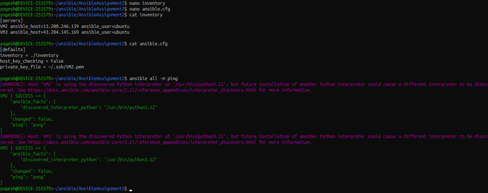

---

### 2. Install Nginx on the servers
```bash
ansible servers -b -m ansible.builtin.apt -a "name=nginx state=present update_cache=yes"
```
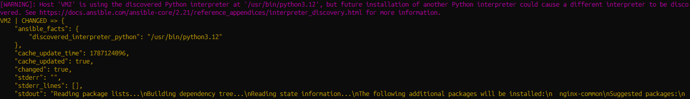
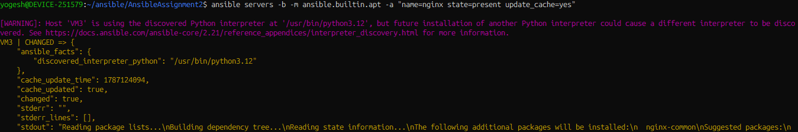

---

### Verify Nginx installation
```bash
ansible servers -m ansible.builtin.command -a "nginx -v"
```
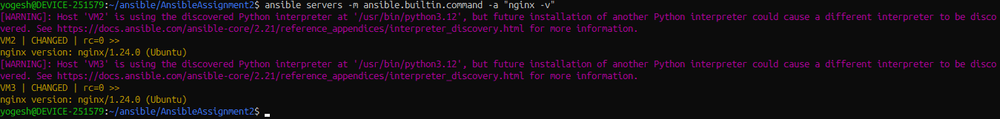

---

### 3. Start and enable Nginx
```bash
ansible servers -b -m ansible.builtin.service -a "name=nginx state=started enabled=yes"
```
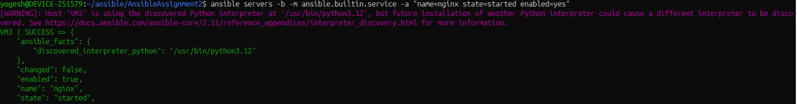


### verify Nginx is running
```bash
ansible servers -m ansible.builtin.shell -a "systemctl status nginx | grep 'Active:'"
```
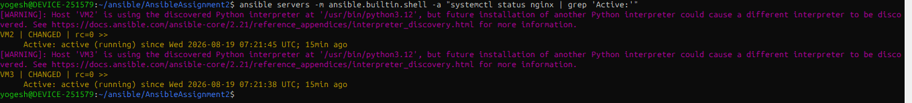

---

### 4. Configure logrotate to cap Nginx logs at 1 GB
```bash
ansible servers -b -m ansible.builtin.copy -a "dest=/etc/logrotate.d/nginx content='/var/log/nginx/*.log {\n  daily\n  missingok\n  rotate 5\n  maxsize 1G\n  compress\n  delaycompress\n  notifempty\n  create 0640 www-data adm\n}\n'"
```
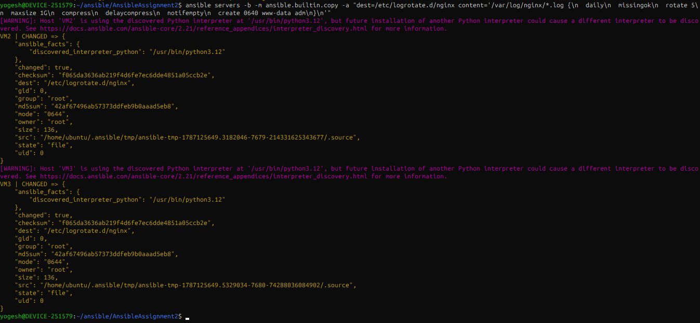

### Verify logrotate configuration
```bash
ansible servers -b -m ansible.builtin.command -a "cat /etc/logrotate.d/nginx"
```
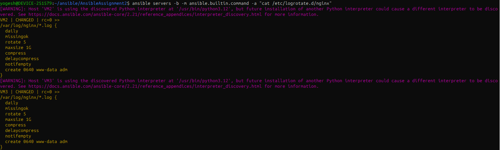
---

### 5. Create website directories for each team member
```bash
ansible servers -b -m ansible.builtin.file -a "path=/var/www/sites/yogesh state=directory mode=0755"
```
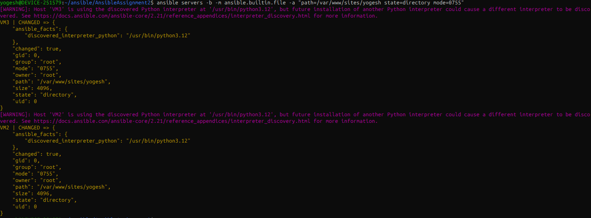

```bash
ansible servers -b -m ansible.builtin.file -a "path=/var/www/sites/bhumika state=directory mode=0755"
```

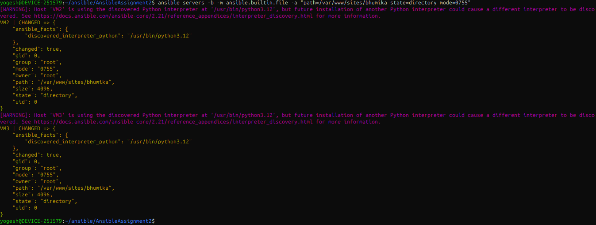

```bash
ansible servers -b -m ansible.builtin.file -a "path=/var/www/sites/devashish state=directory mode=0755"
```

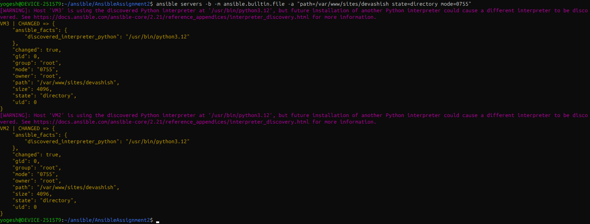

```bash
ansible servers -b -m ansible.builtin.file -a "path=/var/www/sites/jeet state=directory mode=0755"
```

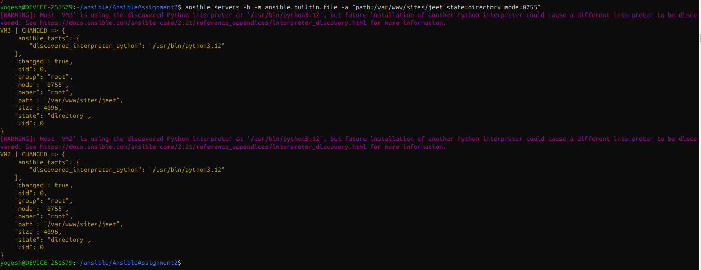

```bash
ansible servers -b -m ansible.builtin.file -a "path=/var/www/sites/mayank state=directory mode=0755"
```
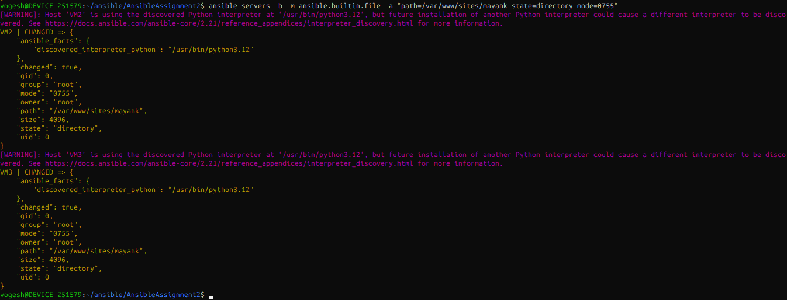

```bash
ansible servers -b -m ansible.builtin.file -a "path=/var/www/sites/prajwal state=directory mode=0755"
```
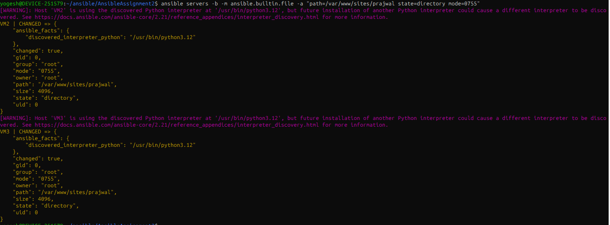

---

### 6. Deploy content for each member's website
```bash
ansible servers -b -m ansible.builtin.copy -a "dest=/var/www/sites/yogesh/index.html content='<h1>Yogesh Website</h1>'"
```
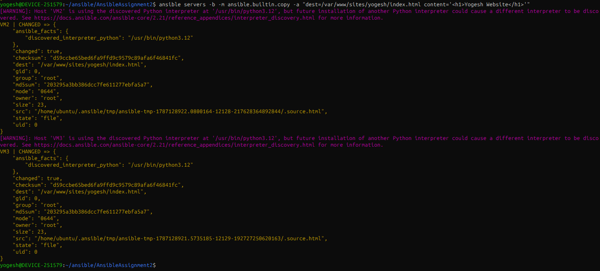

```bash
ansible servers -b -m ansible.builtin.copy -a "dest=/var/www/sites/bhumika/index.html content='<h1>Bhumika Website</h1>'"
```

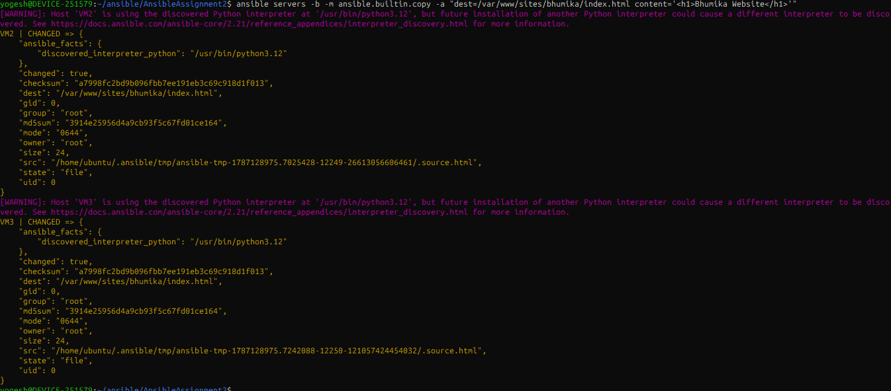

```bash
ansible servers -b -m ansible.builtin.copy -a "dest=/var/www/sites/devashish/index.html content='<h1>Devashish Website</h1>'"
```

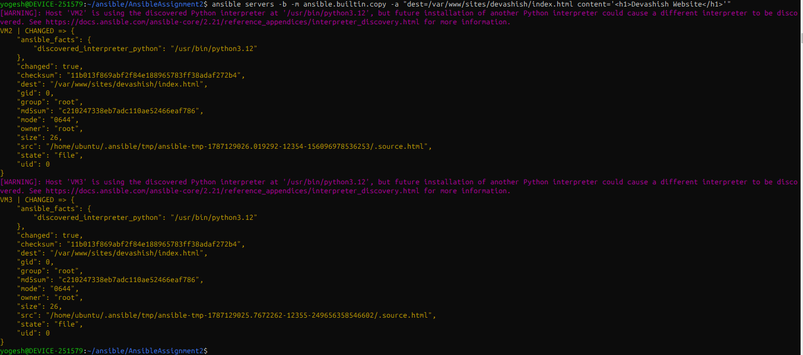

```bash
ansible servers -b -m ansible.builtin.copy -a "dest=/var/www/sites/jeet/index.html content='<h1>Jeet Website</h1>'"
```
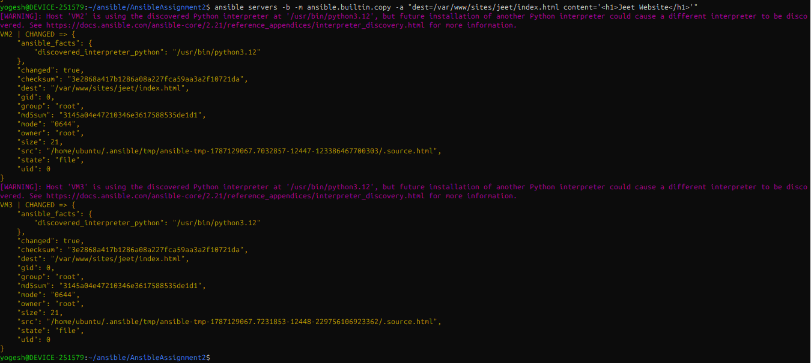

```bash
ansible servers -b -m ansible.builtin.copy -a "dest=/var/www/sites/mayank/index.html content='<h1>Mayank Website</h1>'"
```
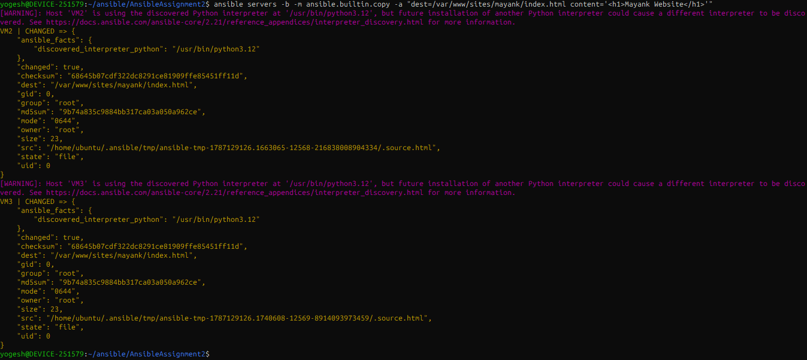

```bash
ansible servers -b -m ansible.builtin.copy -a "dest=/var/www/sites/prajwal/index.html content='<h1>Prajwal Website</h1>'"
```
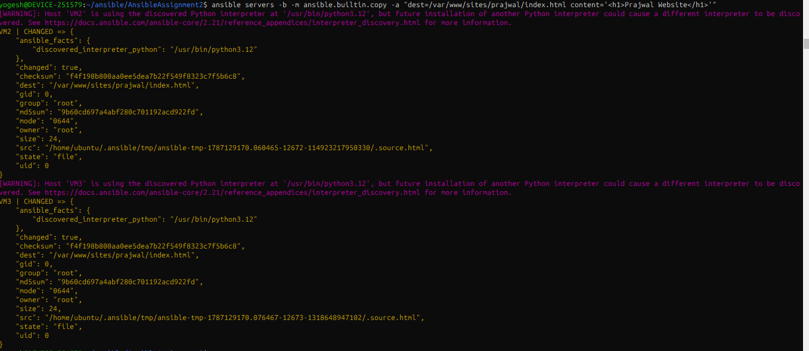

---

### 7. Create web root directory & point it to Yogesh's site initially (symlink)

```bash
ansible servers -b -m ansible.builtin.file -a "path=/var/www/html state=directory mode=0755"
```
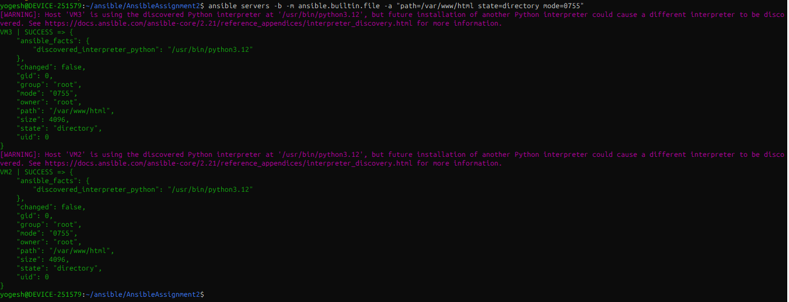

```bash
ansible servers -b -m ansible.builtin.file -a "src=/var/www/sites/yogesh dest=/var/www/html/team1 state=link"
```
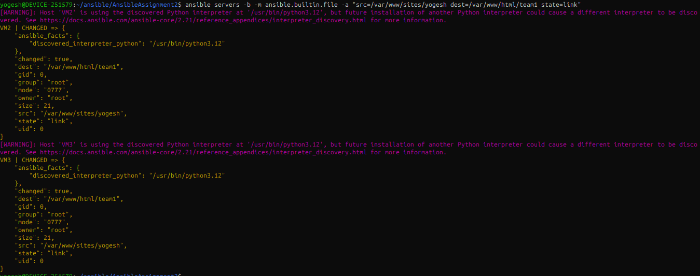

---

### 8. Create Nginx server block for the team domain
```bash
ansible servers -b -m ansible.builtin.copy -a "dest=/etc/nginx/sites-available/team1.opstree.com content='server {\n  listen 80;\n  server_name team1.opstree.com;\n  root /var/www/html/team1;\n  index index.html;\n}\n'"
```

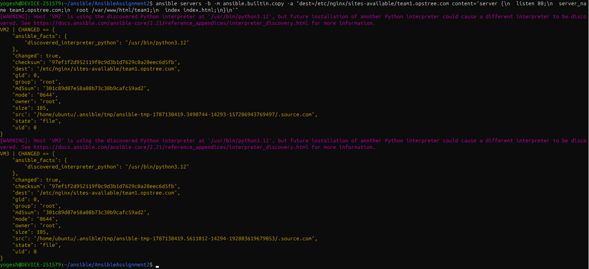

```bash
ansible servers -b -m ansible.builtin.file -a "src=/etc/nginx/sites-available/team1.opstree.com dest=/etc/nginx/sites-enabled/team1.opstree.com state=link"
```
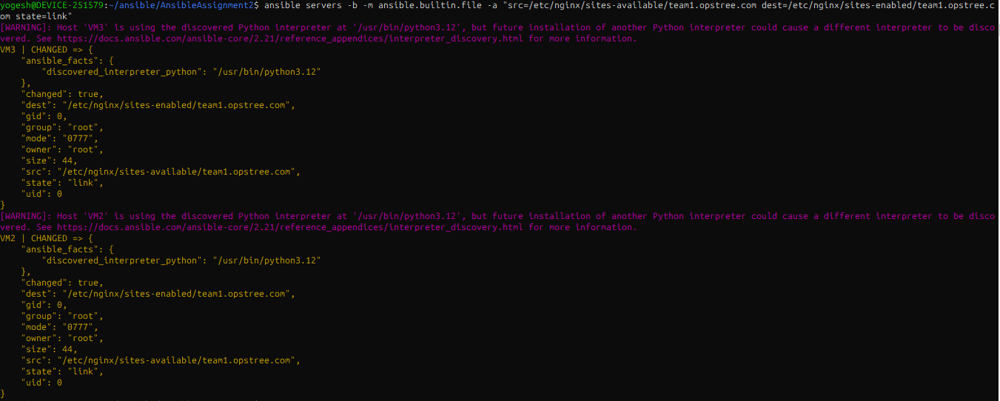

---

### 9. Create the rotation script on each node

```bash
nano rotate_site.sh
```
Round-robin site rotation script (multi-node)

Requirement: har 2 ghante (7200 seconds) me /var/www/html/team1 symlink ko team members ki list me se rotate karke ek member ki site pe point karo, aur nginx reload karo.

Draft/unsafe version (jo pehle diya gaya tha):

```bash
#!/bin/bash
MEMBERS=(yogesh bhumika devashish jeet mayank prajwal)
COUNT=${#MEMBERS[@]}
BLOCK=$(( $(date +%s) / 7200 ))
IDX=$(( BLOCK % COUNT ))
CURRENT=${MEMBERS[$IDX]}
ln -sfn /var/www/sites/$CURRENT /var/www/html/team1
systemctl reload nginx
```

---

###copy the script to each server using Ansible ad-hoc command
```bash
ansible servers -b -m ansible.builtin.copy -a "src=rotate_site.sh dest=/usr/local/bin/rotate_site.sh mode=0755"
```
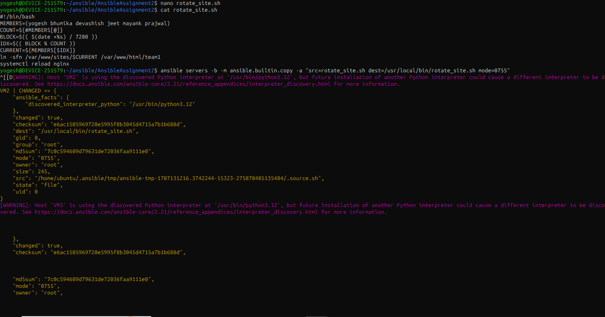
---

### 10. Schedule rotation every 2 hours via cron module
```bash
ansible servers -b -m ansible.builtin.cron -a "name='rotate team website test' minute='*/2' job='/usr/local/bin/rotate_site.sh'"
```
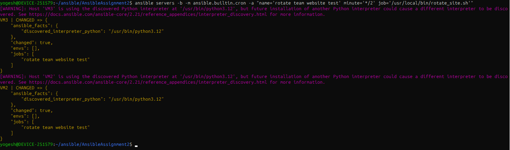
---

### 11. Reload Nginx to apply config
```bash
ansible servers -b -m ansible.builtin.service -a "name=nginx state=reloaded"
```
📸 *[Screenshot here]*

---

### 12. Install Apache
```bash
ansible servers -b -m ansible.builtin.apt -a "name=apache2 state=present update_cache=yes"
```
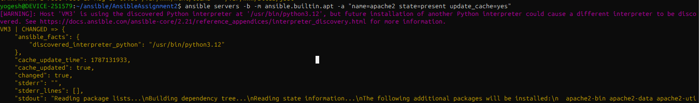
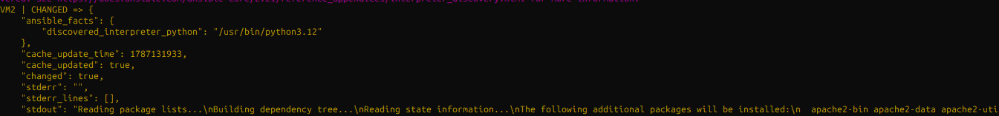
---

### 13. Change Apache to listen on port 8080 (avoid clash with Nginx on 80)
```bash
ansible servers -b -m ansible.builtin.lineinfile -a "path=/etc/apache2/ports.conf regexp='^Listen 80' line='Listen 8080'"
ansible servers -b -m ansible.builtin.lineinfile -a "path=/etc/apache2/sites-available/000-default.conf regexp='<VirtualHost \*:80>' line='<VirtualHost *:8080>'"
```

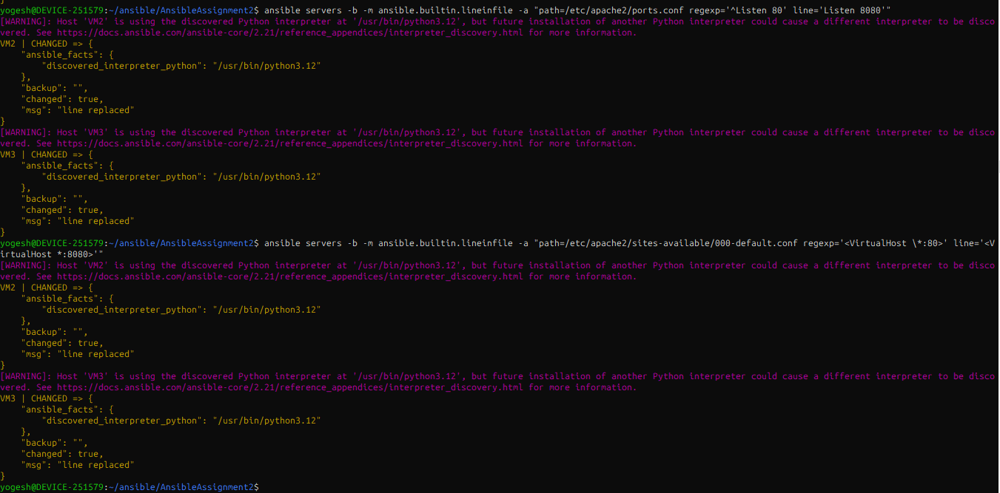


### Verify Apache is reachable
```bash
ansible servers -b -m ansible.builtin.command -a "curl -I http://localhost:8080"
```

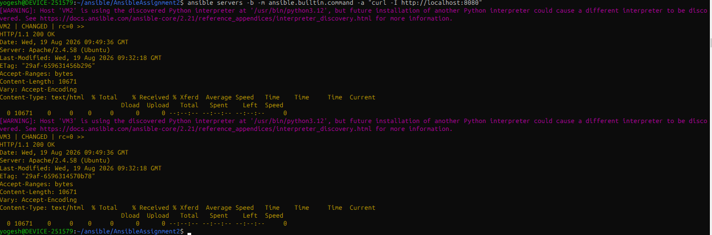
---

### 14. Restart Apache
```bash
ansible servers -b -m ansible.builtin.service -a "name=apache2 state=restarted enabled=yes"
```
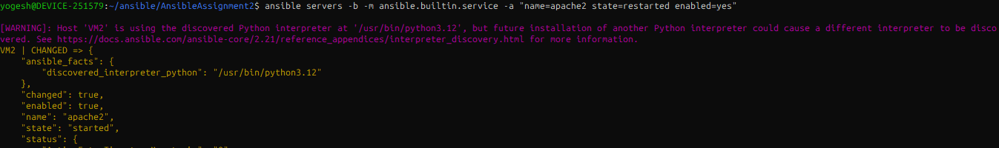
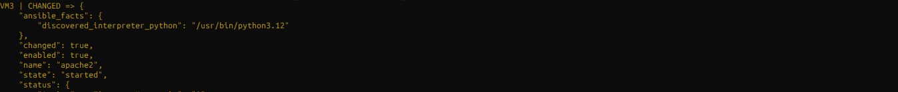

---

### 15. Configure Nginx as a reverse proxy to Apache
```bash
ansible servers -b -m ansible.builtin.copy -a "dest=/etc/nginx/sites-available/reverse-proxy.conf content='server {\n  listen 80;\n  server_name proxy.opstree.com;\n  location / {\n    proxy_pass http://127.0.0.1:8080;\n    proxy_set_header Host \$host;\n  }\n}\n'"
```
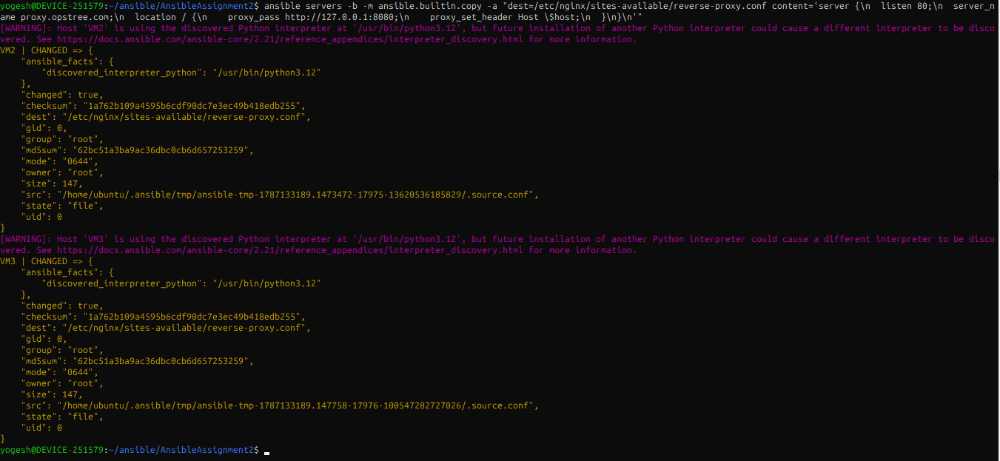

```bash
ansible servers -b -m ansible.builtin.file -a "src=/etc/nginx/sites-available/reverse-proxy.conf dest=/etc/nginx/sites-enabled/reverse-proxy.conf state=link"
```
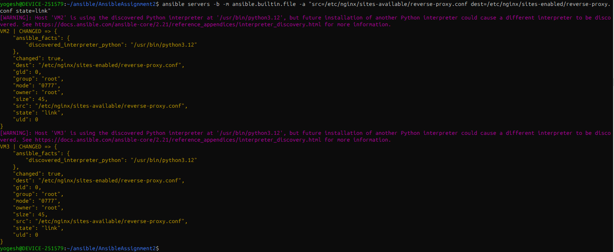
---

### 16. Test Nginx config validity
```bash
ansible servers -b -m ansible.builtin.command -a "nginx -t"
```
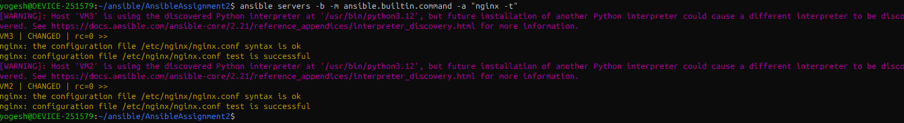
---

### 17. Reload Nginx again to pick up reverse proxy config
```bash
ansible servers -b -m ansible.builtin.service -a "name=nginx state=reloaded"
```
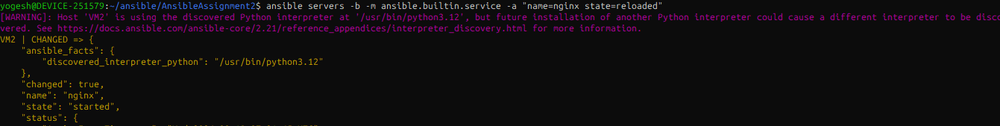

---

### 18. Verify Apache is reachable via Nginx reverse proxy

```bash
ansible servers -m ansible.builtin.uri -a "url=http://localhost:80"
```

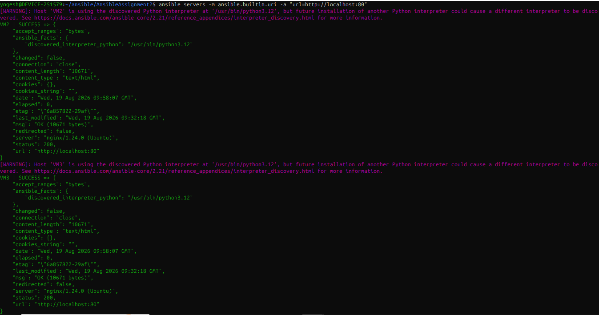

---

### Website Screenshots


---

## Node-by-node execution (not all at once) + strategies

All of the following are still ad-hoc commands — strategy and fork behavior is controlled via CLI flags, no playbook required.

### 19. One node at a time using `--forks=1` (linear/serial behavior)
```bash
ansible servers -b -m ansible.builtin.service -a "name=nginx state=restarted" --forks=1
```
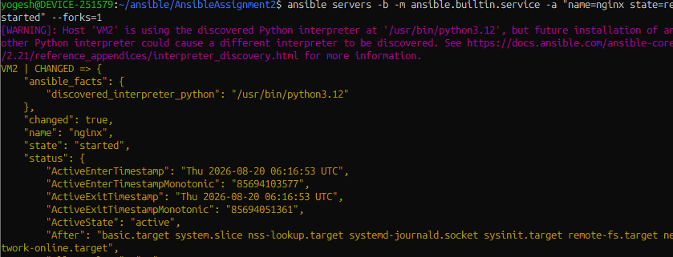
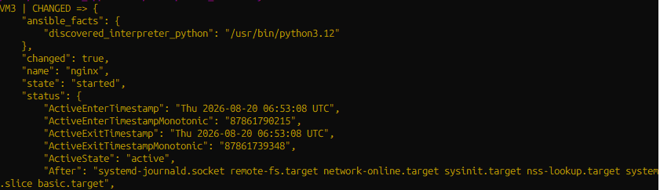

---

### 20. Free strategy — each host proceeds independently, doesn't wait for others
```bash
ansible servers -b -m ansible.builtin.service -a "name=nginx state=restarted" -e "ansible_strategy=free"
```
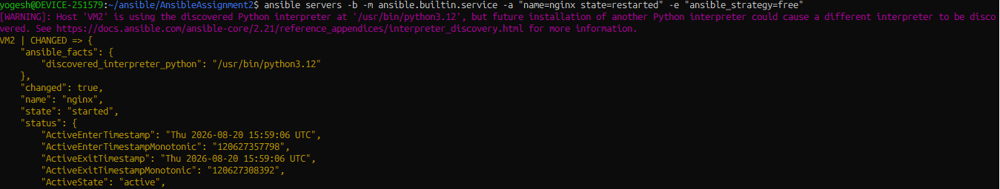

---

### 21. Manual rolling update — one specific host at a time (full control)
```bash
ansible server1 -b -m ansible.builtin.service -a "name=nginx state=restarted"
ansible server2 -b -m ansible.builtin.service -a "name=nginx state=restarted"
```
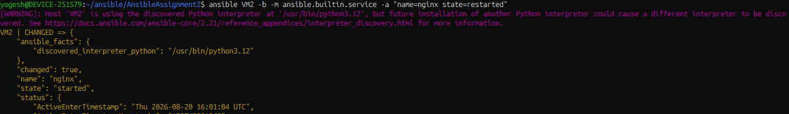

---

### 22. Confirm log file size stays within 1 GB
```bash
ansible servers -m ansible.builtin.shell -a "du -sh /var/log/nginx/access.log"
```
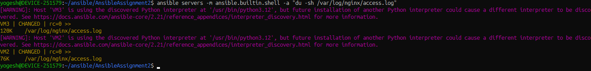

---

## Conclusion

Both servers were configured individually using Ansible ad-hoc commands built entirely on `ansible.builtin` modules, updated one at a time instead of simultaneously, and verified to be serving the correct rotating website with Nginx acting as a reverse proxy to Apache — all while keeping Nginx log growth capped at 1 GB.