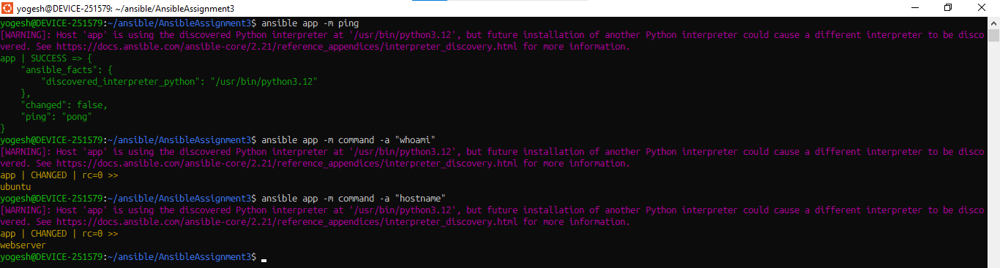
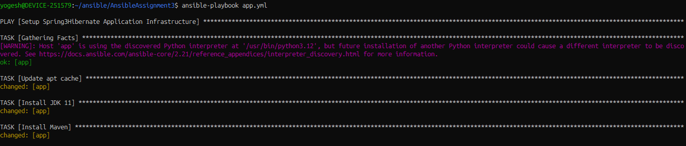
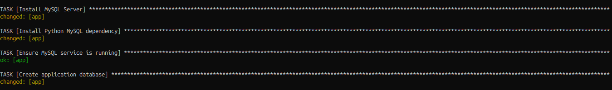
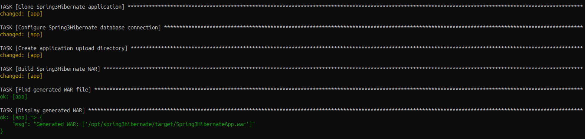
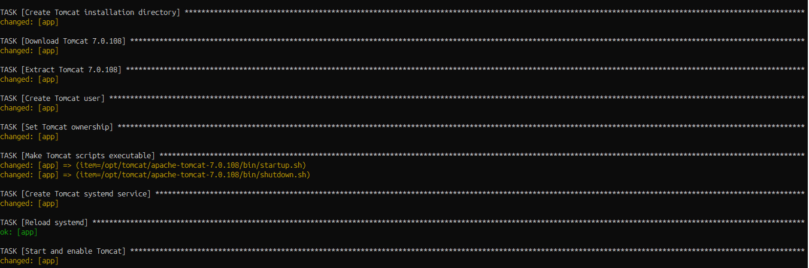
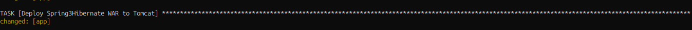
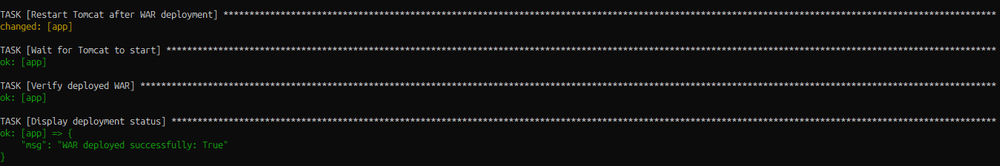
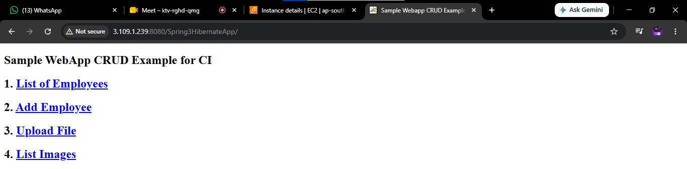

# Ansible Assignment - 3: Spring3HibernateApp Infrastructure Setup on AWS

**Author:** Yogesh Indoria

## Objective

The objective of this assignment is to provision and configure a complete application infrastructure on AWS using an Ansible playbook, and deploy the `Spring3HibernateApp` Java application on it in a fully automated manner. The playbook handles everything from installing dependencies to building the application and deploying it on Tomcat.

## About the Application

**Repository:** [opstree/spring3hibernate](https://github.com/opstree/spring3hibernate)

Spring3HibernateApp is a Java-based application built for various testing purposes, used here to demonstrate an end-to-end Java web application deployment pipeline using Spring, Hibernate, and MySQL.

- **Website:** https://opstree.github.io

## Prerequisites

Before running this playbook, ensure the following are in place:

- An AWS EC2 instance (Ubuntu) provisioned and reachable via SSH
- Ansible installed on the control node
- SSH key-based access configured to the target host
- The target host added to the Ansible inventory under the `app` group
- `become` (sudo) privileges available for the Ansible user on the target host
- Internet access on the target host (to install packages, clone the repo, and download Tomcat)

## Infrastructure & Tools Used

| Component | Version / Details |
|---|---|
| Cloud Provider | AWS EC2 |
| Configuration Management | Ansible |
| OS | Ubuntu |
| JDK | OpenJDK 11 |
| Build Tool | Maven |
| Database | MySQL Server |
| Application Server | Apache Tomcat 7.0.108 |
| Source Control | Git |

## What the Playbook Does

The `app.yml` playbook automates the following steps:

1. **System preparation**
   - Updates the apt package cache
   - Installs OpenJDK 11, Maven, and Git
   - Verifies Java and Maven installations

2. **Database setup**
   - Installs MySQL Server and the `python3-pymysql` dependency
   - Starts and enables the MySQL service
   - Creates the application database `employeedb`

3. **Application build**
   - Clones the `Spring3HibernateApp` repository from GitHub into `/opt/spring3hibernate`
   - Configures `database.properties` with the DB connection, Hibernate dialect, and upload directory settings
   - Creates the upload directory (`/tmp/uploads`)
   - Builds the application using `mvn clean package -DskipTests`
   - Locates the generated WAR file

4. **Tomcat setup**
   - Downloads and extracts Apache Tomcat 7.0.108 to `/opt/tomcat`
   - Creates a dedicated `tomcat` system user
   - Sets correct ownership and executable permissions on Tomcat scripts
   - Creates and registers a `tomcat.service` systemd unit
   - Starts and enables the Tomcat service

5. **Deployment**
   - Copies the generated WAR file to `/opt/tomcat/apache-tomcat-7.0.108/webapps/`
   - Restarts the Tomcat service to trigger deployment
   - Waits for Tomcat to come up on port 8080
   - Verifies the WAR file was deployed successfully
   - Sends an HTTP request to confirm the application is accessible

## Task-wise Execution & Screenshots

As per the problem statement, each task below corresponds to specific plays/tasks in `app.yml`. Add a screenshot for each task right below its placeholder while executing the playbook.

### Connection Verification




### Task 1: Install JDK 11
_Tasks: "Install JDK 11", "Verify Java installation", "Display Java version"_



### Task 2: Install MySQL
_Tasks: "Install MySQL Server", "Install Python MySQL dependency", "Ensure MySQL service is running", "Create application database"_



### Task 3: Create the WAR file for Spring3HibernateApp using Maven
_Tasks: "Clone Spring3Hibernate application", "Configure Spring3Hibernate database connection", "Build Spring3Hibernate WAR", "Find generated WAR file", "Display generated WAR"_



### Task 4: Install Tomcat
_Tasks: "Create Tomcat installation directory", "Download Tomcat 7.0.108", "Extract Tomcat 7.0.108", "Create Tomcat user", "Set Tomcat ownership", "Make Tomcat scripts executable", "Create Tomcat systemd service", "Reload systemd", "Start and enable Tomcat"_



### Task 5: Send the WAR file to `/opt/tomcat/apache-tomcat-7.0.108/webapps/`
_Task: "Deploy Spring3Hibernate WAR to Tomcat"_



### Task 6: Restart Tomcat service
_Tasks: "Restart Tomcat after WAR deployment", "Wait for Tomcat to start", "Verify deployed WAR", "Display deployment status"_



### Final Output: Application Running
_Tasks: "Check Spring3Hibernate application", "Display application status"_



> **Note:** Create a `screenshots/` folder in the repo alongside `README.md` and place the corresponding images there using the filenames referenced above (or update the paths/names as per your actual screenshots).

## Playbook Structure

```
.
├── app.yml            # Main Ansible playbook
├── inventory          # Ansible inventory file with 'app' host group
├── screenshots/        # Task-wise execution screenshots
│   ├── task1-jdk11.png
│   ├── task2-mysql.png
│   ├── task3-maven-war-build.png
│   ├── task4-install-tomcat.png
│   ├── task5-deploy-war.png
│   ├── task6-restart-tomcat.png
│   └── final-output-app-running.png
└── README.md          # This file
```

## Inventory Example

```ini
[app]
<ec2-public-ip> ansible_user=ubuntu ansible_ssh_private_key_file=~/.ssh/your-key.pem
```

## How to Run

1. Clone/copy this repository to your Ansible control node.
2. Update the `inventory` file with your AWS EC2 instance details.
3. Ensure your SSH key has correct permissions:
   ```bash
   chmod 400 your-key.pem
   ```
4. Run the playbook:
   ```bash
   ansible-playbook -i inventory app.yml
   ```
5. Once the playbook completes, verify the application in a browser:
   ```
   http://<ec2-public-ip>:8080/Spring3HibernateApp/
   ```

## Verification

The playbook itself performs verification at the end by:
- Confirming the WAR file exists in the Tomcat `webapps` directory
- Sending an HTTP GET request to the application URL and checking for a `200` or `302` response

You can also manually verify by:
- Checking Tomcat service status: `sudo systemctl status tomcat`
- Checking MySQL service status: `sudo systemctl status mysql`
- Viewing Tomcat logs: `/opt/tomcat/apache-tomcat-7.0.108/logs/catalina.out`

## Notes

- Tomcat 7.0.108 is used since the application targets an older Java web app stack.
- Maven build tests are skipped (`-DskipTests`) to speed up the build process.
- Default MySQL root credentials are used in `database.properties` for demonstration purposes; in a production setup, these should be replaced with a dedicated DB user and secrets management (e.g., Ansible Vault).

## Author

**Yogesh Indoria**