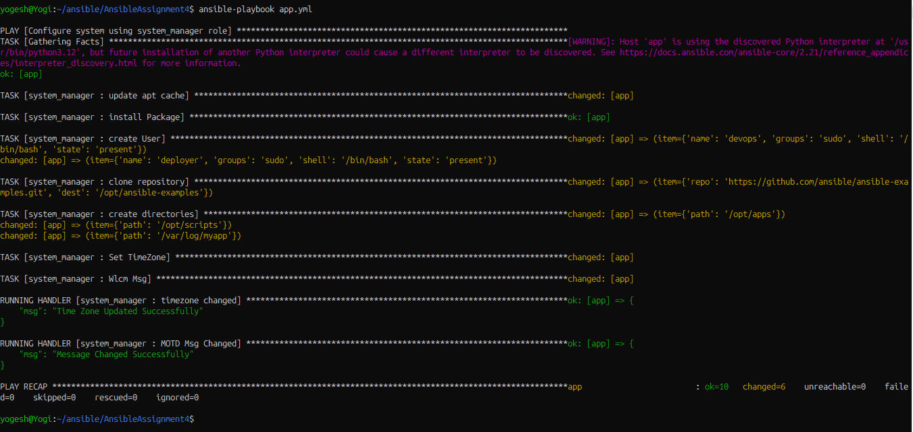

# Ansible System Manager Role

## Objective

Create an Ansible `system_manager` role to manage common system-level
configurations on a Linux server.

The role can be used to manage:
- Software packages
- System users
- Git repositories
- Required folder structures
- Other basic system settings (timezone, MOTD)

## Author

Yogesh Indoria

## Project Structure

```
.
├── ansible.cfg
├── app.yml
├── inventory.ini
├── problem_statement.txt
├── roles
│   └── system_manager
│       ├── README.md
│       ├── defaults
│       │   └── main.yml        # all configurable variables live here
│       ├── files
│       ├── handlers
│       │   └── main.yml        # e.g. restart cron after timezone change
│       ├── meta
│       │   └── main.yml        # role metadata (author, supported OS)
│       ├── tasks
│       │   ├── main.yml        # includes all task files below, in order
│       │   ├── package.yml     # software installation
│       │   ├── user.yml        # user management
│       │   ├── dir.yml         # folder structure
│       │   ├── git.yml         # git repository management
│       │   └── setting.yml     # timezone + MOTD
│       ├── templates
│       │   └── motd.j2
│       ├── tests
│       │   ├── inventory
│       │   └── test.yml
│       └── vars
│           └── main.yml
└── screenshots
    └── image.png
```

## How the role is organized

Instead of putting every task in one long `tasks/main.yml`, the role
splits tasks by concern into separate files, and `tasks/main.yml` just
includes them in order using `include_tasks`:

| File | Responsibility |
|---|---|
| `package.yml` | Update apt cache + install packages from `system_manager_packages` |
| `user.yml` | Create/manage OS users from `system_manager_users` |
| `dir.yml` | Ensure directories from `system_manager_directories` exist |
| `git.yml` | Clone/update repos from `system_manager_git_repos` |
| `setting.yml` | Set timezone + deploy `/etc/motd` |

Order matters: packages are installed first (so `git` itself is
available before the git tasks run), users and directories next, then
git repos, then general settings last.

## Role Variables

All configurable data lives in `roles/system_manager/defaults/main.yml`:

- `system_manager_packages` — list of package names to install
- `system_manager_users` — list of user objects (`name`, `groups`, `shell`, `state`)
- `system_manager_git_repos` — list of repo objects (`repo`, `dest`, `version`)
- `system_manager_directories` — list of directory objects (`path`, `mode`)
- `system_manager_timezone` — system timezone string
- `system_manager_motd_message` — text shown in `/etc/motd`

Override any of these from `app.yml`, in group/host vars, or with `-e`
on the command line.

## Example Playbook (`app.yml`)

```yaml
- name: Configure system using system_manager role
  hosts: servers
  become: true
  gather_facts: true

  roles:
    - system_manager
```

## How to run

```bash
# Syntax check
ansible-playbook app.yml --syntax-check

# Apply for real
ansible-playbook app.yml
```

## Verify Result



