# Ansible Assignment – SonarQube Role

**Author:** Yogesh Indoria

---

## Objective

Create a reusable and OS-independent Ansible role to install, configure, and manage **SonarQube** on Ubuntu and Red Hat/CentOS-family servers.

The role should:
- Support version-specific SonarQube installation
- Support Ubuntu and Red Hat/CentOS-family operating systems
- Use variable-driven configuration
- Use Jinja2 templates for dynamic configuration
- Include separate handlers
- Allow execution on Ubuntu, Red Hat/CentOS, or both

---

## Requirements & Implementation

### 1. Ansible Role Structure

The project follows the standard Ansible role structure with separate directories for tasks, handlers, templates, defaults, variables, and metadata.

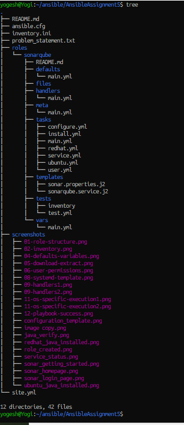

### 2. Inventory & Multiple OS Support

The inventory contains separate groups for Ubuntu and Red Hat servers.

```ini
[ubuntu]
ubuntu1

[redhat]
rhel1
```

OS-specific tasks are selected using `ansible_os_family`.

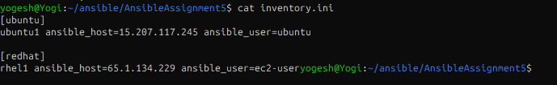

### 3. Java Installation

Java 21 is installed using the appropriate package for each operating system.

- **Ubuntu:** `openjdk-21-jdk`
- **Red Hat/CentOS:** `java-21-openjdk`

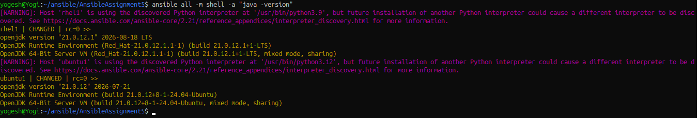

### 4. SonarQube Version & Variables

SonarQube version, web host, port, user, group, installation path, Java packages, and download URL are defined as variables in `defaults/main.yml`.

This keeps the role reusable without hardcoding configuration values.

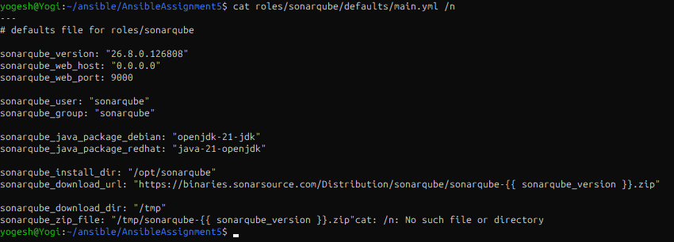

### 5. SonarQube Download & Extraction

The specified SonarQube archive is downloaded using the version variable and extracted under `/opt`.

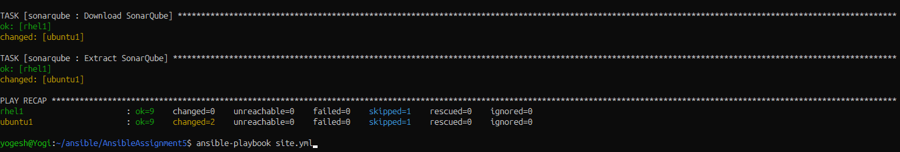

### 6. User, Group & Permissions

A dedicated `sonarqube` user and group are created. The SonarQube installation files are assigned to the correct user and group.

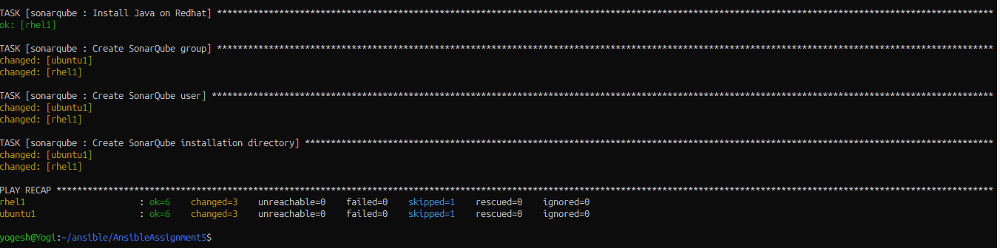

### 7. Jinja2 Configuration Template

The SonarQube configuration is generated using a Jinja2 template.

Example:

```jinja2
sonar.web.host={{ sonarqube_web_host }}
sonar.web.port={{ sonarqube_web_port }}
```

This allows configuration values to be changed through variables without modifying the task or template structure.

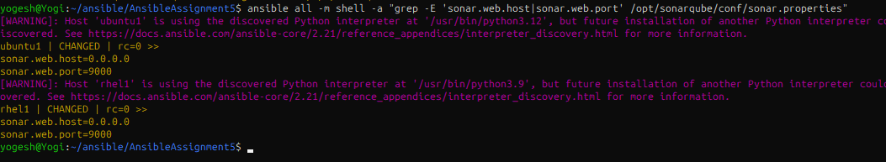

### 8. Systemd Service Template

A Jinja2 template is used to create the SonarQube systemd service.

The service runs SonarQube using the dedicated `sonarqube` user and group.

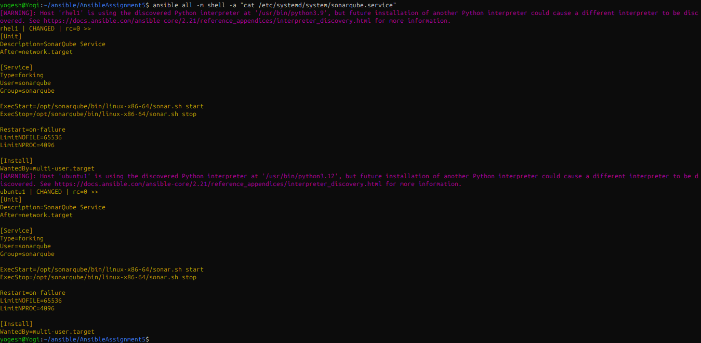

### 9. Handlers

Handlers are defined separately from tasks.

Configuration changes notify the SonarQube restart handler, avoiding unnecessary service restarts when no configuration change occurs.

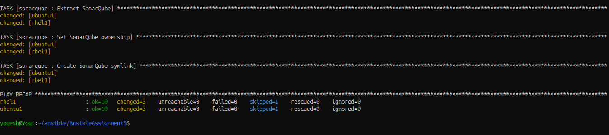

### 10. Enable & Start SonarQube

The role creates the systemd service and ensures that SonarQube is enabled and running.


### 11. OS-Specific Execution

The same role can be executed on Ubuntu, Red Hat/CentOS-family systems, or both.

**Ubuntu only:**

```bash
ansible-playbook site.yml --limit ubuntu
```

**Red Hat/CentOS-family only:**

```bash
ansible-playbook site.yml --limit redhat
```

**Both:**

```bash
ansible-playbook site.yml
```

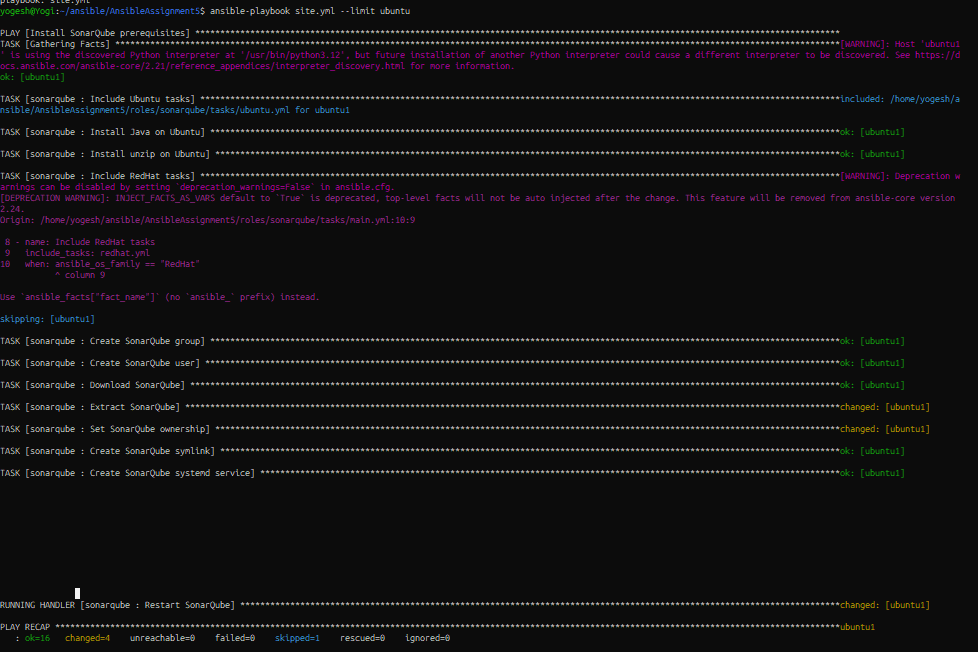

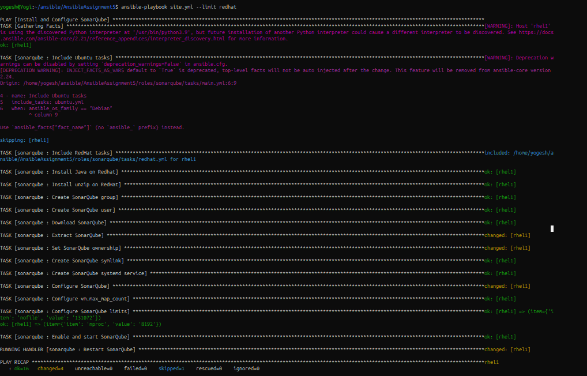

### 12. Successful Deployment

The playbook completes successfully on the target servers without failed or unreachable hosts.

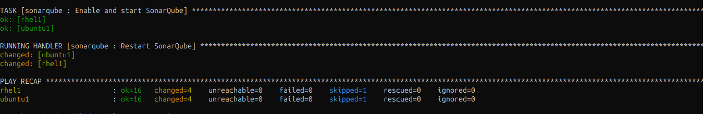

### 13. SonarQube Verification

SonarQube is accessible through the web interface and the application dashboard is available.


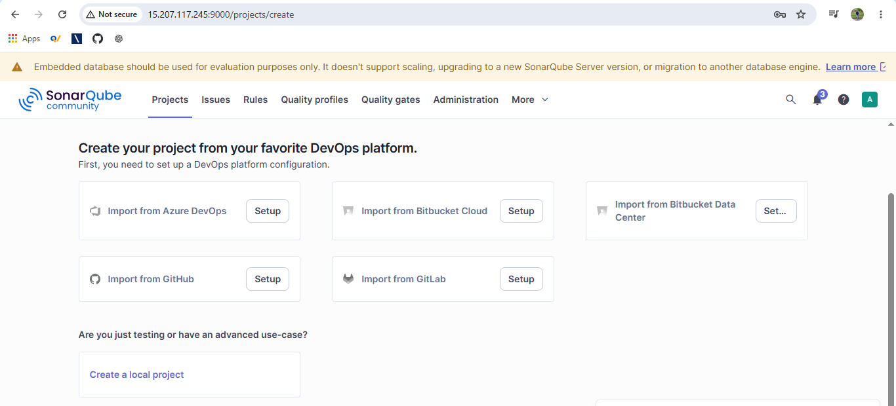

---

## Project Structure

```text
AnsibleAssignment5/
├── ansible.cfg
├── inventory.ini
├── problem_statement.txt
├── site.yml
├── roles/
│   └── sonarqube/
│       ├── README.md
│       ├── defaults/
│       │   └── main.yml
│       ├── files/
│       ├── handlers/
│       │   └── main.yml
│       ├── meta/
│       │   └── main.yml
│       ├── tasks/
│       │   ├── main.yml
│       │   ├── ubuntu.yml
│       │   ├── redhat.yml
│       │   ├── user.yml
│       │   ├── install.yml
│       │   ├── configure.yml
│       │   └── service.yml
│       ├── templates/
│       │   ├── sonar.properties.j2
│       │   └── sonarqube.service.j2
│       ├── tests/
│       │   ├── inventory
│       │   └── test.yml
│       └── vars/
│           └── main.yml
└── screenshots/
```

---

## Result

SonarQube installation and configuration have been automated using a reusable Ansible role that supports **Ubuntu and Red Hat/CentOS-family systems**, uses **variable-driven configuration and Jinja2 templates**, and manages SonarQube as a **systemd service**.

---

**Author: Yogesh Indoria**
