# Linux Assignment 7

This assignment is about creating a Bash utility to manage build operations of a Maven based Java project.

The utility used in this assignment is `buildMaven.sh`. The Java project used for the assignment is `spring3hibernate`.

---

## Assignment Overview

The utility provides options for:

- Generating the project artifact
- Installing the artifact to the local Maven repository
- Running static code analysis
- Running unit tests and code coverage
- Deploying the artifact to Tomcat

The assignment also has optional tasks for generating documentation and adding build thresholds.

Repo: https://github.com/opstree/spring3hibernate.git

---

## Project Structure

```text
.
├── buildMaven.sh
├── pom.xml
├── screenshots/
└── README.md
```

---

# Part A - Maven Build Utility

## Help

```bash
./buildMaven.sh -h
```

The help output shows the available options:

```text
-a              Generate artifact
-i              Install artifact to local repository
-s <tool>       Run static code analysis
-t <plugin>     Run unit tests
-d              Deploy artifact to Tomcat
-h              Show help
```

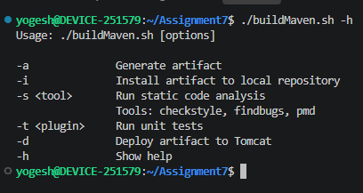

## Generate Artifact

The `-a` option is used to generate the project artifact.

```bash
./buildMaven.sh -a
```

The script uses Maven to generate the project artifact.

The project is a WAR application and the WAR is named `Spring3HibernateApp.war`.

> A separate successful screenshot for this command was not available in the submitted evidence.

---

## Install Artifact

The `-i` option installs the generated artifact into the local Maven repository.

```bash
./buildMaven.sh -i
```

> A separate successful screenshot for this command was not available in the submitted evidence.

---

## Static Code Analysis

The `-s` option is used to run static code analysis.

### Checkstyle

```bash
./buildMaven.sh -s checkstyle
```

The submitted output shows Checkstyle violations and a build failure.


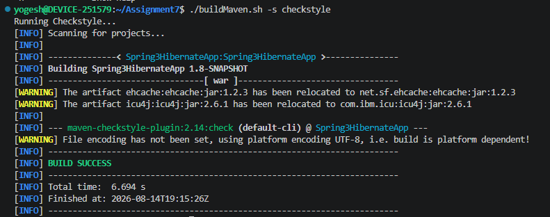


### FindBugs

```bash
./buildMaven.sh -s findbugs
```

FindBugs is supported by the script and configured in the Maven project.

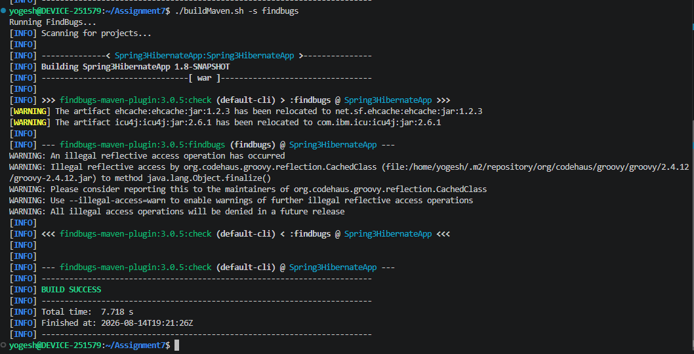

### PMD

```bash
./buildMaven.sh -s pmd
```

The submitted output shows that PMD found 20 violations and the build failed.

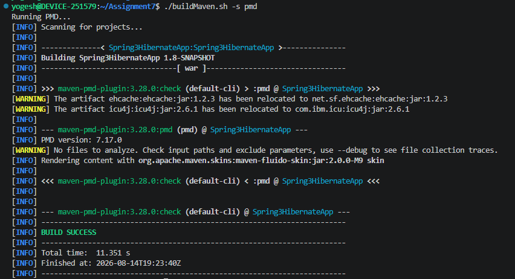

---

## Unit Tests and Code Coverage

The `-t` option is used to run unit tests.

```bash
./buildMaven.sh -t <unit_test_plugin_name>
```

The submitted solution attempted to use cobertura for code coverage, but the Maven plugin was not found.

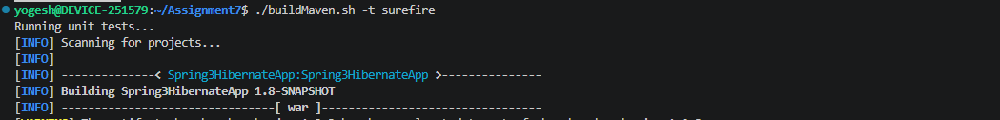

Generated coverage and test report files were also present in the project.

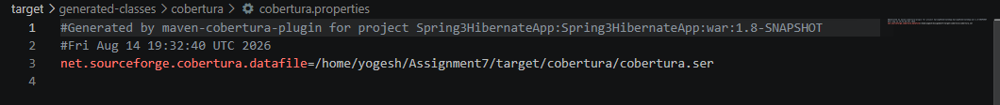

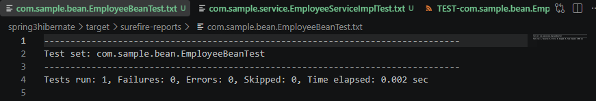

---

## Deploy Artifact to Tomcat

The `-d` option is used to deploy the generated WAR file to Tomcat.

```bash
./buildMaven.sh -d
```

The script copies:

```text
target/Spring3HibernateApp.war
```

to the Tomcat webapps directory.

The first deployment attempt had a permission error.

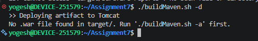

After fixing the permission issue, the WAR was copied successfully.

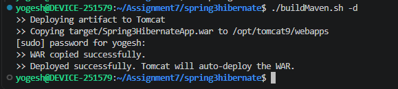

---

## Verify Tomcat

Tomcat 9 was running on the system.

```bash
sudo systemctl status tomcat9
```

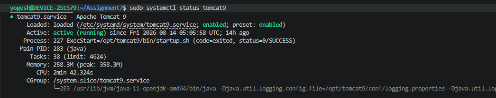

The deployed application was also checked using:

```bash
curl -I http://localhost:8080/Spring3HibernateApp/
```

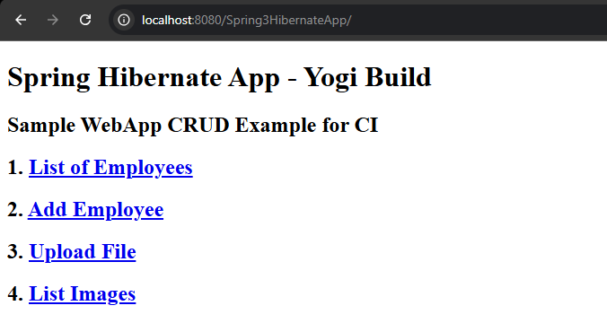

---

# Part B - Optional Requirements

The assignment also mentions:

- Generate application documentation
- Add thresholds for Checkstyle
- Add thresholds for FindBugs
- Add thresholds for PMD
- Add code coverage thresholds

These are optional parts of the assignment.

---

## Maven Configuration

The Maven project contains configuration for:

- Checkstyle
- FindBugs
- PMD
- Cobertura
- Maven Compiler
- Maven WAR Plugin
- Tomcat Maven Plugin

The WAR name is:

```text
Spring3HibernateApp.war
```

---

# Problems Faced

Some operations produced errors while working on the assignment.

### Checkstyle

The project had many Checkstyle violations.

```text
BUILD FAILURE
You have 813 Checkstyle violations.
```

### PMD

PMD reported 20 violations.

### Unit Test / Coverage

The cobertura  command failed because the plugin was not found in the configured Maven plugin groups.

### Tomcat Deployment

The first deployment attempt failed because of permissions on the Tomcat `webapps` directory. After fixing the permissions, the WAR was copied successfully.

---

# Technologies Used

- Bash
- Maven
- Java
- Checkstyle
- FindBugs
- PMD
-  Cobertura
- Apache Tomcat
- Git

---

# Bash Concepts Practiced

- Bash scripting
- Command line arguments
- `case` statements
- Functions
- Variables
- Conditional statements
- Running external commands
- Handling command output
- Checking command success and failure

---

# Learning

This assignment helped me practice using Bash to automate Maven build operations.

I also got hands-on practice with static code analysis, unit testing, code coverage and deploying a WAR application to Tomcat.

---

# Author

**Yogesh Indoria**

Linux / DevOps Assignment 7
