# Assignment 8 – Git Branching, Merging, Tags and Reporting

## Objective

This assignment is about getting comfortable with the day to day git
workflow that most teams use — creating branches, merging them in
different ways (fast-forward, no-ff, and with conflicts), tagging
releases, and pulling a commit history report out of a repo. Along
with doing it manually (Part A), I also wrote a few shell scripts so
the same operations can be done from the command line without typing
out the full git commands every time (Part B, C and D).

## Repo layout

```
assignment8/
├── README.md              
├── ninja/
│   └── README.md 
|          
├── gitBranches.sh       
├── gitTags.sh           
├── gitCommitReport.sh   
|
├── commit_report_demo_repo.csv
├──gitCommitReport-sample.html
|
└── screenshots/              
```


## Part A – branching and merging by hand

Steps I followed:

1. Created a `ninja` folder at repo root and added `ninja/README.md`
   with the content `Trying fast forward merge`.

   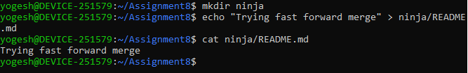

2. Created a branch called `ninja` and switched to it, then ran
   `git status` to confirm the untracked file showed up.

   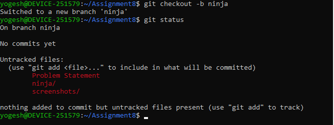

3. Committed the change on the `ninja` branch.

   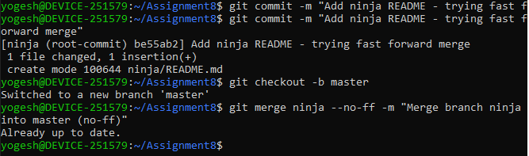

4. Merged `ninja` into `master`. Since `master` hadn't moved, a plain
   merge would have just fast-forwarded, so I used
   `git merge ninja --no-ff` to force a real merge commit.

   

5. On `master`, edited `ninja/README.md` to say
   `Changes in master branch` and committed it.

   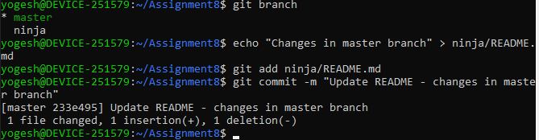

6. Switched back to `ninja`, edited the same file to say
   `Changes in ninja branch` and committed that too. So now both
   branches have diverging changes on the same line of the same file
   — recipe for a conflict.

   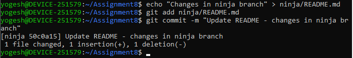

7. Merged `ninja` into `master` again. This time git can't
   auto-merge and throws a conflict:

   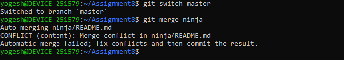

8. Resolved it so that the ninja branch wins over master, using
   `git checkout --theirs ninja/README.md` (since we're merging
   *into* master, "theirs" = the branch being merged in, i.e.
   `ninja`), staged it and committed the merge.

   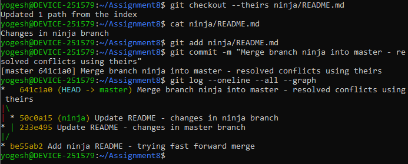

   Final `ninja/README.md` content is `Changes in ninja branch`, and
   `git log --graph` shows the full history — the ff-avoided merge,
   then the two divergent commits, then the conflict-resolution merge
   commit at the tip.

### Good to do — same thing with rebase

Did the same scenario again in a throw-away repo but using rebase
instead of merge. First rebase is basically a no-op fast-forward of
`master` onto `ninja` since master hadn't diverged. After both
branches change the same file, rebasing `ninja` onto `master` hits
the same kind of conflict:

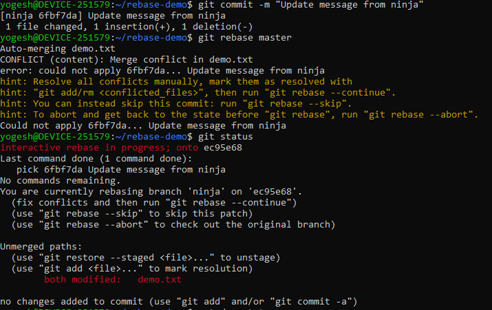

One thing that's easy to mix up: during a **rebase**, "ours" refers
to the branch you're rebasing *onto* (`master` here) and "theirs" is
the commit being replayed (from `ninja`) — it's flipped compared to a
normal merge. So to keep ninja's changes I again ran
`git checkout --theirs`, staged, and `git rebase --continue`:

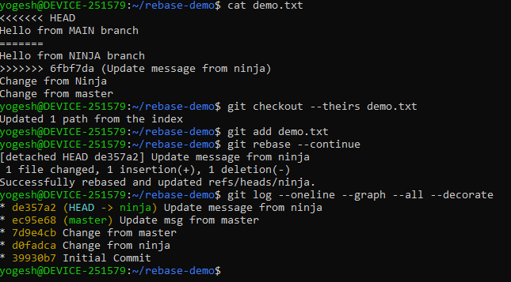

End result is a clean, linear history instead of a merge commit.

---

## Part B – `gitBranches.sh`

Wrapper script for the common branch operations.

```
./gitBranches.sh -l                                 # list branches
./gitBranches.sh -b <branch_name>                    # create branch
./gitBranches.sh -d <branch_name>                    # delete branch
./gitBranches.sh -m -1 <branch1> -2 <branch2>         # merge branch1 into branch2
./gitBranches.sh -r -1 <branch1> -2 <branch2>         # rebase branch1 onto branch2
```

Tested it against a scratch repo — list, create, merge, rebase and
delete all working:

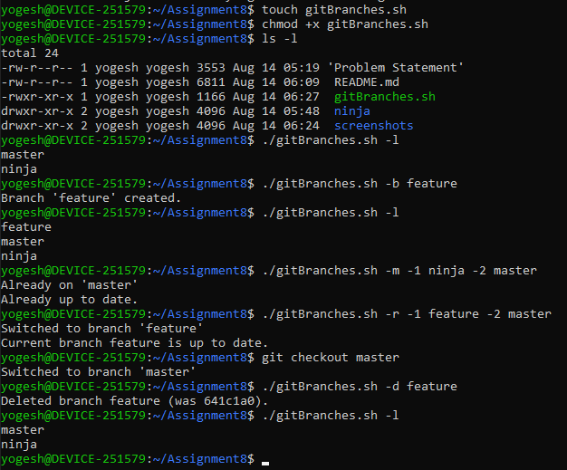

Note on delete: git (correctly) won't let you delete the branch
you're currently on, so the script will fail the same way — just
`checkout` something else first.

---

## Part C – `gitTags.sh`

```
./gitTags.sh -t <tag_name>     # create a tag on current commit
./gitTags.sh -l                # list tags
./gitTags.sh -d <tag_name>     # delete a tag
```

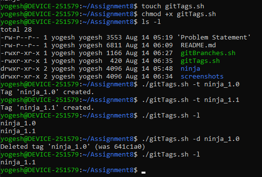

---

## Part D – `gitCommitReport.sh`

Generates a commit history report for a repo over the last N days.

```
./gitCommitReport.sh -u <repo_url> -d <days> [-f csv|html] [-o output_file]

# examples
./gitCommitReport.sh -u https://github.com/opstree/spring3hibernate.git -d 1460 -f csv
./gitCommitReport.sh -u /path/to/local/repo -d 40 -f html
```

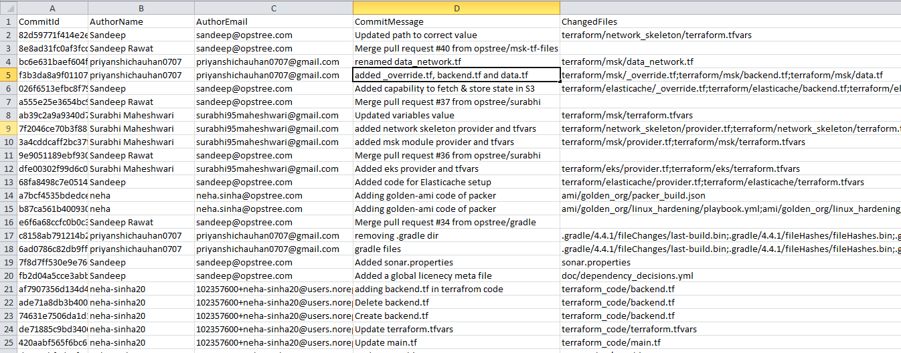

---
