# Jenkins Assignment 1 - Part 1

## Objective

The objective of this assignment is to create a Jenkins job that performs different Git branch operations.

The Jenkins job should be able to perform the following operations:

- Create a branch
- List all branches
- Merge one branch with another branch
- Rebase one branch with another branch
- Delete a branch

Slack and Email notifications are also configured so that notifications are sent when the build succeeds or fails.

---

## Tools Used

- Jenkins
- Git
- GitHub
- Slack
- Gmail
- Jenkins Freestyle Job
- Build Parameters

---

## Jenkins Job

**Job Name:** `Git-Operations`

The job is configured as a parameterized Freestyle project.

The following parameters are used:

| Parameter | Description |
|---|---|
| OPERATION | Git operation to perform |
| BRANCH_NAME | Source/target branch depending on operation |
| TARGET_BRANCH | Target branch for merge/rebase operations |

---

# Git Operations

## 1. Create Branch

The Jenkins job can create a new branch from the specified branch.

Example:

```text
Operation: create
Branch Name: dev
Target Branch: master
```

The job creates the `dev` branch from `master`.

### Proof

Add screenshot of Jenkins Build with Parameters showing the Create operation.

**Screenshot:**

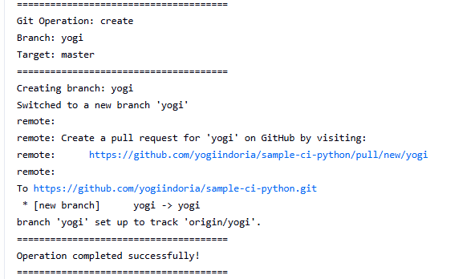

---

## 2. List All Branches

The Jenkins job can list all available Git branches.

The output displays the branches available in the repository.

### Proof

Add screenshot of Jenkins Console Output showing all branches.

**Screenshot:**

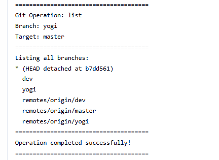

---

## 3. Merge One Branch With Another

The Jenkins job can merge one branch into another branch.

Example:

```text
Source Branch: dev
Target Branch: master
Operation: merge
```

The changes from the source branch are merged into the target branch.

### Proof

Add screenshot of Jenkins Console Output showing successful merge.

**Screenshot:**

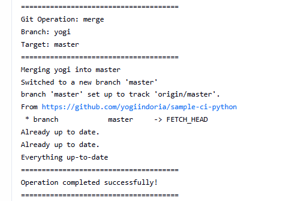

---

## 4. Rebase One Branch With Another

The Jenkins job can rebase one branch on top of another branch.

Example:

```text
Branch: dev
Target Branch: master
Operation: rebase
```

The `dev` branch is rebased with respect to `master`.

### Proof

Add screenshot of Jenkins Console Output showing successful rebase.

**Screenshot:**

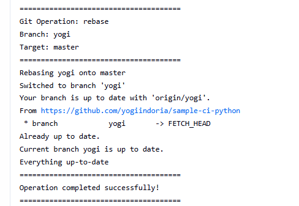

---

## 5. Delete Branch

The Jenkins job can delete a specified Git branch.

Example:

```text
Operation: delete
Branch Name: dev
```

The specified branch is deleted from the repository.

### Proof

Add screenshot of Jenkins Console Output showing successful branch deletion.

**Screenshot:**

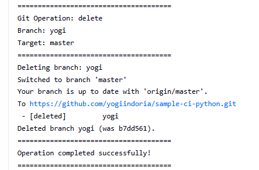

---

# Slack Notification

Slack notification has been configured with Jenkins.

A separate test Slack workspace and `#jenkins` channel are used for Jenkins notifications.

### Slack Configuration

```text
Workspace: Infinity
Channel: #jenkins
```

Notifications are configured for:

- Build Success
- Build Failure

The Slack message contains information such as:

- Job Name
- Build Number
- Triggered By
- Build Status
- Build URL

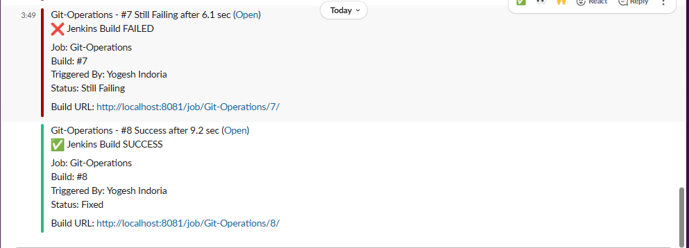

---

# Email Notification

Gmail SMTP has been configured in Jenkins for email notifications.

Email notifications are configured for:

- Successful builds
- Failed builds

### Successful Build Email

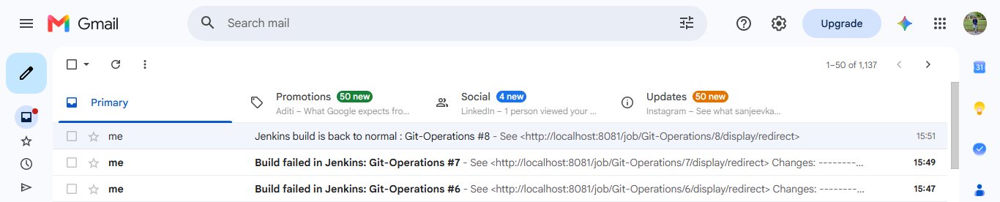

---

# Final Result

The Jenkins Freestyle job successfully performs Git operations and sends Slack and Email notifications based on the build result.

### Summary

| Requirement | Status |
|---|---|
| Create Branch | ✅ Completed |
| List Branches | ✅ Completed |
| Merge Branch | ✅ Completed |
| Rebase Branch | ✅ Completed |
| Delete Branch | ✅ Completed |
| Slack Notification | ✅ Configured |
| Email Notification | ✅ Configured |
| Success Notification | ✅ Configured |
| Failure Notification | ✅ Configured |
| Build User Identification | ✅ Configured |

---

# Part 2 - File Creation and Web Publishing

## Objective

Create a Jenkins job that accepts a string parameter **Ninja Name** and:

1. Creates a file.
2. Adds the content:
   `"<Ninja Name> from DevOps Ninja"`

Create another Jenkins job that publishes the generated file using a web server.

## Job 1 - Create Ninja File

**Job Name:** `Create-Ninja-File`

### Parameter

```text
Ninja Name
```

### File

```text
ninja.txt
```

### Example Content

```text
Yogi from DevOps Ninja
```

The file is archived as a Jenkins artifact.

## Job 2 - Publish Ninja File

**Job Name:** `Publish-Ninja-File`

Job 2 copies `ninja.txt` from Job 1 and publishes it using **Nginx**.

### Published Location

```text
/var/www/html/ninja.txt
```

### Browser Verification

```text
http://<SERVER-IP>/ninja.txt
```

## Automatic Trigger

Job 2 is configured to trigger automatically **only when Job 1 completes successfully**.

```text
Create-Ninja-File
        |
        | SUCCESS
        v
Publish-Ninja-File
        |
        v
Nginx Web Server
        |
        v
Browser
```

If Job 1 fails, Job 2 should not be triggered.

## Notifications

For the assignment:

- Success -> Slack + Email
- Failure -> Slack + Email

## Part 2 Screenshots

### Job 1 Parameter
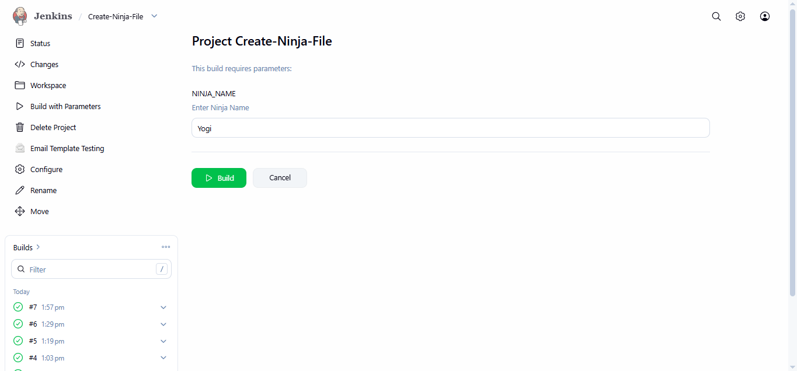

### File Created
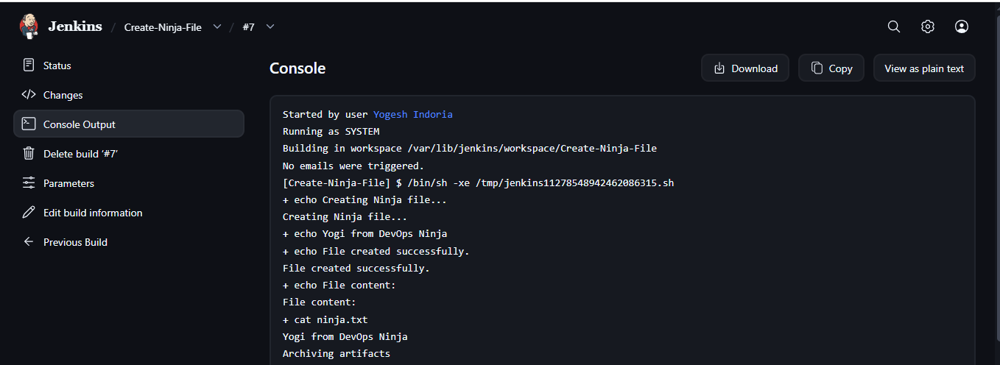
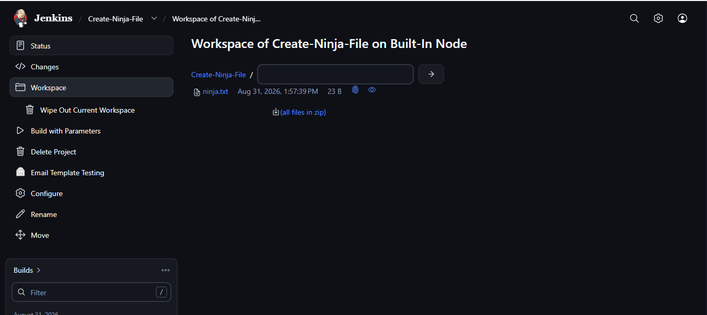

### Job 1 Console Output
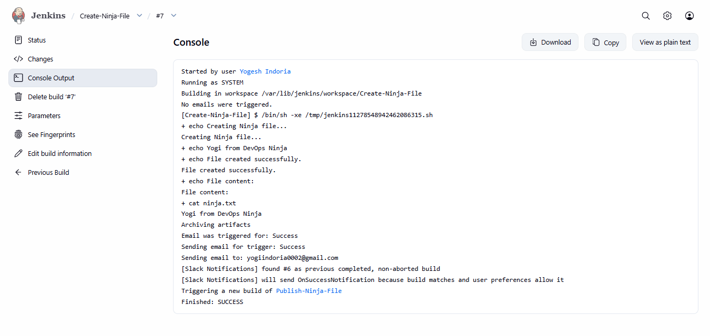

### Automatic Trigger
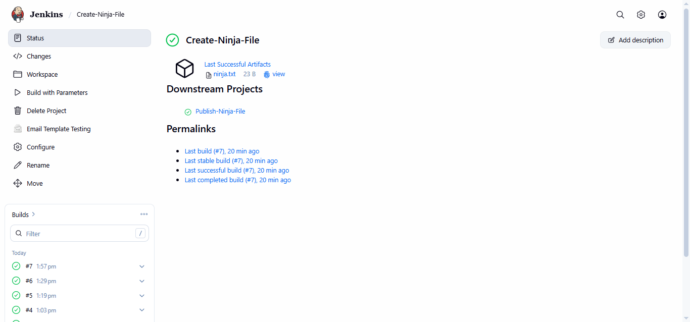

### Job 2 Console Output
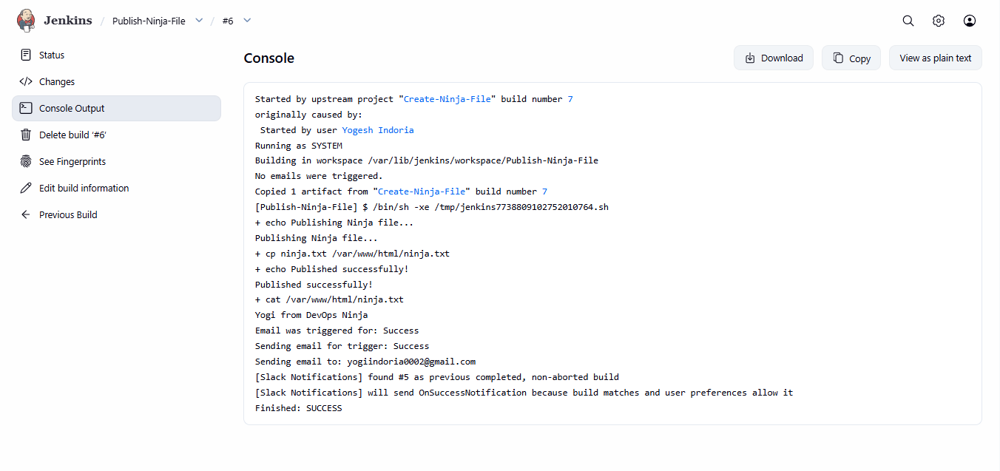


### Browser Output
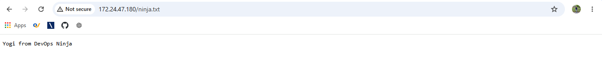

### Success Notification
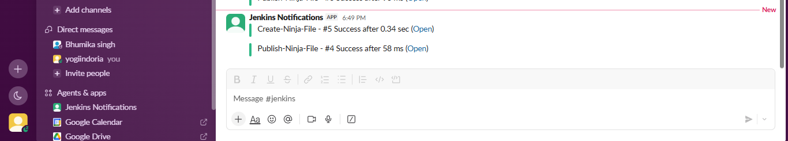
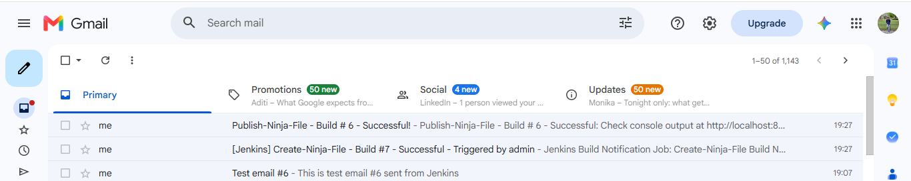


---

# Folder Structure

```text
Jenkins-Assignment/
│
├── README.md
│
└── screenshots/
```

# Tools Used

- Jenkins
- Git / GitHub
- Slack
- Gmail SMTP
- Nginx
- Linux

# Conclusion

This assignment demonstrates Jenkins automation, Git operations, build chaining, artifact handling, Nginx web publishing, and Slack/Email build notifications.