# Jenkins Assignment - 02

## User Authentication & User Authorization

**Author:** Yogesh Indoria

---

## 1. Objective

The objective of this assignment is to implement **User Authentication** and **User Authorization** in Jenkins for an organization having three teams:

- Developer
- Testing
- DevOps

The assignment covers:

- Creating 9 Jenkins Freestyle Jobs.
- Creating separate Developer, Testing, and DevOps views.
- Creating users for each team.
- Configuring team-specific permissions.
- Providing controlled read-only cross-team access.
- Studying Jenkins authorization strategies.
- Selecting and implementing **Role-Based Authorization Strategy**.
- Enabling **Google SSO** for the administrator.

---

## 2. Organization Structure

```text
Jenkins Assignment - 02
│
├── Developer
│   ├── dev-1
│   ├── dev-2
│   └── dev-3
│
├── Testing
│   ├── test-1
│   ├── test-2
│   └── test-3
│
├── DevOps
│   ├── devops-1
│   ├── devops-2
│   └── devops-3
│
└── Administration
    └── admin-1
```

---

# 3. Jenkins Jobs

A total of **9 Jenkins Freestyle Jobs** are created.

| Team | Job 1 | Job 2 | Job 3 |
|---|---|---|---|
| Developer | `dev-1` | `dev-2` | `dev-3` |
| Testing | `test-1` | `test-2` | `test-3` |
| DevOps | `devops-1` | `devops-2` | `devops-3` |

Each dummy job prints its **Job Name** and **Build Number**.

---

# 4. Job Build Configuration

Each job is configured as a **Freestyle Project**.

Navigate to:

```text
Job
 ↓
Configure
 ↓
Build Steps
 ↓
Execute shell
```

Use:

```bash
echo "Job Name: $JOB_NAME"
echo "Build Number: $BUILD_NUMBER"
```

Jenkins automatically provides:

```text
JOB_NAME
BUILD_NUMBER
```

For example:

```text
Job Name: dev-1
Build Number: 1
```

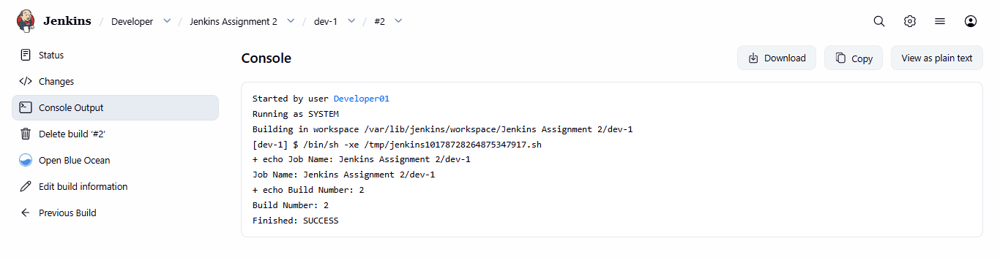

---

# 5. Jenkins Views

Three views are created:

```text
Developer
Testing
DevOps
```

## Developer View

Contains:

```text
dev-1
dev-2
dev-3
```

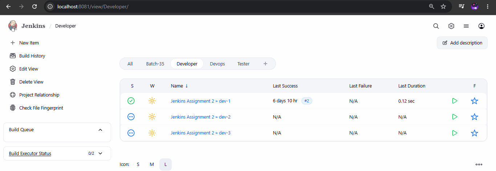

## Testing View

Contains:

```text
test-1
test-2
test-3
```

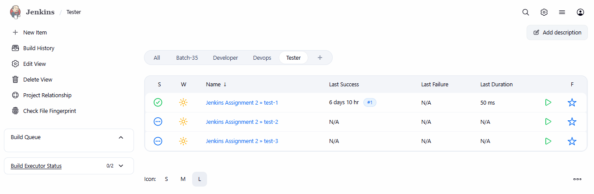

## DevOps View

Contains:

```text
devops-1
devops-2
devops-3
```

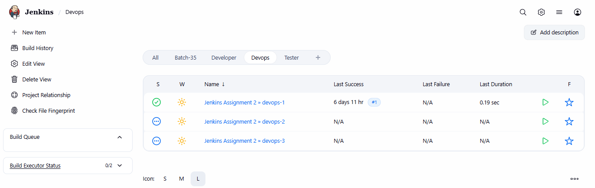

---

# 6. User Structure

## Developer Team

Users:

```text
developer-1
developer-2
```

Permissions:

- View Jenkins
- View Developer jobs
- Build Developer jobs
- View workspace
- Configure Developer jobs

Developer users must not access Testing or DevOps jobs.

---

## Testing Team

Users:

```text
testing-1
testing-2
```

Permissions:

- View Jenkins
- View Testing jobs
- Build Testing jobs
- View workspace
- Configure Testing jobs
- View Developer jobs

Testing users must not build/configure Developer jobs and must not access DevOps jobs.

---

## DevOps Team

Users:

```text
devops-1
devops-2
```

Permissions:

- View Jenkins
- View DevOps jobs
- Build DevOps jobs
- View workspace
- Configure DevOps jobs
- View Developer jobs
- View Testing jobs

DevOps users must not build/configure Developer or Testing jobs.

---

## Administrator

User:

```text
admin-1
```

The administrator has full Jenkins access, including:

- Manage Jenkins
- Manage users
- Manage plugins
- Manage credentials
- Manage security
- Create/configure jobs
- Build jobs
- Delete jobs
- Full administrative access

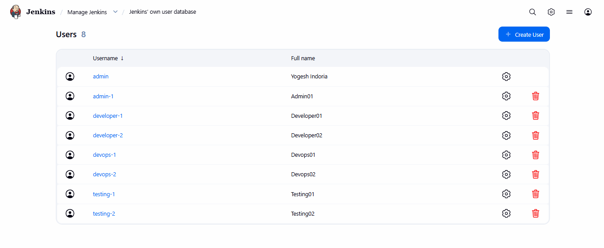

---

# 7. Authentication vs Authorization

## Authentication

Authentication answers:

> **Who are you?**

Examples:

```text
Jenkins User Database
Google Login / SSO
LDAP
Active Directory
```

For this assignment:

```text
Jenkins User Database
        +
Google Login for Admin SSO
```

## Authorization

Authorization answers:

> **What are you allowed to do?**

Example:

```text
developer-1
    |
    +-- Read dev jobs
    +-- Build dev jobs
    +-- Configure dev jobs
    +-- View workspace
    |
    +-- Cannot access test jobs
    +-- Cannot access devops jobs
```

Authentication identifies the user, while authorization controls the user's permissions.

---

# 8. Jenkins Authorization Strategies

The assignment requires understanding these strategies:

1. Legacy Mode
2. Matrix-Based Security
3. Project-Based Authorization
4. Role-Based Authorization Strategy

---

# 9. Legacy Mode

Legacy authorization is Jenkins' traditional and relatively simple authorization approach.

### Advantages

- Simple
- Easy to understand
- Suitable for basic setups

### Disadvantages

- Limited granularity
- Difficult to manage multiple teams
- Not suitable for complex job-level permissions

### Decision

**Not selected** because this assignment requires different permissions for multiple teams and jobs.

---

# 10. Matrix-Based Security

Matrix-based authorization provides fine-grained permissions for users or groups.

Example:

```text
User          Read   Build   Configure   Workspace
---------------------------------------------------
developer-1    ✓       ✓        ✓           ✓
testing-1      ✓       ✓        ✓           ✓
devops-1       ✓       ✓        ✓           ✓
```

### Advantages

- Fine-grained permissions
- User/group-based access
- Powerful for complex requirements

### Disadvantages

- Permission matrix can become large
- More manual configuration
- Harder to maintain at scale

### Decision

**Possible, but not selected.**

---

# 11. Project-Based Authorization

Project-based authorization allows permissions to be controlled at individual project/job level.

Example:

```text
dev-1
  |
  +-- developer-1 -> Build
  +-- developer-2 -> Build

test-1
  |
  +-- testing-1 -> Build
  +-- testing-2 -> Build
```

### Advantages

- Job-level control
- Fine-grained permissions
- Useful for project-specific access

### Disadvantages

- Repeated manual configuration
- Difficult to maintain with many users/jobs

### Decision

**Possible, but not the best fit.**

---

# 12. Role-Based Authorization Strategy

The **Role-Based Authorization Strategy** is selected for this assignment.

The model is:

```text
User
  ↓
Role
  ↓
Permissions
  ↓
Jobs
```

Roles can be mapped to teams:

```text
Developer Role
    ├── developer-1
    └── developer-2

Testing Role
    ├── testing-1
    └── testing-2

DevOps Role
    ├── devops-1
    └── devops-2

Admin Role
    └── admin-1
```

Item roles can use job-name patterns:

```regex
^dev-.*
^test-.*
^devops-.*
```

This makes the strategy a good fit for the assignment.

---

# 13. Why Role-Based Strategy?

The requirements are naturally organized around **teams and roles**.

Instead of assigning permissions individually to every user, roles can be created and users can be mapped to those roles.

```text
Developer → developer-1, developer-2
Testing   → testing-1, testing-2
DevOps    → devops-1, devops-2
Admin     → admin-1
```

This provides a cleaner and easier-to-maintain permission model.

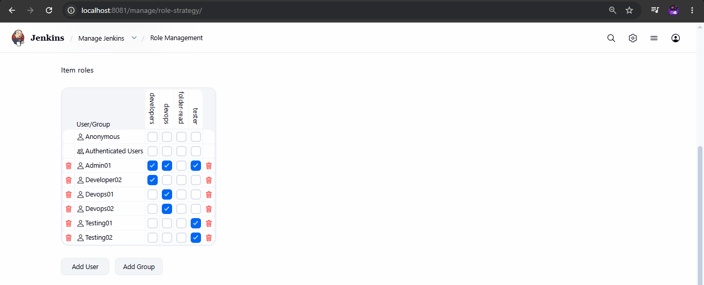

---

# 14. Required Plugins

## Role-Based Authorization

```text
Role-based Authorization Strategy
Plugin ID: role-strategy
```

## Google SSO

```text
Google Login
Plugin ID: google-login
```

> Google Login is used for Jenkins user authentication. Google OAuth Credentials is a different plugin and is not the same as Google Login.

---

# 15. Create Global Admin Role

Navigate to:

```text
Manage Jenkins
    ↓
Manage and Assign Roles
    ↓
Manage Roles
```

Create:

```text
admin
```

Grant:

```text
Overall/Administer
```

This gives `admin-1` full Jenkins access.

---

# 16. Create Item Roles

Create these team roles:

```text
developer
testing
devops
```

Also create read-only roles for cross-team visibility:

```text
developer-read
testing-read
```

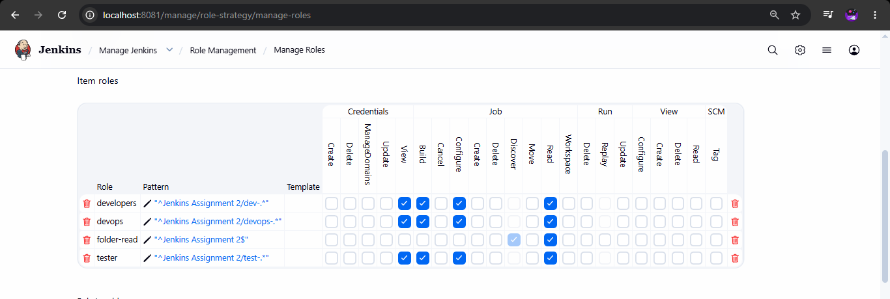

---

# 17. Developer Item Role

Role:

```text
developer
```

Pattern:

```regex
^dev-.*
```

Matches:

```text
dev-1
dev-2
dev-3
```

Permissions:

```text
Job/Read
Job/Build
Job/Configure
Job/Workspace
```

Depending on the Jenkins/plugin version, Job permissions may appear as Item permissions.

---

# 18. Testing Item Role

Role:

```text
testing
```

Pattern:

```regex
^test-.*
```

Matches:

```text
test-1
test-2
test-3
```

Permissions:

```text
Job/Read
Job/Build
Job/Configure
Job/Workspace
```

---

# 19. DevOps Item Role

Role:

```text
devops
```

Pattern:

```regex
^devops-.*
```

Matches:

```text
devops-1
devops-2
devops-3
```

Permissions:

```text
Job/Read
Job/Build
Job/Configure
Job/Workspace
```

---

# 20. Cross-Team Read Access

The assignment requires controlled visibility between teams.

Testing users:

```text
Testing
   ↓
View Developer jobs
   ↓
Cannot Build/Configure Developer jobs
```

DevOps users:

```text
DevOps
   ↓
View Developer jobs
   ↓
View Testing jobs
   ↓
Cannot Build/Configure those jobs
```

Therefore, read-only item roles are used.

---

# 21. Developer Read-Only Role

Create:

```text
developer-read
```

Pattern:

```regex
^dev-.*
```

Permission:

```text
Job/Read
```

Assign to:

```text
testing-1
testing-2
devops-1
devops-2
```

Do not grant Build or Configure through this role.

---

# 22. Testing Read-Only Role

Create:

```text
testing-read
```

Pattern:

```regex
^test-.*
```

Permission:

```text
Job/Read
```

Assign to:

```text
devops-1
devops-2
```

---

# 23. Overall Read Permission

The relevant users/roles should have:

```text
Overall/Read
```

This allows users to access the Jenkins interface while item-level permissions control access to jobs.

---

# 24. Assign Roles to Users

Navigate to:

```text
Manage Jenkins
    ↓
Manage and Assign Roles
    ↓
Assign Roles
```

Assign:

### Developer

```text
developer-1 → developer
developer-2 → developer
```

### Testing

```text
testing-1 → testing
testing-2 → testing

testing-1 → developer-read
testing-2 → developer-read
```

### DevOps

```text
devops-1 → devops
devops-2 → devops

devops-1 → developer-read
devops-2 → developer-read

devops-1 → testing-read
devops-2 → testing-read
```

### Administrator

```text
admin-1 → admin
```


---

# 25. Final Permission Model

| User | Developer Jobs | Testing Jobs | DevOps Jobs |
|---|---|---|---|
| developer-1 | Read + Build + Configure + Workspace | No Access | No Access |
| developer-2 | Read + Build + Configure + Workspace | No Access | No Access |
| testing-1 | Read Only | Read + Build + Configure + Workspace | No Access |
| testing-2 | Read Only | Read + Build + Configure + Workspace | No Access |
| devops-1 | Read Only | Read Only | Read + Build + Configure + Workspace |
| devops-2 | Read Only | Read Only | Read + Build + Configure + Workspace |
| admin-1 | Full Access | Full Access | Full Access |

---

# 26. Permission Testing

## Developer User

Login as:

```text
developer-1
```

Expected:

```text
dev-1   ✓
dev-2   ✓
dev-3   ✓

test-*   ✗
devops-* ✗
```

Developer can:

```text
Read
Build
Configure
View Workspace
```

on Developer jobs only.

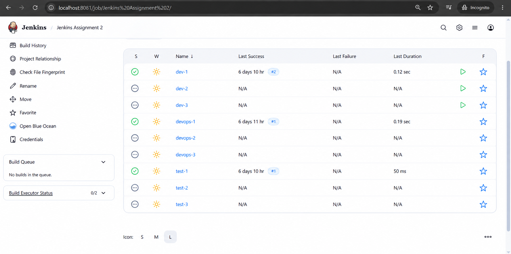

---

## Testing User

Login as:

```text
testing-1
```

Expected:

```text
Developer Jobs → Read Only
Testing Jobs   → Read + Build + Configure + Workspace
DevOps Jobs    → No Access
```

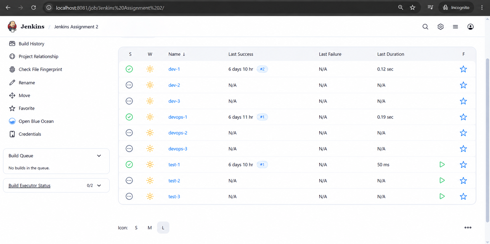

---

## DevOps User

Login as:

```text
devops-1
```

Expected:

```text
Developer Jobs → Read Only
Testing Jobs   → Read Only
DevOps Jobs    → Read + Build + Configure + Workspace
```

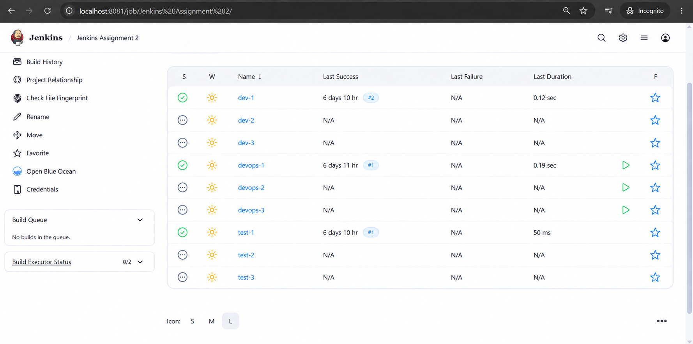

---

## Administrator

Login as:

```text
admin-1
```

Expected access:

```text
All Jobs
All Views
Users
Credentials
Plugins
Security
System Configuration
Manage Jenkins
```

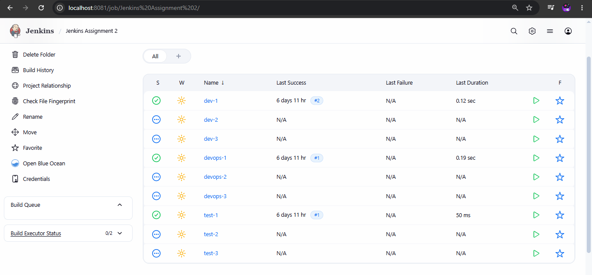

---

# 27. Part 2 - Google SSO

## Objective

The second part of the assignment is to enable **Google SSO** for the administrator.

Authentication flow:

```text
Google Account
      ↓
Google Authentication
      ↓
Jenkins
      ↓
Authenticated User
      ↓
Jenkins Authorization
      ↓
Admin Permissions
```

---

# 28. Install Google Login Plugin

Navigate to:

```text
Manage Jenkins
    ↓
Plugins
    ↓
Available Plugins
```

Search for:

```text
Google Login
```

Install the plugin.

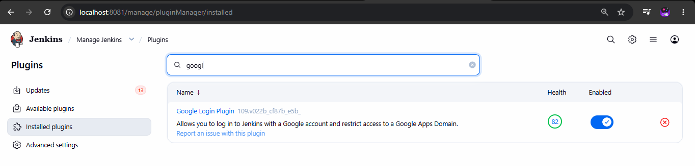

---

# 29. Google Cloud Configuration

Create/select a Google Cloud project and configure OAuth.

Basic flow:

```text
Google Cloud Project
        ↓
OAuth Consent Screen
        ↓
Create OAuth Client
        ↓
Web Application
        ↓
Configure Authorized / Redirect URI
```

Create an OAuth client for the Jenkins web application.

Use the exact callback/redirect URI required by the installed Google Login plugin.

Example:

```text
http://YOUR-JENKINS-HOST:8080
```

> Never commit the Google Client Secret to GitHub or this README.

---

# 30. Configure Google Login in Jenkins

Navigate to:

```text
Manage Jenkins
    ↓
Security
```

Under **Security Realm**, select the Google Login option provided by the plugin.

Configure the required:

```text
Client ID
Client Secret
```

and other settings exposed by the installed plugin version.


> **Security:** Mask the Client Secret before adding screenshots to GitHub.

---

# 31. Test Google SSO

Open Jenkins in a private/incognito browser window.

The login flow should be:

```text
Jenkins Login
      ↓
Google Login
      ↓
Google Authentication
      ↓
Jenkins
```

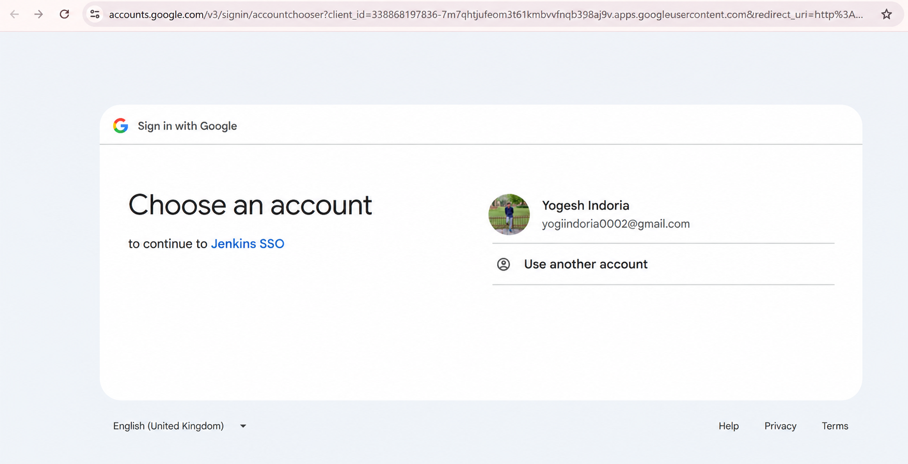

---

# 32. Verify Google Authenticated Admin

After successful Google authentication, verify that the administrator has the required permissions.

Expected access:

```text
Manage Jenkins
Users
Plugins
Security
Credentials
Jobs
Nodes
System Configuration
```


---

# 33. Final Architecture

```text
                         Jenkins
                            |
              +-------------+-------------+
              |                           |
       Authentication                Authorization
              |                           |
       Jenkins Database          Role-Based Strategy
              |                           |
          Google SSO               +-------+-------+
                                  |       |       |
                                Dev    Testing  DevOps
                                  |       |       |
                                dev-*  test-*  devops-*
```

Security flow:

```text
Authentication
      ↓
Who is the user?
      ↓
Authorization
      ↓
What can the user access/do?
```

---

# 34. Final Access Matrix

| User | Developer | Testing | DevOps | Jenkins Administration |
|---|---|---|---|---|
| developer-1 | Full Team Access | No Access | No Access | No |
| developer-2 | Full Team Access | No Access | No Access | No |
| testing-1 | Read Only | Full Team Access | No Access | No |
| testing-2 | Read Only | Full Team Access | No Access | No |
| devops-1 | Read Only | Read Only | Full Team Access | No |
| devops-2 | Read Only | Read Only | Full Team Access | No |
| admin-1 | Full | Full | Full | Yes |

---

# 35. Verification Checklist

## Jobs

- [ ] `dev-1`
- [ ] `dev-2`
- [ ] `dev-3`
- [ ] `test-1`
- [ ] `test-2`
- [ ] `test-3`
- [ ] `devops-1`
- [ ] `devops-2`
- [ ] `devops-3`

## Views

- [ ] Developer
- [ ] Testing
- [ ] DevOps

## Users

- [ ] developer-1
- [ ] developer-2
- [ ] testing-1
- [ ] testing-2
- [ ] devops-1
- [ ] devops-2
- [ ] admin-1

## Authorization

- [ ] Role-Based Strategy enabled
- [ ] Developer role configured
- [ ] Testing role configured
- [ ] DevOps role configured
- [ ] Admin role configured
- [ ] Developer read-only role configured
- [ ] Testing read-only role configured
- [ ] Roles assigned to users
- [ ] Permission testing completed

## Google SSO

- [ ] Google Login plugin installed
- [ ] Google OAuth application configured
- [ ] Jenkins Google Login configured
- [ ] Google authentication tested
- [ ] Admin access verified

---

# 36. Conclusion

This assignment demonstrates Jenkins **User Authentication and User Authorization** for a three-team organization.

Nine Jenkins Freestyle Jobs are created and organized into Developer, Testing, and DevOps views. Each team receives the required permissions for its own jobs, while Testing and DevOps receive controlled read-only access to jobs belonging to other teams.

After studying Legacy, Matrix-Based, Project-Based, and Role-Based authorization strategies, **Role-Based Authorization Strategy** is selected because the requirements are naturally organized around teams, roles, and job-name patterns.

Google SSO is then configured for administrator authentication.

The final security model demonstrates:

```text
Authentication → Who can log in?
Authorization  → What can they access/do?
```

---

## Author

**Yogesh Indoria**
