# Assignment 03 - Jenkins CI Checks

**Author:** Yogesh Indoria

## Objective

The objective of this assignment is to perform Continuous Integration (CI) checks on three different repositories using **Jenkins Freestyle Jobs**.

The implementation covers GitHub integration, automated testing, code coverage, credential/secret scanning, dependency checking, report storage, artifact management, and failure notifications.

---

## Repositories

| Language | Repository | GitHub URL |
|---|---|---|
| Python | attendance-api | https://github.com/OT-MICROSERVICES/attendance-api |
| GoLang | employee-api | https://github.com/OT-MICROSERVICES/employee-api |
| Java | spring3hibernate | https://github.com/opstree/spring3hibernate.git |

---

# 1. Jenkins Job Structure

For this assignment, Jenkins jobs are organized **language-wise**.

There are three main folders/views:

- `Go`
- `Java`
- `Python`

Each folder contains four separate Jenkins Freestyle Jobs:

1. `unit-test`
2. `dependency-check`
3. `credential-scan`
4. `code-coverage`

Therefore, there are **12 CI jobs in total**.

```text
Jenkins Assignment 3
│
├── Go
│   ├── Go → unit-test
│   ├── Go → dependency-check
│   ├── Go → credential-scan
│   └── Go → code-coverage
│
├── Java
│   ├── Java → unit-test
│   ├── Java → dependency-check
│   ├── Java → credential-scan
│   └── Java → code-coverage
│
└── Python
    ├── Python → unit-test
    ├── Python → dependency-check
    ├── Python → credential-scan
    └── Python → code-coverage
```

The Jenkins dashboard below shows the actual job structure.

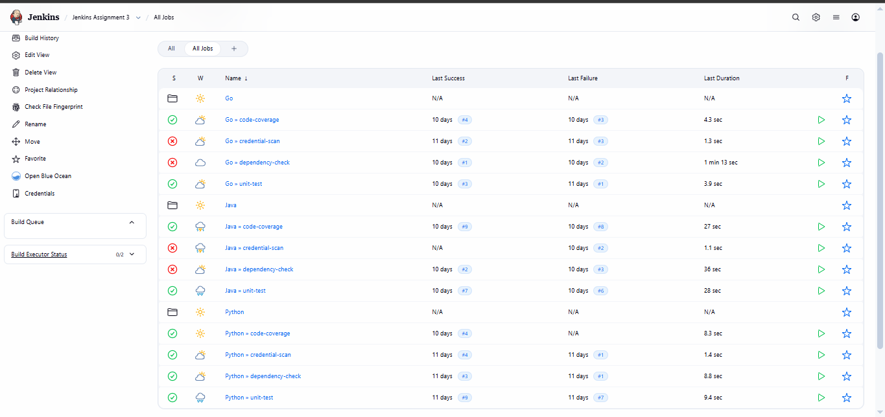

### Why separate jobs are used

Each CI check is kept independent. This makes it easier to identify, troubleshoot, and maintain a particular check.

For example, if the dependency check fails, the specific `Go → dependency-check` job can be opened without mixing its logs with the unit-test or coverage jobs.

---

# 2. Common CI Workflow

Each repository follows the same overall CI approach:

```text
GitHub Repository
       |
       v
Jenkins Freestyle Job
       |
       v
Checkout Source Code
       |
       v
Run Specific CI Check
       |
       v
Generate Report
       |
       v
Archive / Store Output
       |
       v
Build Result
       |
       +----> Email / Slack on Failure
```

The four jobs have different responsibilities:

| Job | Purpose |
|---|---|
| `unit-test` | Execute automated unit tests |
| `dependency-check` | Check project dependencies |
| `credential-scan` | Detect committed credentials/secrets |
| `code-coverage` | Generate code coverage information |

---

# 3. GoLang CI Jobs

Repository:

`https://github.com/OT-MICROSERVICES/employee-api`

The GoLang repository is configured under the **Go** folder.

```text
Go
├── Go → unit-test
├── Go → dependency-check
├── Go → credential-scan
└── Go → code-coverage
```

## 3.1 Go - Unit Test

The purpose of this job is to execute the Go unit tests.

Typical command:

```bash
go test ./...
```

The Jenkins console output is checked to verify the test result.

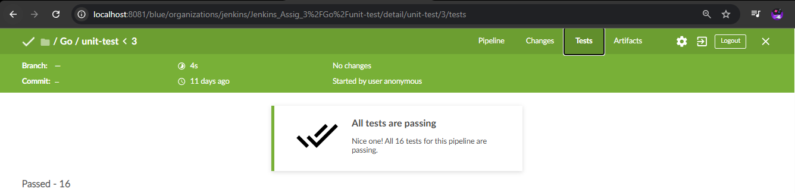

## 3.2 Go - Dependency Check

This job checks the Go project's dependencies.

Typical commands:

```bash
go mod download
go mod verify
```

A dependency vulnerability scanner can also be integrated where required.

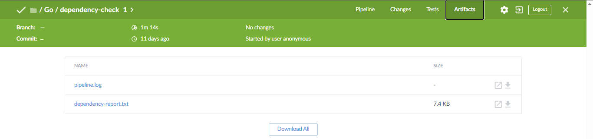

## 3.3 Go - Credential Scan

This job scans the repository for accidentally committed secrets such as API keys, passwords, tokens, and private keys.

If the configured scanner detects a critical secret, the Jenkins build can be marked as failed.

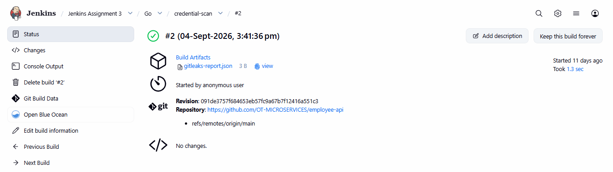

## 3.4 Go - Code Coverage

Go coverage can be generated using:

```bash
go test ./... -coverprofile=coverage.out
go tool cover -html=coverage.out -o coverage.html
```

The generated coverage output can be archived or published in Jenkins.

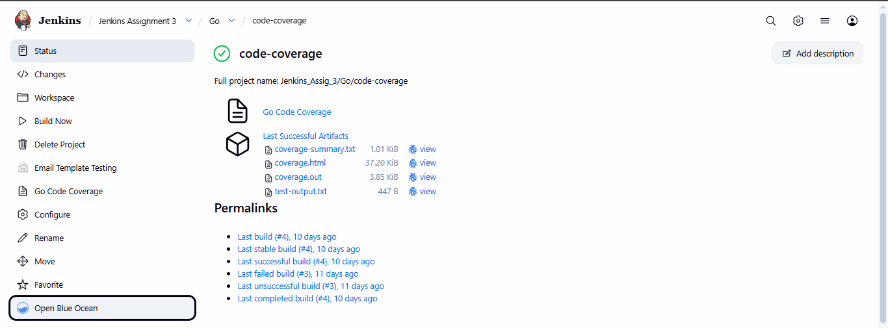

---

# Go Email Notification

Email notifications can be configured for CI failures.

A failure notification can contain:

- Jenkins job name
- Build number
- Build status
- Build URL
- Relevant failure information

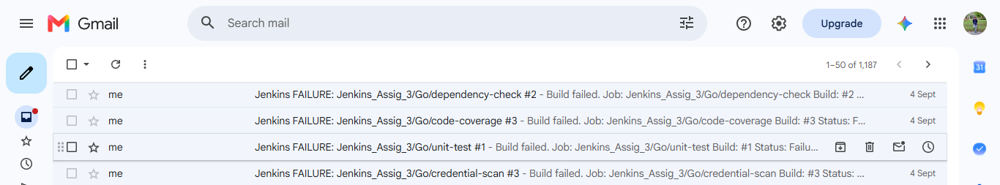

---

# Go Slack Notification

Slack notification can also be configured for Jenkins CI failures.

```text
Jenkins Job
     |
     v
CI Check
     |
     v
Build Failure
     |
     v
Slack Notification
```

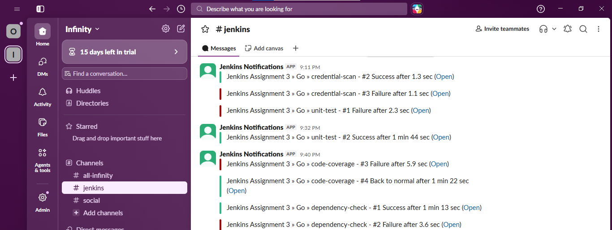

---

# 4. Java CI Jobs

Repository:

`https://github.com/opstree/spring3hibernate.git`

The Java repository is configured under the **Java** folder.

```text
Java
├── Java → unit-test
├── Java → dependency-check
├── Java → credential-scan
└── Java → code-coverage
```

## 4.1 Java - Unit Test

Maven is used to execute the Java project's tests.

Typical command:

```bash
mvn clean test
```

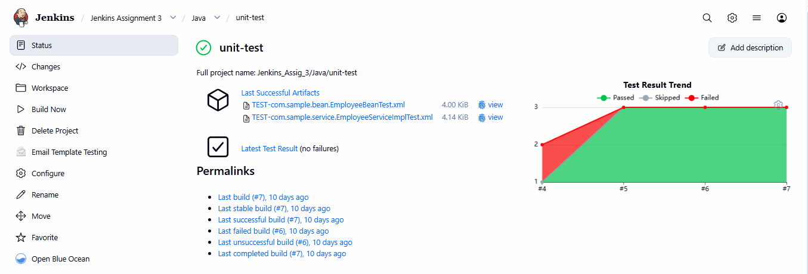

## 4.2 Java - Dependency Check

Maven dependency information can be inspected using:

```bash
mvn dependency:tree
```

A dedicated dependency vulnerability scanner can additionally be integrated.

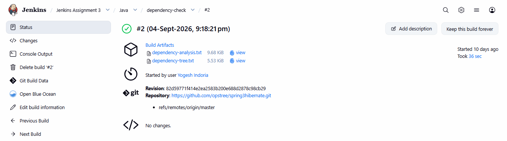

## 4.3 Java - Credential Scan

This job scans the Java repository for accidentally committed credentials and other sensitive information.

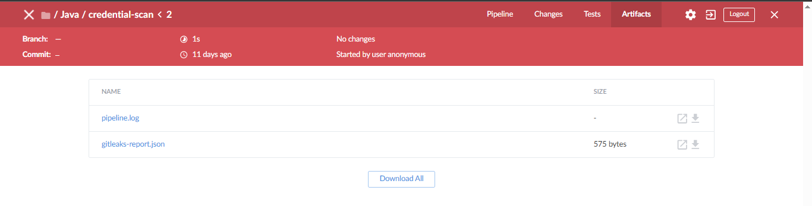

## 4.4 Java - Code Coverage

JaCoCo can be used to generate Java code coverage.

Example:

```bash
mvn clean test jacoco:report
```

The resulting report can be published or archived in Jenkins.

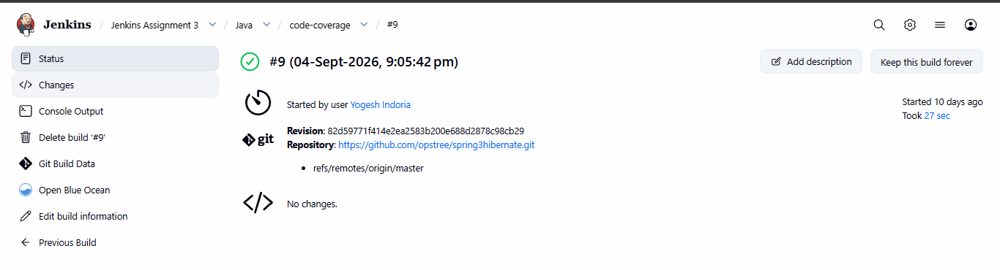

---

# Java Email Notification

Email notifications can be configured for CI failures.

A failure notification can contain:

- Jenkins job name
- Build number
- Build status
- Build URL
- Relevant failure information

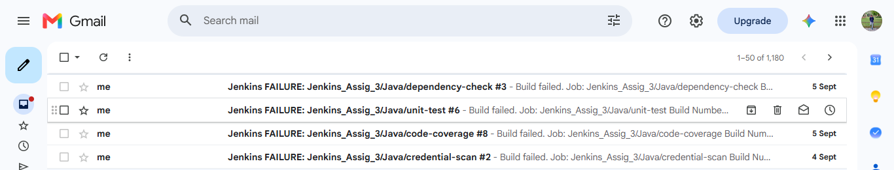

---

# Java Slack Notification

Slack notification can also be configured for Jenkins CI failures.

```text
Jenkins Job
     |
     v
CI Check
     |
     v
Build Failure
     |
     v
Slack Notification
```

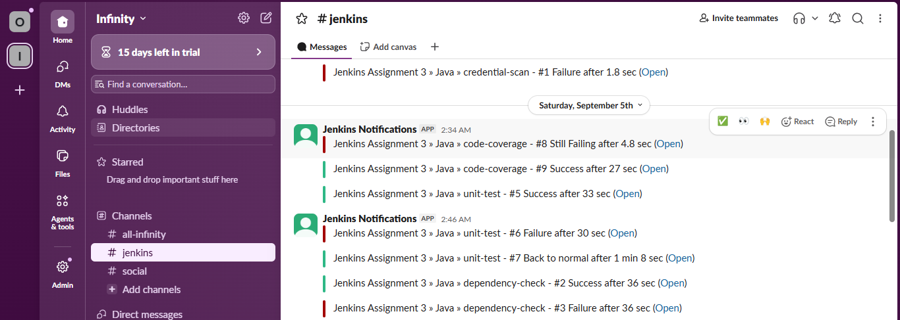

---

# 5. Python CI Jobs

Repository:

`https://github.com/OT-MICROSERVICES/attendance-api`

The Python repository is configured under the **Python** folder.

```text
Python
├── Python → unit-test
├── Python → dependency-check
├── Python → credential-scan
└── Python → code-coverage
```

## 5.1 Python - Unit Test

The Python unit-test job executes automated tests using `pytest`.

Typical commands:

```bash
python3 -m venv venv
source venv/bin/activate
pip install -r requirements.txt
pytest
```

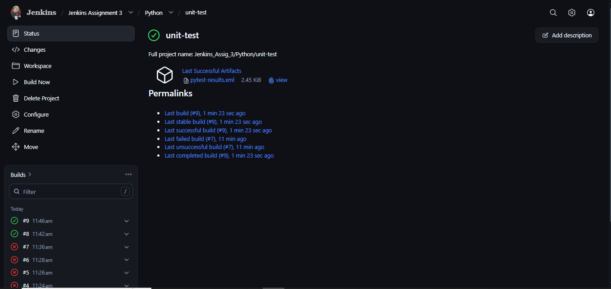

## 5.2 Python - Dependency Check

This job checks the dependencies required by the application.

Typical command:

```bash
pip install -r requirements.txt
```

A dependency vulnerability scanner can additionally be used to identify vulnerable packages.

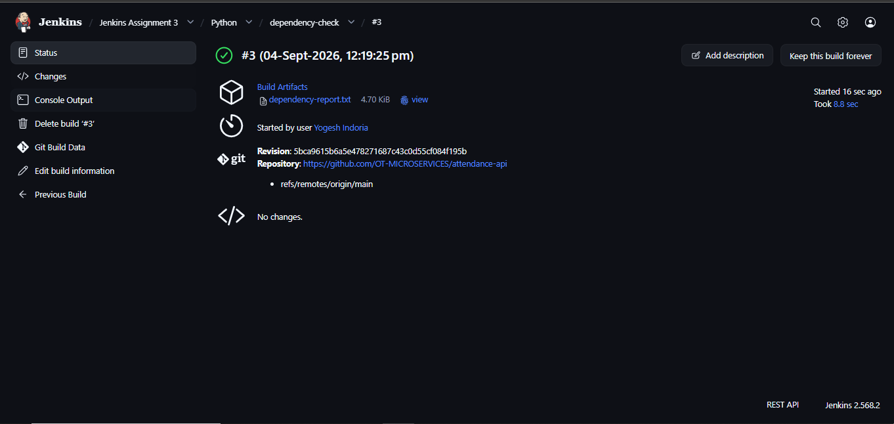

## 5.3 Python - Credential Scan

This job scans the repository for accidentally committed credentials and secrets.

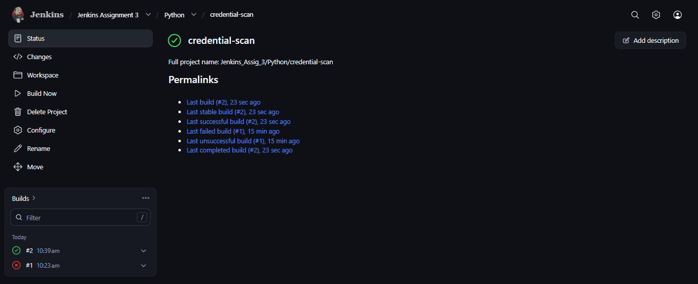

## 5.4 Python - Code Coverage

Python code coverage can be generated using `pytest-cov`.

Example:

```bash
pytest --cov=. --cov-report=xml --cov-report=html
```

The generated HTML/XML reports can be stored and accessed from Jenkins.

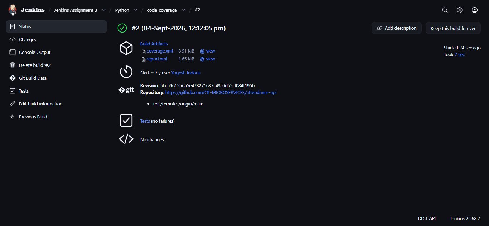

---


# Python Email Notification

Email notifications can be configured for CI failures.

A failure notification can contain:

- Jenkins job name
- Build number
- Build status
- Build URL
- Relevant failure information

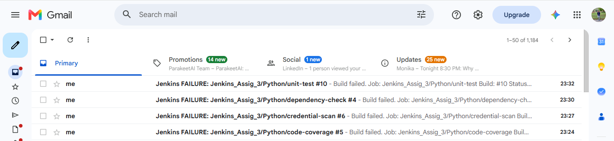

---

# Python Slack Notification

Slack notification can also be configured for Jenkins CI failures.

```text
Jenkins Job
     |
     v
CI Check
     |
     v
Build Failure
     |
     v
Slack Notification
```

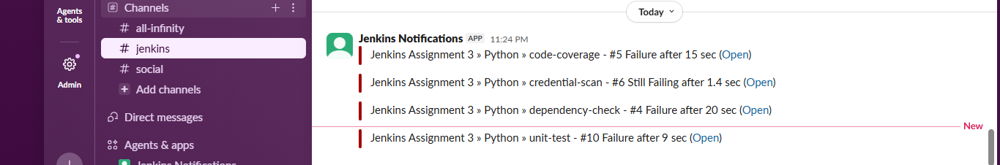

---

# 6. Reports and Test Results

Each CI job can generate output that is useful for troubleshooting and auditing.

Examples include:

- Unit test reports
- Code coverage reports
- Credential scan reports
- Dependency reports
- Jenkins console logs

---

# 7. Artifact Management

Artifacts generated by CI jobs can be archived in Jenkins.

Examples:

```text
coverage.html
coverage.out
coverage.xml
test reports
security scan reports
JAR files
```

In a Freestyle Job, artifacts can be stored using:

**Post-build Actions → Archive the artifacts**

Example patterns:

```text
**/target/*.jar
**/coverage.*
**/reports/**
```

## Artifact Storage

For this assignment, Jenkins local artifact storage can be used.

Archived files remain accessible from the corresponding Jenkins build page.

For a production CI/CD environment, a remote artifact repository such as Nexus or JFrog Artifactory can be used for centralized artifact management.

---

# 8. Failure Handling

Each CI job can fail independently.

Common failure conditions include:

- Git checkout failure
- Dependency installation failure
- Unit test failure
- Credential scan failure
- Dependency/security scan failure
- Coverage generation failure
- Build command failure

Example:

```text
Go → dependency-check
        |
        v
      FAILURE
        |
        +----> Jenkins Build Status
        |
        +----> Email Notification
        |
        +----> Slack Notification
```

---

# 9. Final CI Check Summary

| CI Check | GoLang | Java | Python |
|---|:---:|:---:|:---:|
| GitHub Integration | Yes | Yes | Yes |
| Unit Testing | Yes | Yes | Yes |
| Dependency Check | Yes | Yes | Yes |
| Credential / Secret Scan | Yes | Yes | Yes |
| Code Coverage | Yes | Yes | Yes |
| Reports | Yes | Yes | Yes |
| Artifact Management | Yes | Yes | Yes |
| Failure Handling | Yes | Yes | Yes |
| Email Notification | Yes | Yes | Yes |
| Slack Notification | Yes | Yes | Yes |

---

# 10. Final Jenkins Structure

The final Jenkins structure implemented for this assignment is:

```text
Jenkins Assignment 3
│
├── Go
│   ├── unit-test
│   ├── dependency-check
│   ├── credential-scan
│   └── code-coverage
│
├── Java
│   ├── unit-test
│   ├── dependency-check
│   ├── credential-scan
│   └── code-coverage
│
└── Python
    ├── unit-test
    ├── dependency-check
    ├── credential-scan
    └── code-coverage
```

**Total: 12 Jenkins Freestyle Jobs**

---

# 11. Expected Result

After completing this assignment:

1. Three GitHub repositories are integrated with Jenkins.
2. Three language-wise Jenkins folders/views are maintained.
3. Four separate CI jobs are created for each repository.
4. A total of 12 Jenkins Freestyle Jobs are configured.
5. Unit tests are executed.
6. Dependency checks are performed.
7. Credential/secret scanning is performed.
8. Code coverage reports are generated.
9. Reports are stored and accessible from Jenkins.
10. Build artifacts are archived.
11. Jenkins maintains build history for every CI job.
12. Failed CI checks can trigger Email and Slack notifications.

---

# 12. Conclusion

This assignment demonstrates a practical CI workflow using **Jenkins Freestyle Jobs** for three technology stacks: **GoLang, Java, and Python**.

Each repository has independent jobs for **Unit Testing, Dependency Checking, Credential Scanning, and Code Coverage**. This separation provides clear visibility into individual CI checks and makes failures easier to troubleshoot.

The assignment also demonstrates Jenkins report handling, artifact management, build history, and failure notifications, which are important components of a practical CI environment.

---

## Author

**Yogesh Indoria**
