# Jenkins Assignment 4

## Declarative CI Pipeline for a Java-Based Project

**Author:** Yogesh Indoria

## Objective

The objective of this assignment is to create a Declarative Jenkins CI
pipeline for a Java-based project that automates the complete Continuous
Integration workflow.

The pipeline is designed to:

-   Checkout source code from GitHub.
-   Build the Java application using Maven.
-   Execute Code Stability, SonarQube Code Quality, and Code Coverage analysis in
    parallel.
-   Provide build-time options to skip individual scans.
-   Generate and archive analysis reports.
-   Evaluate the SonarQube Quality Gate before artifact publication.
-   Add a manual approval step before artifact publication.
-   Allow the user to approve or deny artifact publication.
-   Publish the generated WAR artifact.
-   Send Slack and Email notifications after successful or failed
    artifact publication.

## Project Repository

Repository:

`https://github.com/yogiindoria/spring3hibernate.git`

Branch:

`master`

Application artifact:

`Spring3HibernateApp.war`

## Assignment Requirements

The pipeline implements:

1.  Code checkout
2.  Java project build
3.  Code Stability Analysis
4.  SonarQube Code Quality Analysis
5.  Code Coverage Analysis
6.  Parallel execution of the analysis stages
7.  User-controlled scan skipping
8.  Report generation and archiving
9.  Manual approval before publication
10. Approve or Deny publication
11. WAR artifact publication
12. Slack notification after publication
13. Email notification after publication

## Tools Used

  Tool              Purpose
  ----------------- ---------------------------------------
  Jenkins           CI pipeline automation
  Git               Source-code management
  GitHub            Source-code repository
  Maven             Build and test automation
  Java              Compilation and runtime
  JUnit             Unit testing and stability validation
  FindBugs          Code quality analysis
  JaCoCo            Code coverage analysis
  Slack             Pipeline notifications
  Email Extension   Email notifications

SonarQube is used for Code Quality Analysis and Quality Gate evaluation.
FindBugs is no longer used as the primary Code Quality Analysis tool.

## Pipeline Flow

``` text
Code Checkout
      |
     Build
      |
      +------------------- Parallel Analysis -------------------+
      |                         |                 |               |
      |                  Code Stability    SonarQube Quality    Code Coverage
      |                         |                 |               |
      +-------------------------+-----------------+---------------+
                                |
                         Generate Reports
                                |
                            Approval
                         APPROVE / DENY
                                |
                         Publish Artifact
                                |
                     +----------+----------+
                     |                     |
                  Slack                 Email
                 Success/Failure       Success/Failure
```

## 1. Code Checkout

Jenkins checks out the application source code from GitHub using the
`master` branch.

``` groovy
stage('Code Checkout') {
    steps {
        git branch: 'master',
            url: 'https://github.com/yogiindoria/spring3hibernate.git'
    }
}
```

### Screenshot

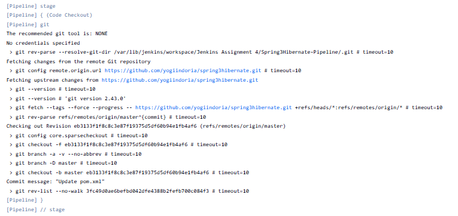

Capture the Jenkins Code Checkout stage and save it as
`screenshots/01-code-checkout.png`.

## 2. Build

The Build stage first verifies Java and Maven versions and updates the
old Java compiler settings from Java 1.6 to Java 1.8.

``` bash
sed -i 's/<source>1.6<\/source>/<source>1.8<\/source>/g' pom.xml
sed -i 's/<target>1.6<\/target>/<target>1.8<\/target>/g' pom.xml
```

The application is packaged using Maven:

``` bash
mvn clean package -DskipTests -Dfindbugs.skip=true
```

The generated WAR is:

``` text
target/Spring3HibernateApp.war
```

The source code and WAR are stored separately using Jenkins `stash`.

### Screenshot

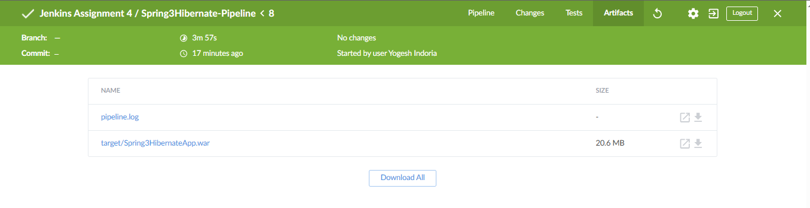

Capture the Jenkins Build stage and save it as
`screenshots/11-artifact.png`.

## 3. Parallel Analysis

The following three stages execute in parallel:

-   Code Stability
-   SonarQube Quality Analysis
-   Code Coverage

Jenkins Declarative Pipeline `parallel` is used for this implementation.

### Screenshot

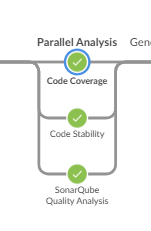

Capture the Jenkins Blue Ocean parallel execution view and save it as
`screenshots/03-parallel-analysis.png`.

## 4. Code Stability Analysis

Code Stability is implemented using Maven tests.

``` bash
mvn test -Dfindbugs.skip=true
```

JUnit/Surefire reports are generated under:

``` text
target/surefire-reports/
```

The reports are later published through Jenkins using the `junit` step.

### Screenshot

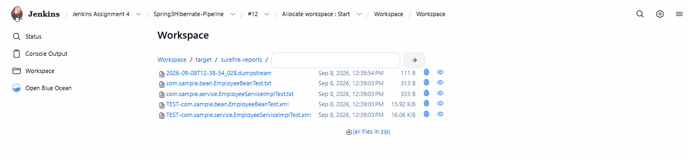

Capture the Code Stability stage and save it as
`screenshots/04-code-stability.png`.

## 5. SonarQube Code Quality Analysis

Code Quality Analysis is implemented using SonarQube.

The SonarQube stage uses a dedicated `@quality` workspace and performs a
fresh Git checkout so that SonarQube can access the Git metadata required
for SCM analysis.

The project is compiled before running the scanner:

``` bash
mvn clean package -DskipTests -Dfindbugs.skip=true
```

The SonarQube analysis is executed using the SonarScanner for Maven:

``` bash
mvn org.sonarsource.scanner.maven:sonar-maven-plugin:5.8.0.7211:sonar     -Dsonar.projectKey=Spring3Hibernate     -Dsonar.projectName=Spring3Hibernate
```

Jenkins provides the configured SonarQube server environment using:

``` groovy
withSonarQubeEnv('SonarQube') {
    sh 'mvn org.sonarsource.scanner.maven:sonar-maven-plugin:5.8.0.7211:sonar ...'
}
```

The SonarQube project key used in this assignment is:

``` text
Spring3Hibernate
```

SonarQube analyzes the source code and publishes the quality results to the
configured SonarQube server.

### Screenshot


Capture the Jenkins SonarQube Quality Analysis stage and save it as
`screenshots/16-sonarqube-analysis.png`.

## 6. Code Coverage Analysis

Code Coverage is implemented using JaCoCo.

Tests are executed first:

``` bash
mvn test -Dfindbugs.skip=true
```

The JaCoCo report is then generated:

``` bash
mvn jacoco:report -Dfindbugs.skip=true
```

The generated report is located under:

``` text
target/site/jacoco/
```

The report is later archived in Jenkins.

### Screenshot

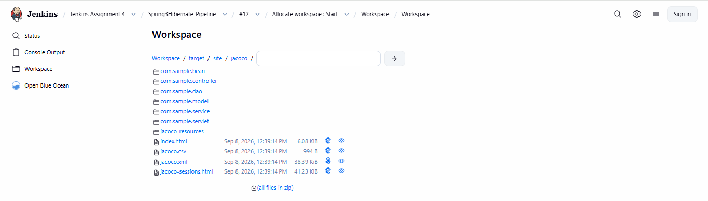

Capture the Code Coverage stage and save it as
`screenshots/06-code-coverage.png`.

## 7. Separate Workspaces for Parallel Stages

Each parallel branch uses a separate Jenkins workspace:

``` groovy
ws("${env.WORKSPACE}@stability")
ws("${env.WORKSPACE}@quality")
ws("${env.WORKSPACE}@coverage")
```

Each branch starts with:

``` groovy
deleteDir()
unstash 'source-code'
```

Separate workspaces prevent parallel Maven and FindBugs executions from
modifying the same files at the same time.

## 8. Optional Scan Execution

The pipeline provides three Boolean parameters:

``` text
RUN_STABILITY
RUN_QUALITY
RUN_COVERAGE
```

These parameters allow the user to skip individual scans during build
execution.

Example:

``` text
RUN_STABILITY = false
RUN_QUALITY   = true
RUN_COVERAGE  = true
```

In this case, Code Stability is skipped while Code Quality and Code
Coverage run.

### Screenshot

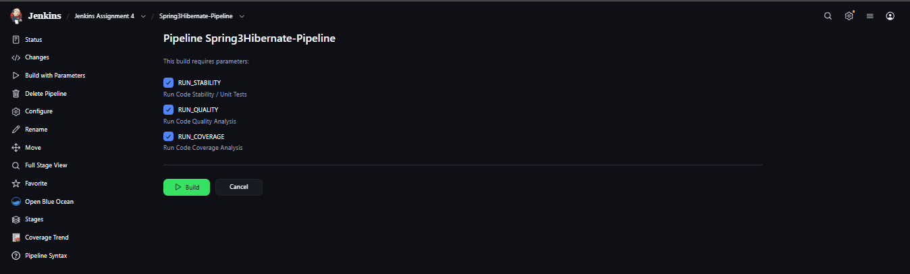

Capture the Jenkins Build with Parameters screen and save it as
`screenshots/07-build-with-parameters.png`.

## 9. Generate Reports

After the parallel analysis stages finish, Jenkins collects the
generated reports.

### JUnit

``` groovy
junit(
    allowEmptyResults: true,
    testResults: 'target/surefire-reports/*.xml'
)
```

### FindBugs

``` groovy
archiveArtifacts(
    artifacts: 'target/findbugs/**,target/findbugsXml.xml',
    allowEmptyArchive: true
)
```

### JaCoCo

``` groovy
archiveArtifacts(
    artifacts: 'target/site/jacoco/**',
    allowEmptyArchive: true
)
```

### Screenshot

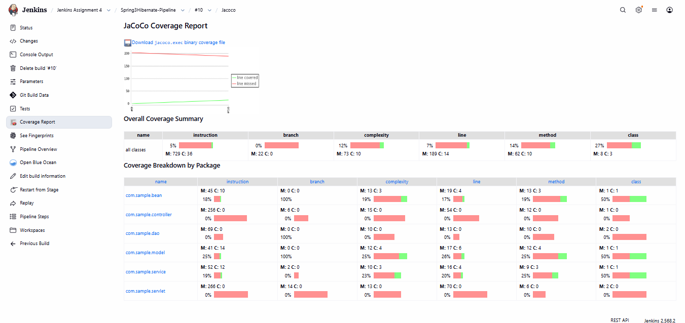

Capture the Jenkins reports/artifacts view and save it as
`screenshots/08-generate-reports.png`.

## 10. SonarQube Quality Gate

After the parallel analysis and report generation stages, Jenkins waits for
the SonarQube Quality Gate result.

The Quality Gate is checked only when the SonarQube quality scan is enabled:

``` groovy
script {
    if (params.RUN_QUALITY) {
        timeout(time: 5, unit: 'MINUTES') {
            def qualityGate = waitForQualityGate(abortPipeline: true)

            if (qualityGate.status != 'OK') {
                error("SonarQube Quality Gate failed: ${qualityGate.status}")
            }
        }
    }
}
```

If the Quality Gate fails, the pipeline stops before the manual approval and
artifact publication stages.

### Screenshot

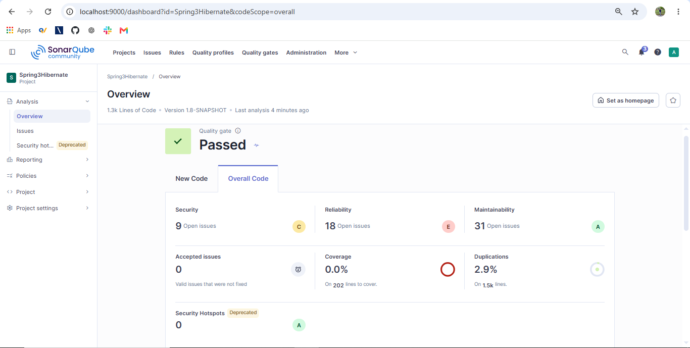

Capture the Jenkins SonarQube Quality Gate result and save it as
`screenshots/17-sonarqube-quality-gate.png`.

## 11. Approval Before Publication

Before publishing the WAR artifact, Jenkins asks the user for a
publication decision.

The available decisions are:

``` text
APPROVE
DENY
```

The approval has a five-minute timeout.

``` groovy
timeout(time: 5, unit: 'MINUTES')
```

If `APPROVE` is selected, publication continues.

If `DENY` is selected, the pipeline stops before artifact publication.

### Screenshot

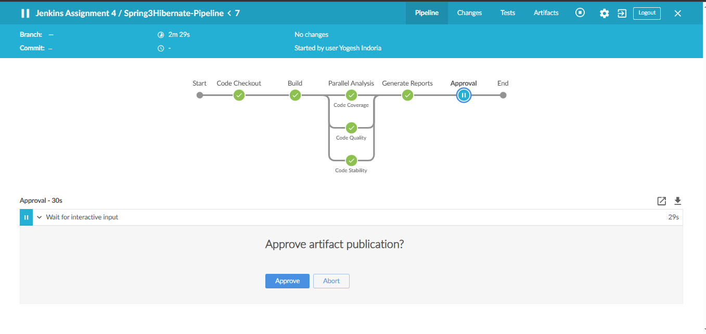

Capture the Jenkins approval/input screen and save it as
`screenshots/09-approval.png`.

## 12. Artifact Publication

The WAR generated during the Build stage is restored using:

``` groovy
unstash 'war-artifact'
```

It is then published using:

``` groovy
archiveArtifacts(
    artifacts: 'target/Spring3HibernateApp.war',
    fingerprint: true
)
```

The WAR can be accessed from the Jenkins build Artifacts section.

### Screenshot


Capture the Jenkins Artifacts section showing `Spring3HibernateApp.war`
and save it as `screenshots/11-artifact.png`.

## 13. Slack Notification

After successful artifact publication, Jenkins sends a Slack
notification.

Example:

``` groovy
slackSend(
    channel: '#jenkins',
    message: "SUCCESS: ${env.JOB_NAME} #${env.BUILD_NUMBER} - WAR artifact published successfully."
)
```

A failure notification is also configured for failed artifact
publication.

### Screenshot

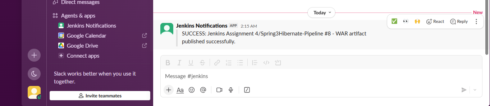

Capture the Slack success message and save it as
`screenshots/12-slack-success.png`.

## 14. Email Notification

After successful artifact publication, Jenkins sends an email containing
the job name, build number, artifact name, and Jenkins build URL.

Example:

``` groovy
emailext(
    subject: "SUCCESS: ${env.JOB_NAME} #${env.BUILD_NUMBER}",
    body: "Jenkins Pipeline completed successfully.",
    to: "your-email@example.com"
)
```

A failure email is also configured for failed artifact publication.

### Screenshot

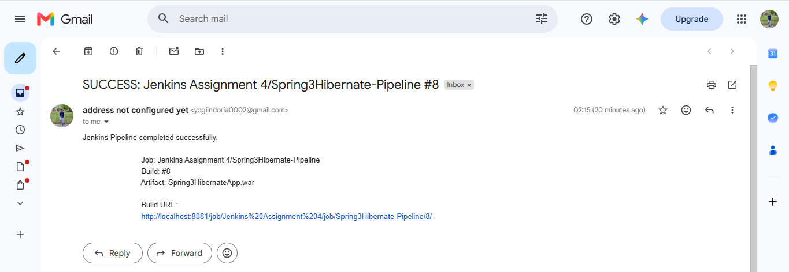

Capture the successful Email notification and save it as
`screenshots/14-email-success.png`.

## 15. Pipeline Post Actions

The pipeline also defines overall post actions for:

``` text
SUCCESS
FAILURE
ABORTED
```

Publication-specific Slack and Email notifications are placed inside the
`post` block of the `Publish Artifact` stage.

## 16. Final Successful Execution

The complete pipeline was successfully executed.

The Jenkins pipeline contains the following completed stages:

``` text
Code Checkout
Build
Parallel Analysis
    Code Stability
    SonarQube Quality Analysis
    Code Coverage
Generate Reports
SonarQube Quality Gate
Approval
Publish Artifact
Post Actions
```

### Pipeline Overview

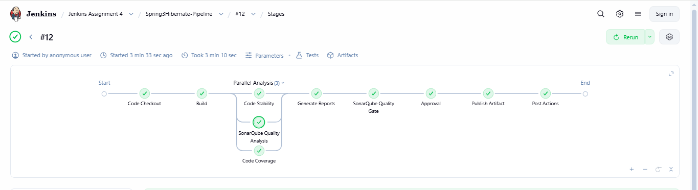

This screenshot shows the successful execution of the complete pipeline
and the three analysis stages running under the Parallel Analysis stage.

## 17. Verification

The following items were verified during the final execution:

  Verification               Result
  -------------------------- ------------
  Code Checkout              Successful
  Maven Build                Successful
  Code Stability             Successful
  Code Quality               Successful
  Code Coverage              Successful
  Parallel Execution         Successful
  Report Generation          Successful
  Approval                   Successful
  WAR Artifact Publication   Successful
  Slack Notification         Received
  Email Notification         Received

## 18. Screenshot Checklist

The README is prepared for the following screenshots:

``` text
screenshots/
├── 01-code-checkout.png
├── 02-build.png
├── 03-parallel-analysis.png
├── 04-code-stability.png
├── 05-code-quality.png
├── 06-code-coverage.png
├── 07-build-with-parameters.png
├── 08-generate-reports.png
├── 09-approval.png
├── 10-pipeline-overview.png
├── 11-artifact.png
├── 12-slack-success.png
├── 13-slack-failure.png
├── 14-email-success.png
├── 15-email-failure.png
├── 16-sonarqube-analysis.png
└── 17-sonarqube-quality-gate.png
```

The currently available Jenkins pipeline screenshot is already included
as:

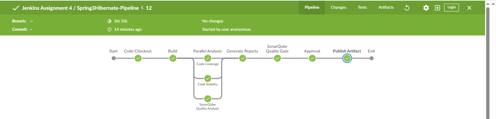

Add the remaining screenshots using the filenames above. The Markdown
image references are already present in the README.

## 19. Conclusion

The Jenkins Declarative CI pipeline successfully automates the complete
CI workflow for the Java application.

The implementation provides:

-   Source-code checkout
-   Maven build
-   Parallel stability, SonarQube quality, and coverage analysis
-   Optional scan execution
-   SonarQube Quality Gate validation
-   Report generation
-   Manual approval
-   Artifact publication
-   Slack notifications
-   Email notifications

The pipeline is suitable for demonstrating the complete Assignment 4 CI
workflow in Jenkins.

## Author

**Yogesh Indoria**
