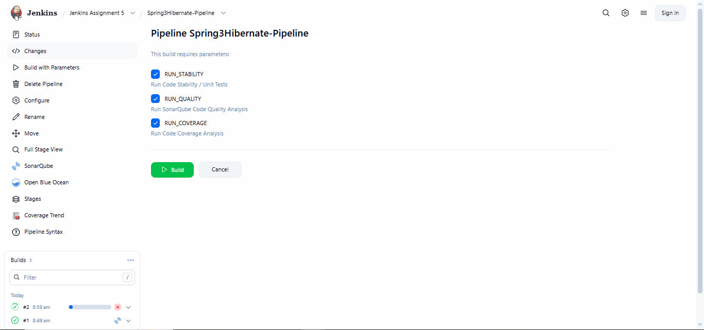
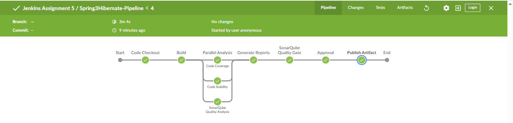
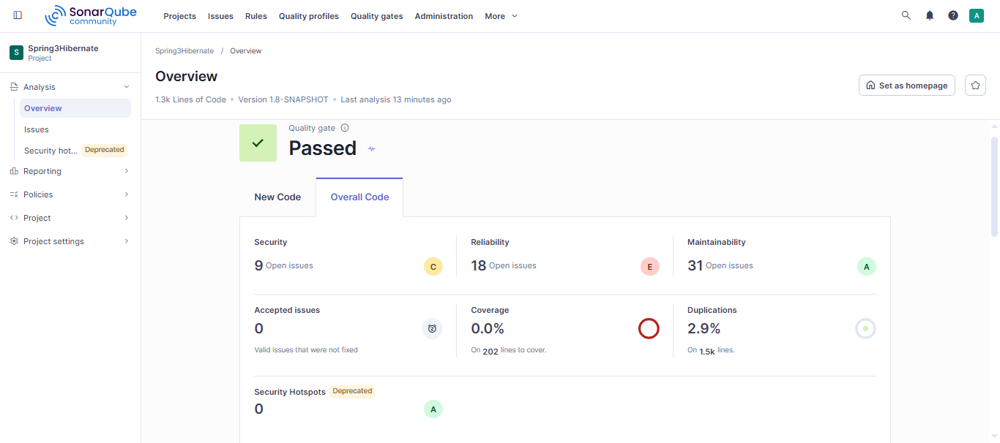
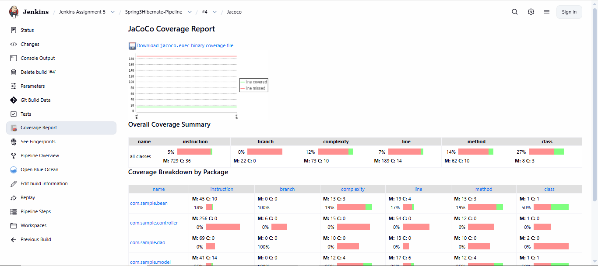
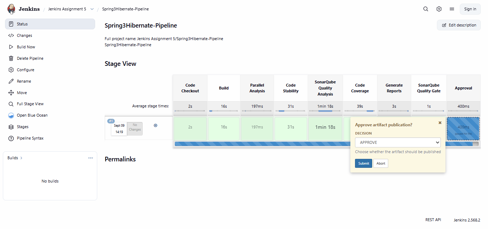
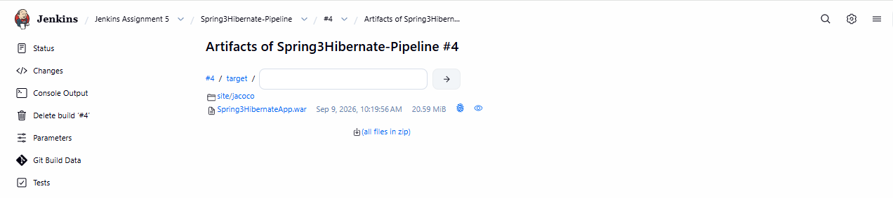
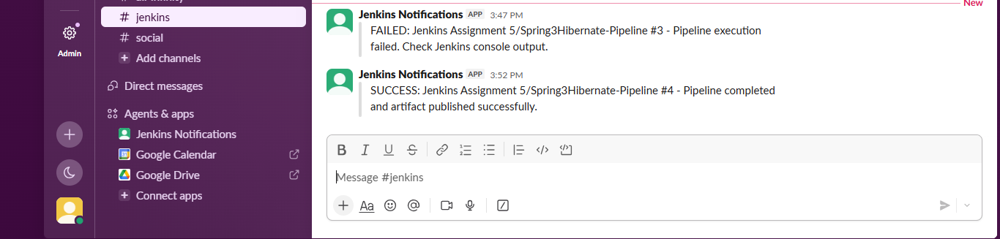
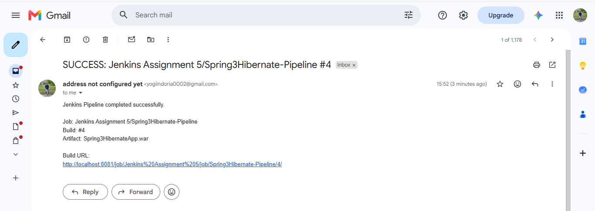

# Jenkins Assignment 5 — Scripted CI Pipeline

**Author:** Yogesh Indoria

## Assignment Overview

Create a **Scripted CI Pipeline** for a Java-based project using Jenkins.

The pipeline performs:

- Code Checkout
- Application Build
- Code Stability Analysis
- Code Quality Analysis
- Code Coverage Analysis
- Parallel execution of analysis stages
- User-controlled scan skipping
- Report generation
- SonarQube Quality Gate validation
- Manual approval before artifact publication
- Artifact publication
- Slack notifications
- Email notifications
- Success and failure handling


## Objective

The objective of this assignment is to create a Scripted Jenkins CI pipeline for a Java project.
The pipeline builds the application, runs code checks in parallel, generates reports, checks the SonarQube Quality Gate,
asks for approval before publishing the WAR file, and sends Slack and email notifications.

---

# ️ Project Structure

```text
Assignment-5-Scripted-CI/
│
├── Jenkinsfile
├── README.md
│
└── screenshots/
 ├── 01-jenkins-job.png
 ├── 02-build-parameters.png
 ├── 03-pipeline-overview.png
 ├── 04-parallel-analysis.png
 ├── 05-sonarqube.png
 ├── 06-jacoco-report.png
 ├── 07-approval.png
 ├── 08-artifact.png
 └── 09-build-success.png
```

---

# ️ Technologies Used

| Technology | Purpose |
|---|---|
| Jenkins | CI/CD Automation |
| Groovy | Scripted Pipeline |
| Java | Application |
| Maven | Build & Dependency Management |
| Git/GitHub | Source Code Management |
| SonarQube | Code Quality Analysis |
| JaCoCo | Code Coverage |
| JUnit | Test Reporting |
| Slack | Notifications |
| Email | Notifications |

---

# Application Details

### Git Repository

```text
https://github.com/yogiindoria/spring3hibernate.git
```

### Branch

```text
master
```

### Artifact

```text
target/Spring3HibernateApp.war
```

---

# Pipeline Architecture

```text
 Code Checkout
 │
 ▼
 Build
 │
 ▼
 ┌─────────────────────┐
 │ Parallel Analysis │
 └──────────┬──────────┘
 │
 ┌────────────────┼────────────────┐
 ▼ ▼ ▼
 Code Stability SonarQube Quality Code Coverage
 │ │ │
 └────────────────┼────────────────┘
 ▼
 Generate Reports
 │
 ▼
 SonarQube Quality Gate
 │
 ▼
 Approval
 / \
 APPROVE DENY
 │ │
 ▼ ▼
 Publish Artifact Pipeline Failed
 │
 ▼
 Slack + Email
 Notification
```

---

# 1. Jenkins Job

Create a new Jenkins Pipeline job:

```text
New Item
 ↓
Assignment-5-Scripted-CI
 ↓
Pipeline
```

---

# ️ 2. Build Parameters

The pipeline provides three Boolean parameters.

```text
RUN_STABILITY
RUN_QUALITY
RUN_COVERAGE
```

Example:

```text
Build with Parameters

RUN_STABILITY 
RUN_QUALITY 
RUN_COVERAGE 
```

Any scan can be disabled before starting the build.

### Screenshot



---

# 3. Scripted Pipeline

This assignment uses the Scripted Pipeline syntax:

```groovy
node {
 ...
}
```

instead of:

```groovy
pipeline {
 ...
}
```

Job parameters are configured using:

```groovy
properties([
 parameters([
 ...
 ])
])
```

---

# 4. Code Checkout

The pipeline checks out the Java project from GitHub.

```groovy
stage('Code Checkout') {

 git branch: 'master',
 url: 'https://github.com/yogiindoria/spring3hibernate.git'
}
```

The source code is now available in the Jenkins workspace.

---

# 5. Build

The project is built using Maven.

```bash
mvn clean package \
 -DskipTests \
 -Dfindbugs.skip=true
```

The generated WAR file is:

```text
target/Spring3HibernateApp.war
```

The source code and WAR artifact are stored using Jenkins `stash`.

```groovy
stash(
 name: 'source-code',
 includes: '**/*',
 excludes: 'target/**,.git/**'
)

stash(
 name: 'war-artifact',
 includes: 'target/Spring3HibernateApp.war'
)
```

---

# 6. Parallel Analysis

The three analysis stages run at the same time.

```text
 Parallel Analysis
 │
 ┌───────────────┼───────────────┐
 ▼ ▼ ▼
 Stability Quality Coverage
```

In a Scripted Pipeline, the parallel stages are stored in a Groovy map.

```groovy
def parallelStages = [:]
```

The stages are then executed using:

```groovy
parallel parallelStages
```

### Screenshot



---

# 7. Code Stability Analysis

Code stability is checked using Maven unit tests.

```bash
mvn test -Dfindbugs.skip=true
```

JUnit/Surefire reports are generated under:

```text
target/surefire-reports/
```

The report is stashed and later published by Jenkins.

---

# 8. SonarQube Code Quality Analysis

SonarQube checks the code for quality issues.

```groovy
withSonarQubeEnv('SonarQube') {

 sh '''
 mvn org.sonarsource.scanner.maven:sonar-maven-plugin:5.8.0.7211:sonar \
 -Dsonar.projectKey=Spring3Hibernate \
 -Dsonar.projectName=Spring3Hibernate
 '''
}
```

### SonarQube Project

```text
Project Key : Spring3Hibernate
Project Name : Spring3Hibernate
```

### Screenshot



---

# 9. Code Coverage Analysis

JaCoCo is used for code coverage analysis.

```bash
mvn test -Dfindbugs.skip=true
mvn jacoco:report -Dfindbugs.skip=true
```

The JaCoCo report is generated under:

```text
target/site/jacoco/
```

### Screenshot



---

# 10. Generate Reports

After the parallel analysis, the pipeline generates the reports.

### JUnit

```groovy
junit(
 allowEmptyResults: true,
 testResults: 'target/surefire-reports/*.xml'
)
```

### JaCoCo

```groovy
jacoco(
 execPattern: 'target/jacoco.exec',
 classPattern: 'target/classes',
 sourcePattern: 'src/main/java'
)
```

The JaCoCo HTML report is also archived as a Jenkins artifact.

---

# 11. SonarQube Quality Gate

When Quality Analysis is enabled, Jenkins waits for the SonarQube Quality Gate.

```groovy
def qualityGate = waitForQualityGate(
 abortPipeline: true
)
```

The pipeline checks the status:

```groovy
if (qualityGate.status != 'OK') {

 error(
 "SonarQube Quality Gate failed: ${qualityGate.status}"
 )
}
```

If the Quality Gate fails, the pipeline stops before the artifact is published.

---

# 12. Manual Approval

Before publishing the WAR file, Jenkins asks for manual approval.

The user gets two options:

```text
APPROVE
DENY
```

Example:

```text
Approve artifact publication?

DECISION:
APPROVE / DENY
```

### Screenshot



---

## If DENY is selected

The pipeline executes:

```groovy
if (decision != 'APPROVE') {

 error(
 'Artifact publication denied by user.'
 )
}
```

Result:

```text
Approval
 ↓
DENY
 ↓
Pipeline Failed
 ↓
Artifact NOT Published
```

---

## If APPROVE is selected

The pipeline continues:

```text
Approval
 ↓
APPROVE
 ↓
Publish Artifact
```

---

# 13. Publish Artifact

After approval, the WAR artifact is restored using:

```groovy
unstash 'war-artifact'
```

It is then archived:

```groovy
archiveArtifacts(
 artifacts: 'target/Spring3HibernateApp.war',
 fingerprint: true
)
```

Published artifact:

```text
Spring3HibernateApp.war
```

### Screenshot



---

# 14. Slack Notification

The pipeline sends a Slack notification after the build.

### SUCCESS

```text
SUCCESS: Job #BuildNumber -
Pipeline completed and artifact published successfully.
```

### FAILURE

```text
FAILED: Job #BuildNumber -
Pipeline execution failed.
```



---

# 15. Email Notification

Email notifications are sent for both successful and failed builds.

### Success Email

Contains:

- Job name
- Build number
- Artifact name
- Jenkins build URL

### Failure Email

Contains:

- Job name
- Build number
- Jenkins build URL
- Console-output troubleshooting message




---

# 16. Scripted Pipeline Concepts

This assignment uses the following Scripted Pipeline concepts.

## `node`

Allocates a Jenkins executor and workspace.

```groovy
node {
 ...
}
```

## `stage`

Creates a pipeline stage.

```groovy
stage('Build') {
 ...
}
```

## `properties()`

Creates and configures Jenkins job parameters.

```groovy
properties([
 parameters([
 ...
 ])
])
```

## `if`

Used to run a block only when a condition is true.

```groovy
if (params.RUN_COVERAGE) {
 ...
}
```

This replaces Declarative Pipeline's `when`.

## `parallel`

Runs multiple stages at the same time.

```groovy
parallel parallelStages
```

## `stash / unstash`

Transfers files between stages.

## `input`

Pauses the pipeline for manual approval.

## `try / catch / finally`

Handles errors and runs the final notification logic.

```groovy
try {
 ...
}
catch (err) {
 ...
}
finally {
 ...
}
```

## `archiveArtifacts`

Stores build artifacts in Jenkins.

---

# Declarative vs Scripted Pipeline

| Feature | Declarative | Scripted |
|---|---|---|
| Pipeline root | `pipeline {}` | `node {}` |
| Parameters | `parameters {}` | `properties()` |
| Conditions | `when` | `if` |
| Parallel | `parallel {}` | `parallel()` |
| Post actions | `post {}` | `try/catch/finally` |
| Syntax | Structured | Groovy-based |
| Flexibility | More opinionated | More flexible |

---

# 17. Testing Scenarios

## Test 1 — All Scans Enabled

```text
RUN_STABILITY = true
RUN_QUALITY = true
RUN_COVERAGE = true
```

Expected:

```text
All three analysis stages execute in parallel.
```

---

## Test 2 — Skip Stability

```text
RUN_STABILITY = false
RUN_QUALITY = true
RUN_COVERAGE = true
```

Expected:

```text
Code Stability is skipped.
Quality + Coverage execute.
```

---

## Test 3 — Skip Quality

```text
RUN_STABILITY = true
RUN_QUALITY = false
RUN_COVERAGE = true
```

Expected:

```text
SonarQube analysis and Quality Gate are skipped.
```

---

## Test 4 — Skip Coverage

```text
RUN_STABILITY = true
RUN_QUALITY = true
RUN_COVERAGE = false
```

Expected:

```text
Coverage analysis and JaCoCo report are skipped.
```

---

## Test 5 — Approval Denied

```text
DECISION = DENY
```

Expected:

```text
 Artifact is not published
 Pipeline fails
 Failure notification
 Slack failure notification
```

---

## Test 6 — Approval Granted

```text
DECISION = APPROVE
```

Expected:

```text
 WAR artifact is published
 Success notification
 Slack success notification
```

---

# 18. Pipeline Execution

Add a screenshot of the successful Jenkins pipeline execution.

### Screenshot


---

# Final Pipeline Flow

```text
GitHub
 │
 ▼
Code Checkout
 │
 ▼
Maven Build
 │
 ▼
Parallel Analysis
 │
 ├── Code Stability
 │
 ├── SonarQube Quality
 │
 └── Code Coverage
 │
 ▼
Generate Reports
 │
 ▼
SonarQube Quality Gate
 │
 ▼
Manual Approval
 │
 ├── DENY ───────► Pipeline Failed
 │
 └── APPROVE
 │
 ▼
 Publish WAR
 │
 ▼
 Slack + Email
 │
 ▼
 SUCCESS
```

---

# Key Learning Outcomes

This assignment covers the following Jenkins concepts:

- Scripted Jenkins Pipeline
- Groovy-based pipeline syntax
- Jenkins build parameters
- Conditional execution
- Parallel execution
- Workspace management
- Stash and Unstash
- Maven build
- JUnit reporting
- JaCoCo coverage
- SonarQube analysis
- SonarQube Quality Gate
- Manual approval
- Artifact publishing
- Slack notifications
- Email notifications
- Error handling
- Declarative vs Scripted Pipeline

---

# Assignment Status

```text
 Code Checkout
 Maven Build
 Parallel Code Stability
 Parallel Code Quality
 Parallel Code Coverage
 Skip Scan Parameters
 JUnit Reports
 JaCoCo Reports
 SonarQube Analysis
 SonarQube Quality Gate
 Manual Approval
 Artifact Publication
 Slack Notification
 Email Notification
 Success Handling
 Failure Handling
 Scripted Pipeline
```

# Assignment Completed

**Jenkins Scripted CI Pipeline implemented successfully for the Java project.**