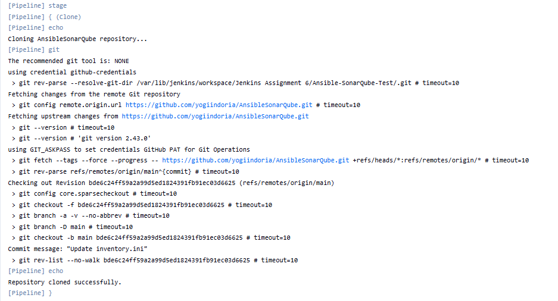
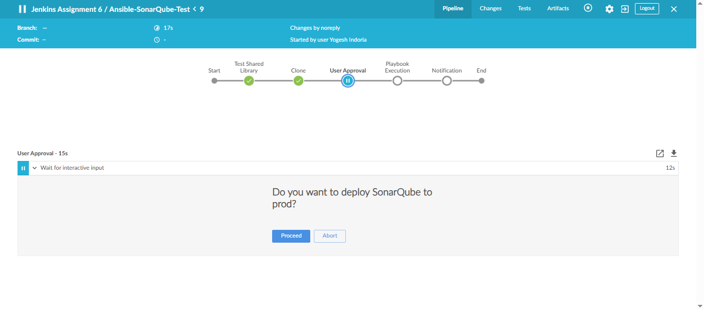
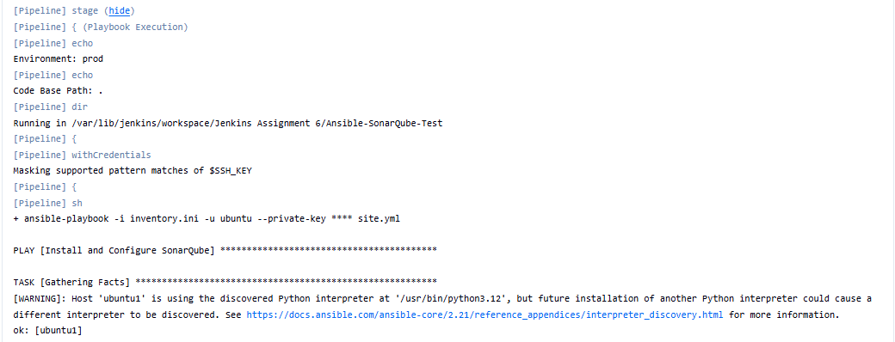
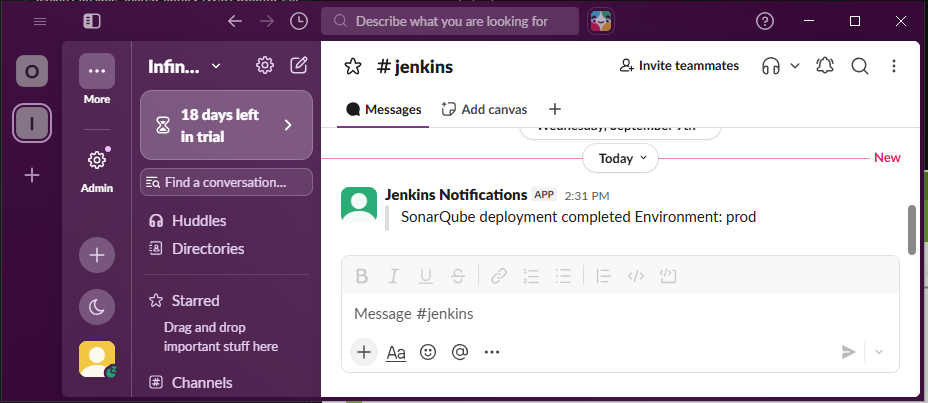
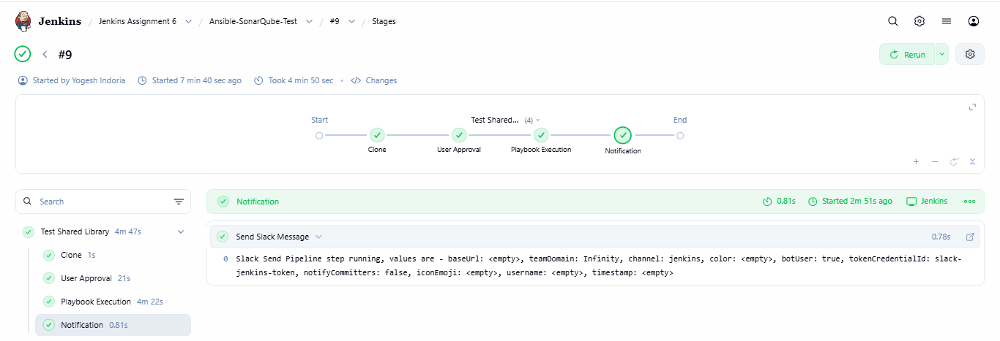
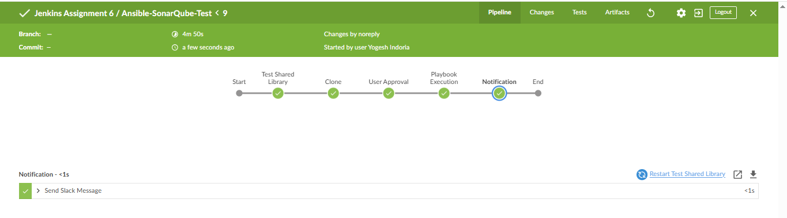
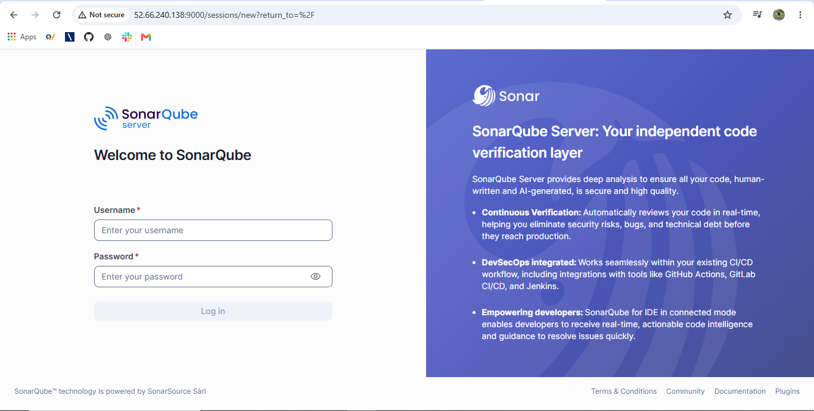

# Jenkins Ansible Shared Library - SonarQube Deployment

**Author:** Yogesh Indoria

## Overview

This project demonstrates a Jenkins Shared Library for automating SonarQube deployment using Ansible.

The Shared Library provides the following stages:

1. Clone
2. User Approval
3. Playbook Execution
4. Notification

The required configuration is maintained in a properties file.

## Project Architecture

Two GitHub repositories are used:

### 1. Ansible Repository

`AnsibleSonarQube`

Contains the Ansible playbook and SonarQube role.

Main playbook:

```yaml
- name: Install and Configure SonarQube
  hosts: all
  become: true

  roles:
    - sonarqube
```

### 2. Jenkins Shared Library Repository

`jenkins-ansible-shared-library`

Structure:

```text
jenkins-ansible-shared-library/
├── vars/
│   └── ansibleDeploy.groovy
├── resources/
│   └── sonarqube.properties
├── screenshots/
└── README.md
```

---

# Workflow

The Jenkins Shared Library executes the following workflow:

```text
Clone
   ↓
User Approval
   ↓
Playbook Execution
   ↓
Notification
```

---

## 1. Clone Stage

The Shared Library clones the `AnsibleSonarQube` repository from GitHub.

The GitHub repository is accessed using the Jenkins credential:

`github-credentials`

Example:

```groovy
git(
    url: 'https://github.com/yogiindoria/AnsibleSonarQube.git',
    branch: 'main',
    credentialsId: 'github-credentials'
)
```

### Clone Stage Screenshot

Add the screenshot here:

```text
screenshots/clone-stage.png
```



---

## 2. User Approval Stage

Before executing the Ansible playbook, Jenkins asks the user for approval.

The approval is controlled using:

```properties
KEEP_APPROVAL_STAGE=true
```

If enabled, Jenkins displays an approval message:

```text
Do you want to deploy SonarQube to prod?
```

The user must click **Proceed** to continue the pipeline.

### User Approval Screenshot

Add the screenshot here:

```text
screenshots/user-approval.png
```



---

## 3. Playbook Execution

After approval, Jenkins executes the Ansible playbook.

The playbook is executed using the Jenkins SSH credential:

`vm2-ssh-key`

The private key is securely provided to Ansible through Jenkins Credentials.

Example:

```groovy
withCredentials([
    sshUserPrivateKey(
        credentialsId: 'vm2-ssh-key',
        keyFileVariable: 'SSH_KEY',
        usernameVariable: 'SSH_USER'
    )
]) {
    sh '''
        ansible-playbook         -i inventory.ini         -u "$SSH_USER"         --private-key "$SSH_KEY"         site.yml
    '''
}
```

No private key is stored inside the Git repository.

### Playbook Execution Screenshot

Add the screenshot here:

```text
screenshots/playbook-execution.png
```



---

## 4. Notification Stage

After successful playbook execution, Jenkins sends a Slack notification.

The Slack channel is configured using:

```properties
SLACK_CHANNEL_NAME=jenkins
```

Example notification:

```text
SonarQube deployment completed successfully. Environment: prod
```

### Slack Notification Screenshot

Add the screenshot here:

```text
screenshots/slack-notification.png
```



---

# Configuration File

The configuration is stored in:

```text
resources/sonarqube.properties
```

Current configuration:

```properties
SLACK_CHANNEL_NAME=jenkins
ENVIRONMENT=prod
CODE_BASE_PATH=.
ACTION_MESSAGE=SonarQube deployment completed successfully.
KEEP_APPROVAL_STAGE=true
```

## Configuration Parameters

| Parameter | Description |
|---|---|
| `SLACK_CHANNEL_NAME` | Slack channel where the notification is sent |
| `ENVIRONMENT` | Deployment environment |
| `CODE_BASE_PATH` | Path where the Ansible repository is available in the Jenkins workspace |
| `ACTION_MESSAGE` | Message sent in the Slack notification |
| `KEEP_APPROVAL_STAGE` | Enables or disables the approval stage |

---

# Jenkinsfile

The Jenkins pipeline uses the Shared Library with:

```groovy
@Library('ansible-shared-library') _

pipeline {
    agent any

    stages {
        stage('Deploy SonarQube') {
            steps {
                ansibleDeploy()
            }
        }
    }
}
```

The main pipeline logic is maintained inside the Shared Library.

---

# Shared Library

The main Shared Library file is:

```text
vars/ansibleDeploy.groovy
```

It performs:

- Configuration loading
- Git repository cloning
- User approval
- Ansible playbook execution
- Slack notification

---

# Jenkins Credentials

The following Jenkins credentials are used:

| Credential ID | Purpose |
|---|---|
| `github-credentials` | Access to GitHub repository |
| `vm2-ssh-key` | SSH access to the Ansible target server |
| `slack-jenkins-token` | Slack integration |

Sensitive credentials are stored in Jenkins Credentials and are not hard-coded in the repository.

---

# Full Pipeline Screenshot

This screenshot shows the complete Jenkins pipeline with all stages successfully executed.

Add the screenshot here:

```text
screenshots/full-pipeline.png
```



---

# Final Pipeline Flow Screenshot

Add the final pipeline screenshot here:

```text
screenshots/final-pipeline.png
```



---

# SonarQube Deployment Screenshot



---

# Tools and Technologies

- Jenkins
- Jenkins Shared Library
- Ansible
- Git
- GitHub
- SonarQube
- Slack
- Linux

---

# Conclusion

This project demonstrates how a Jenkins Shared Library can be used to create a reusable deployment workflow for Ansible-based SonarQube deployment.

The workflow provides:

- Automated source code cloning
- Manual deployment approval
- Secure SSH-based Ansible execution
- Configuration-driven pipeline behavior
- Slack deployment notification

**Author:** Yogesh Indoria
