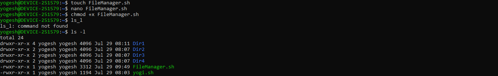
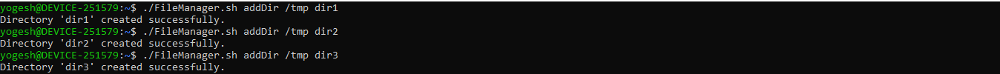
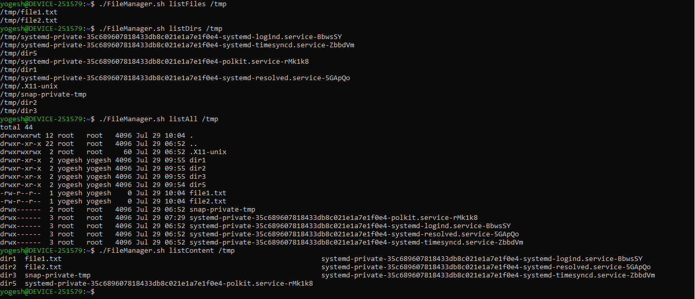
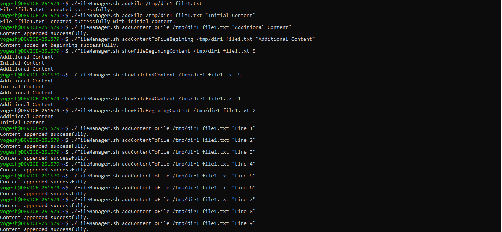
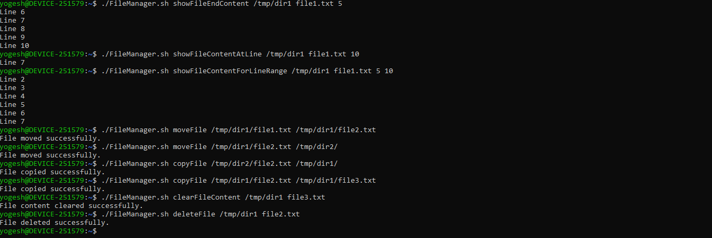

# 🐧 Linux File & Directory Manager — Assignment 1.2

> A Bash-based command-line utility (`FileManager.sh`) that wraps common Linux file and directory operations — create, delete, list, read, and modify — behind a single, subcommand-driven script.

---

## 📌 Assignment Overview

**Problem Statement: ASSIGNMENT 1 — Basic Linux Commands**

Build a utility, `FileManager.sh`, that performs basic directory and file management tasks through simple subcommands, without relying on any text editor for file edits.

### Part A – Directory Operations

Create a utility that can:
- Create a Directory
- Delete a Directory
- List Content of a Directory
- Only list Files in a Directory
- Only list Directories in a Directory
- List All (files and directories)

```bash
./FileManager.sh addDir /tmp dir1
./FileManager.sh addDir /tmp dir2
./FileManager.sh addDir /tmp dir3
./FileManager.sh listFiles /tmp
./FileManager.sh listDirs /tmp
./FileManager.sh listAll /tmp
./FileManager.sh deleteDir /tmp dir3
```

### Part B – File Operations

Update `FileManager.sh` to also process files:
- Create a file
- Add content to a file
- Add content at the beginning of a file
- Show top N lines of a file
- Show last N lines of a file
- Show content at a specific line number
- Show content for a specific line number range
- Move / Copy a file from one location to another
- Delete a file

```bash
./FileManager.sh addFile /tmp/dir1 file1.txt
./FileManager.sh addFile /tmp/dir1 file1.txt "Initial Content"
./FileManager.sh addContentToFile /tmp/dir1 file1.txt "Additional Content"
./FileManager.sh addContentToFileBegining /tmp/dir1 file1.txt "Additional Content"
./FileManager.sh showFileBeginingContent /tmp/dir1 file1.txt 5
./FileManager.sh showFileEndContent /tmp/dir1 file1.txt 5
./FileManager.sh showFileContentAtLine /tmp/dir1 file1.txt 10
./FileManager.sh showFileContentForLineRange /tmp/dir1 file1.txt 5 10
./FileManager.sh moveFile /tmp/dir1/file1.txt /tmp/dir1/file2.txt
./FileManager.sh moveFile /tmp/dir1/file2.txt /tmp/dir2/
./FileManager.sh copyFile /tmp/dir2/file2.txt /tmp/dir1/
./FileManager.sh copyFile /tmp/dir1/file2.txt /tmp/dir1/file3.txt
./FileManager.sh clearFileContent /tmp/dir1 file3.txt
./FileManager.sh deleteFile /tmp/dir1 file2.txt
```

---

## 📂 Project Structure

```text
.
├── FileManager.sh
├── screenshots/
│   ├── setup.png
│   ├── dir-operations.png
│   ├── list-operations.png
│   ├── file-operations-1.png
│   └── file-operations-2.png
└── README.md
```

---

## ⚙️ Setup

```bash
touch FileManager.sh
nano FileManager.sh        # paste the script content
chmod +x FileManager.sh    # make it executable
```



---

## 🗂 Directory Commands

| Command | Description |
|---|---|
| `addDir <path> <dirname>` | Create a directory at the given path |
| `deleteDir <path> <dirname>` | Delete a directory (and its contents) |
| `listContent <path>` | List everything inside a directory |
| `listFiles <path>` | List only files (`find -maxdepth 1 -type f`) |
| `listDirs <path>` | List only directories (`find -mindepth 1 -maxdepth 1 -type d`) |
| `listAll <path>` | List all entries, including hidden ones (`ls -la`) |

```bash
./FileManager.sh addDir /tmp dir1
./FileManager.sh addDir /tmp dir2
./FileManager.sh addDir /tmp dir3
```



```bash
./FileManager.sh listFiles /tmp
./FileManager.sh listDirs /tmp
./FileManager.sh listAll /tmp
./FileManager.sh listContent /tmp
```



---

## 📄 File Commands

| Command | Description |
|---|---|
| `addFile <path> <filename> [content]` | Create an empty file, or with initial content |
| `addContentToFile <path> <filename> <content>` | Append content to the end of a file |
| `addContentToFileBegining <path> <filename> <content>` | Insert content at the start of a file |
| `showFileBeginingContent <path> <filename> <n>` | Show top N lines (`head -n`) |
| `showFileEndContent <path> <filename> <n>` | Show last N lines (`tail -n`) |
| `showFileContentAtLine <path> <filename> <line>` | Show a specific line (`sed -n '<n>p'`) |
| `showFileContentForLineRange <path> <filename> <start> <end>` | Show a line range (`sed -n '<s>,<e>p'`) |
| `moveFile <source> <destination>` | Move/rename a file (`mv`) |
| `copyFile <source> <destination>` | Copy a file (`cp`) |
| `clearFileContent <path> <filename>` | Truncate file content to empty |
| `deleteFile <path> <filename>` | Delete a file (`rm`) |

```bash
./FileManager.sh addFile /tmp/dir1 file1.txt
./FileManager.sh addFile /tmp/dir1 file1.txt "Initial Content"
./FileManager.sh addContentToFile /tmp/dir1 file1.txt "Additional Content"
./FileManager.sh addContentToFileBegining /tmp/dir1 file1.txt "Additional Content"
./FileManager.sh showFileBeginingContent /tmp/dir1 file1.txt 5
./FileManager.sh showFileEndContent /tmp/dir1 file1.txt 5
```



```bash
./FileManager.sh showFileContentAtLine /tmp/dir1 file1.txt 10
./FileManager.sh showFileContentForLineRange /tmp/dir1 file1.txt 5 10
./FileManager.sh moveFile /tmp/dir1/file1.txt /tmp/dir1/file2.txt
./FileManager.sh moveFile /tmp/dir1/file2.txt /tmp/dir2/
./FileManager.sh copyFile /tmp/dir2/file2.txt /tmp/dir1/
./FileManager.sh copyFile /tmp/dir1/file2.txt /tmp/dir1/file3.txt
./FileManager.sh clearFileContent /tmp/dir1 file3.txt
./FileManager.sh deleteFile /tmp/dir1 file2.txt
```



---

## ✅ Additional Features

Beyond the base problem statement, the script also implements:

- **Argument validation** — every subcommand checks the exact expected number of arguments (`$#`) and prints a usage message before exiting with a non-zero status if the count is wrong.
- **Existence checks** — directory/file existence (`-d`, `-f`) is verified before acting, avoiding silent failures (e.g. `addDir` fails cleanly if the parent path doesn't exist; file commands fail cleanly if the target file is missing).
- **Global usage help** — running the script with no command (`./FileManager.sh`) prints the full list of supported commands and their syntax.
- **Invalid command handling** — any unrecognized subcommand falls through to a catch-all `*)` case that reports the invalid command instead of failing silently.
- **In-place prepend** — `addContentToFileBegining` inserts content at the top of a file using a temp file + `mv`, since Bash redirection alone has no native "prepend" mode.

---

## 🧠 Implementation Notes

- Built entirely with a single `case "$1" in ... esac` block dispatching on the first argument (the subcommand name).
- Uses only core Linux utilities: `mkdir`, `rm`, `ls`, `find`, `touch`, `echo`, `sed`, `head`, `tail`, `mv`, `cp`.
- `listFiles` / `listDirs` use `find -maxdepth 1` (scoped to the given directory, not recursive) to correctly separate files from directories.
- Line-based commands (`showFileContentAtLine`, `showFileContentForLineRange`) are implemented with `sed -n`, avoiding the need to load the whole file for a single line or range.

---

## Requirements

- Linux / Bash shell (tested on Ubuntu via WSL)
- Read/write permissions on the target paths

---

## Author

**Yogesh Indoria**

