# Linux Assignment 4

This assignment is about creating a small SSH connection utility using Bash.

The utility is called `otssh` and is used to add, list, update, delete and connect to saved SSH connections.

---

## Assignment Overview

The main features of `otssh` are:

- Add an SSH connection
- List saved SSH connections
- List connection details
- Update an SSH connection
- Delete an SSH connection
- Connect to a saved server

The utility stores the connection details in a local file and uses those details when connecting to a server.

---

## Project Structure

```text
.
├── otssh
├── screenshots/
└── README.md
```

---

## Add SSH Connection

A new server can be added using the `-a` option.

```bash
./otssh.sh -a -n server1 -h 192.168.21.30 -u kirti
```

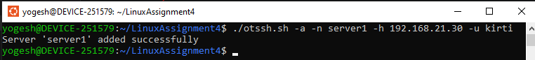

A port and SSH key can also be provided:

```bash
./otssh.sh -a -n server2 -h 192.168.42.34 -u kirti -p 2022
```

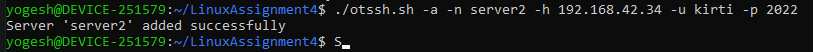

```bash
./otssh.sh -a -n server3 -h 192.168.46.34 -u ubuntu -p 2022 -i ~/.ssh/server3.pem
```
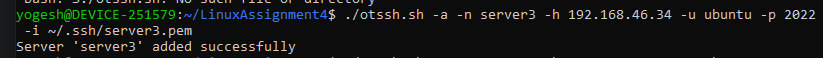] 

Here:

- `-n` is the connection name
- `-h` is the host
- `-u` is the SSH user
- `-p` is the SSH port
- `-i` is the SSH key file

The script uses port `22` by default.

---

## List SSH Connections

To list only the saved connection names:

```bash
./otssh.sh ls
```
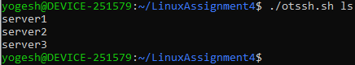


Example:

```text
server1
server2
server3
```

To see the connection details:

```bash
./otssh.sh ls -d
```

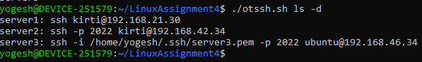

Example:

```text
server1: ssh kirti@192.168.21.30
server2: ssh -p 2022 kirti@192.168.42.34
server3: ssh -i ~/.ssh/server3.pem -p 2022 ubuntu@192.168.46.34
```

---

## Update SSH Connection

An existing connection can be updated using `-U`.

```bash
./otssh.sh -U -n server1 -h server1 -u user1
```
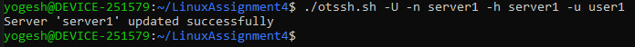

For example, the port can also be changed:

```bash
./otssh.sh -U -n server2 -h server2 -u user2 -p 2022
```

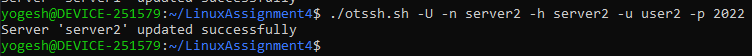

After updating, the details can be checked with:

```bash
./otssh.sh ls -d
```

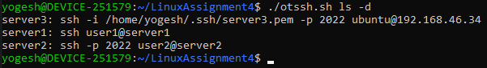


The update keeps the old values for options that are not provided.

---

## Delete SSH Connection

A saved connection can be removed using `rm`.

```bash
./otssh.sh rm server1
```

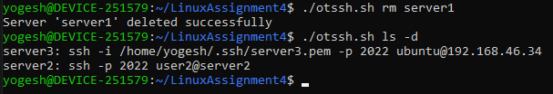

After deleting connections:

```bash
./otssh.sh ls -d
```


The deleted connection will no longer be listed.

---

## Connect to Server

To connect to a saved server:

```bash
./otssh.sh server3
```

The utility reads the saved details and builds the SSH command using the user, host, port and key.

For example:

```text
Connecting to server3 on 22 port as user3 via ~/.ssh/VM2.pem key
```
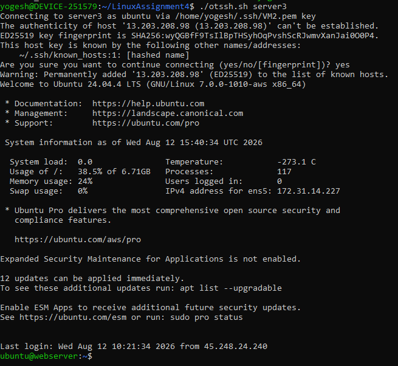

If the server name is not present, an error is shown:

```text
[ERROR]: Server information is not available, please add server first
```

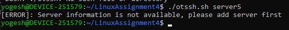

---

## How It Works

The script stores server information in:

```text
$HOME/LinuxAssignment4/.otssh/server.db
```

The database directory and file are created automatically if they do not exist.

Each connection is stored with:

```text
name|host|user|port|key
```

The script uses Bash functions for the different operations:

- `add_server`
- `update_server`
- `list_server`
- `delete_server`
- `connect_server`

The main `case` statement decides which function should run based on the command.

---

## Commands

| Command | Description |
|---|---|
| `otssh.sh -a` | Add a new SSH connection |
| `otssh.sh -U` | Update an existing connection |
| `otssh.sh ls` | List saved connection names |
| `otssh.sh ls -d` | List connection details |
| `otssh.sh rm SERVER_NAME` | Delete a connection |
| `otssh.sh SERVER_NAME` | Connect to a saved server |

---

## Bash Concepts Practiced

- Bash scripting
- Command line arguments
- `getopts`
- Functions
- `case` statements
- Local variables
- File handling
- `grep`
- `sed`
- SSH command construction
- Arrays
- Reading data using `IFS`

---

## Author

**Yogesh Indoria**

Linux Shell Scripting - Assignment 4
