# Linux Assignment 5

> A Bash scripting project demonstrating text processing, template rendering, and file manipulation using standard Linux utilities such as `sed`, `grep`, `wc`, and shell scripting.

Submitted by: Yogesh Indoria

## Assignment Overview

This assignment consists of two parts:

### Part A – Template Engine

Build a template engine that reads a template file and replaces placeholders with values passed as command-line arguments.

### Part B – Text Editor Utility

Develop a command-line text editor capable of performing common text manipulation operations on files.

---

# Project Structure

```
.
├── templateEngine.sh
├── trainer.template
├── otTextEditor
├── sample.txt
├── screenshots/
└── README.md
```

---

# Features

## Part A – Template Engine

✔ Replace template variables

✔ Pass unlimited key=value pairs

✔ Generate final output dynamically

### Template Format

```text
{{fname}} is trainer of {{topic}}
```

### Usage

```bash
./templateEngine.sh trainer.template fname=Sandeep topic=Linux
```

### Output

```text
Sandeep is trainer of Linux
```

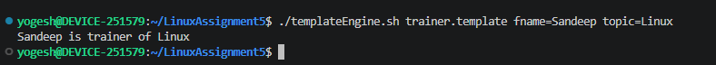

---

# Part B – Text Editor Utility

The utility supports various file editing operations from the command line.

## Supported Commands

| Command | Description |
|----------|-------------|
| addLineTop | Add a line at the beginning of a file |
| addLineBottom | Add a line at the end of a file |
| addLineAt | Insert a line at a specific line number |
| updateFirstWord | Replace the first occurrence of a word |
| updateAllWords | Replace all occurrences of a word |
| insertWord | Insert a word between two words |
| deleteLine | Delete a line by line number |
| deleteLine (with word) | Delete a line containing a specific word |

---

# Additional Features

Implemented beyond the assignment requirements:

- Search a word in a file
- Display complete file contents
- Count total number of lines

---

# Usage

## Add line at top

```bash
./otTextEditor addLineTop sample.txt "First Line"
```

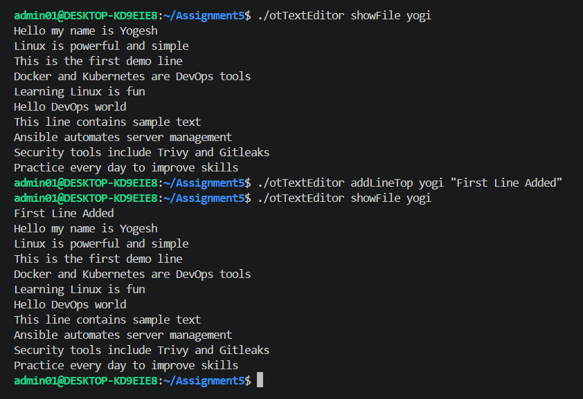

---

## Add line at bottom

```bash
./otTextEditor addLineBottom sample.txt "Last Line"
```

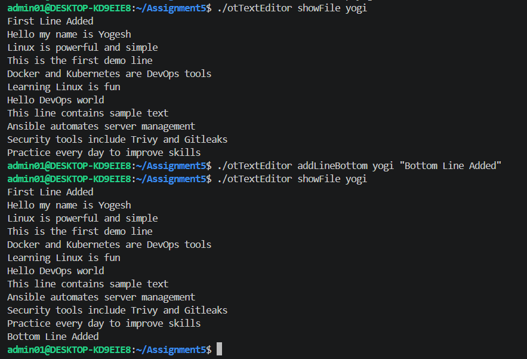

---

## Add line at specific position

```bash
./otTextEditor addLineAt sample.txt 3 "Inserted Line"
```

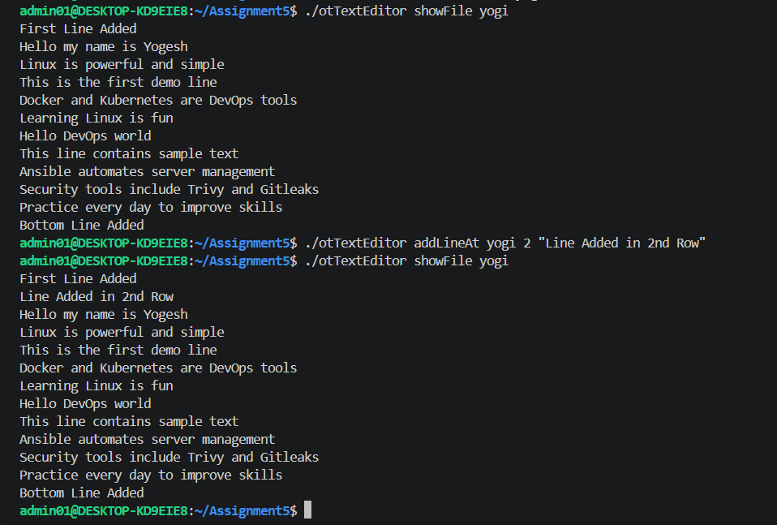

---

## Replace first occurrence

```bash
./otTextEditor updateFirstWord sample.txt Hello Hi
```

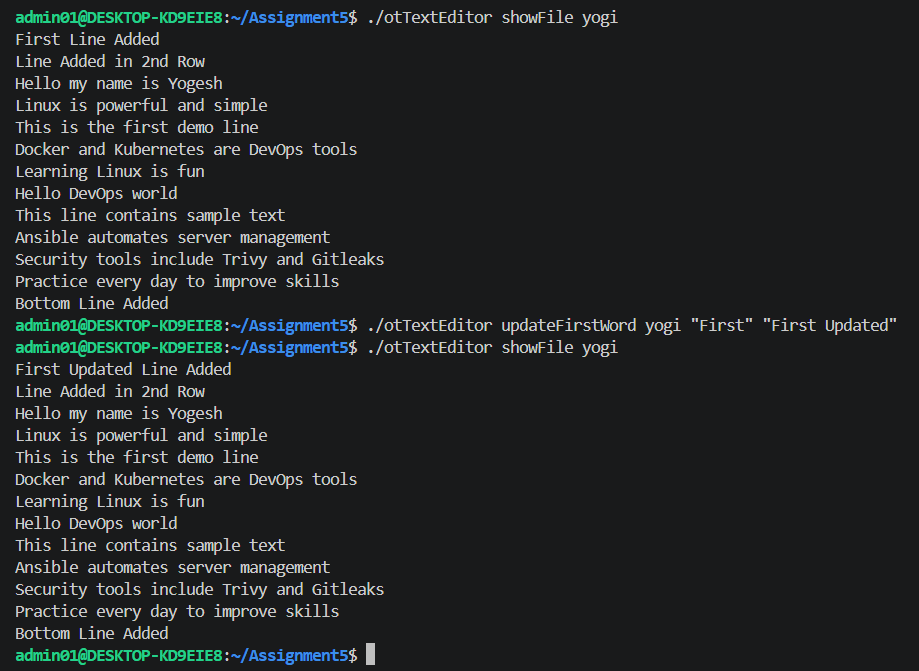

---

## Replace all occurrences

```bash
./otTextEditor updateAllWords sample.txt Hello Hi
```

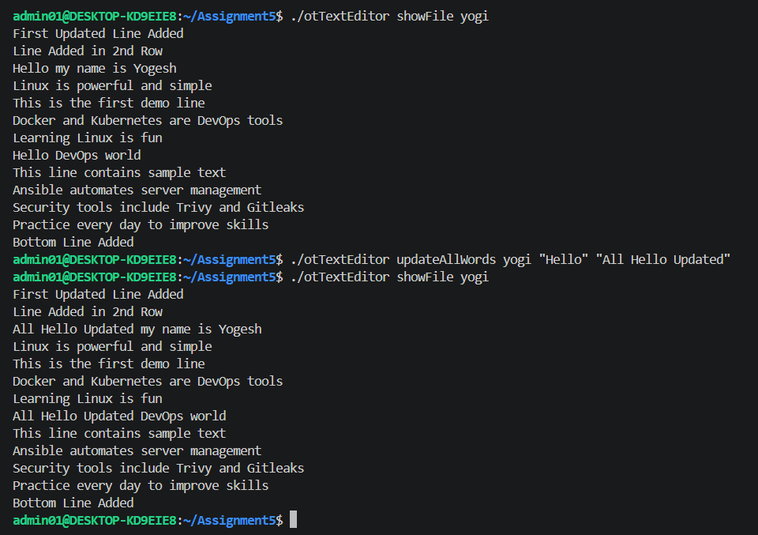

---

## Insert a word

```bash
./otTextEditor insertWord sample.txt First Updated Middle
```

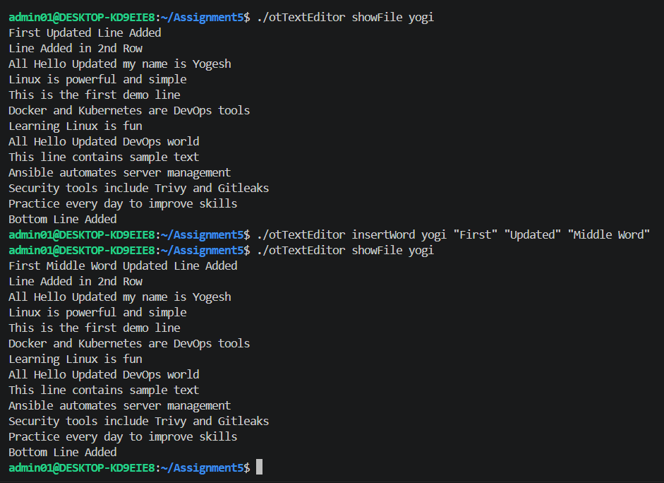

---

## Delete line by number

```bash
./otTextEditor deleteLine sample.txt 4
```

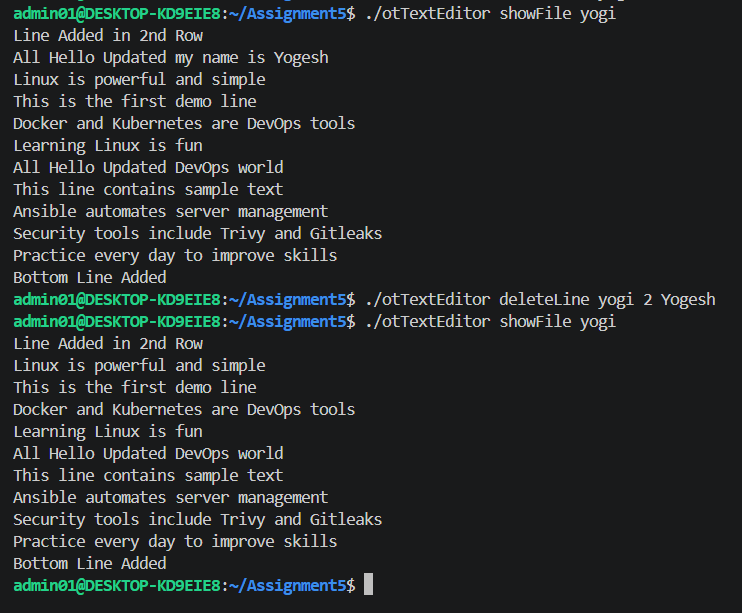

---

## Delete line containing a word

```bash
./otTextEditor deleteLine sample.txt 0 Docker
```

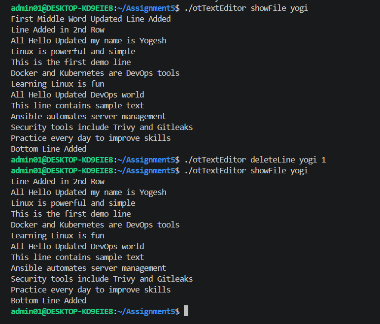

---

## Search word

```bash
./otTextEditor searchWord sample.txt Docker
```


---

## Show file

```bash
./otTextEditor showFile sample.txt
```

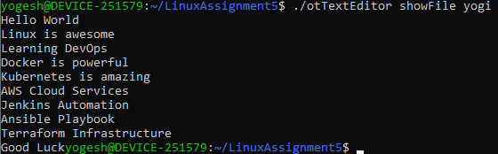

---

## Count lines

```bash
./otTextEditor countLines sample.txt
```

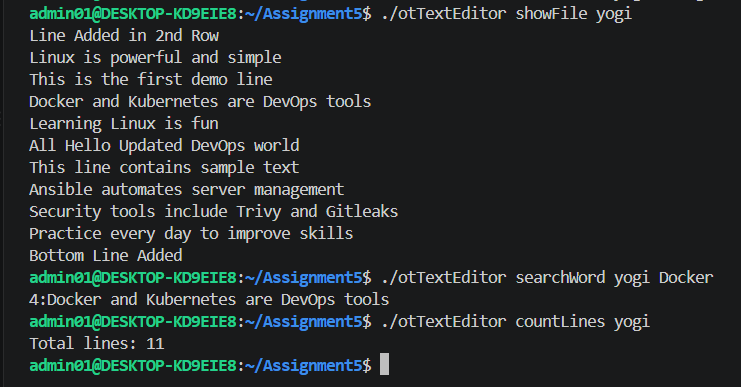

---

# Technologies Used

- Bash Shell Scripting
- Linux
- sed
- grep
- wc
- cat
- Shell Case Statements

---

# Concepts Covered

- Shell Scripting
- Command Line Arguments
- Variables
- Loops
- Case Statements
- File Handling
- Text Processing
- Pattern Matching
- Regular Expressions
- sed Commands
- grep Commands
- wc Utility

# Learning Outcomes

Through this assignment, I learned:

- Writing modular Bash scripts
- Working with Linux command-line utilities
- Using `sed` for text manipulation
- Searching patterns using `grep`
- Counting file statistics using `wc`
- Handling user input through command-line arguments
- Building reusable command-line utilities

---

# Author

**Yogesh Indoria**

Linux Shell Scripting Assignment 5

---

