# Linux Assignment 6

This assignment is about Linux process management using shell scripting. It has three parts covering process monitoring, managing services, and working with running processes.

Submitted By : Yogesh Indoria

## Assignment Overview

### Part A - Process Management Utility

Create a process management utility called `otProcessManager` to perform different operations on Linux processes.

### Part B - Process Manager Utility

Create `ProcessManager.sh` to register and manage processes as services.

### Part C - Process Practice

Work with running processes and observe what happens when their log files, priorities, and other process-related settings are changed.

---

# Part A - Process Management Utility

The utility provides different commands to find, monitor and manage processes.

## Top N Processes by Memory

Find the top N processes based on memory usage.

```bash
./otProcessManager topProcess 5 memory
```

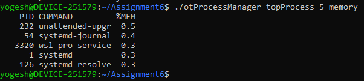

---

## Top N Processes by CPU

Find the top N processes based on CPU usage.

```bash
./otProcessManager topProcess 10 cpu
```

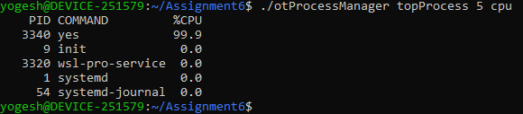

---

## Kill Process Having Least Priority

Find and kill the process having the least priority.

```bash
./otProcessManager killLeastPriorityProcess
```

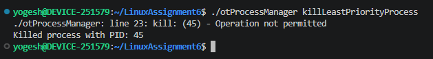

---

## Running Duration of a Process

Check the running duration of a process using its name or PID.

```bash
./otProcessManager RunningDurationProcess <processName>/<processID>
```

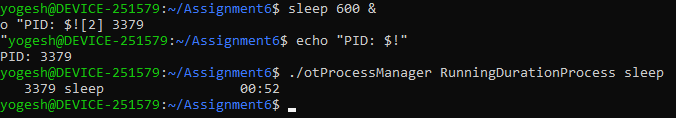

---

## List Orphan Processes

List orphan processes, if any are running.

```bash
./otProcessManager listOrphanProcess
```

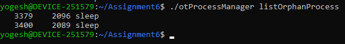

---

## List Zombie Processes

List zombie processes, if any are running.

```bash
./otProcessManager listZombieProcess
```

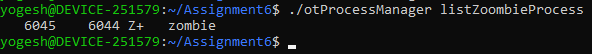

---

## Kill Process by Name or PID

Kill a process by providing its name or PID.

```bash
./otProcessManager killProcess <processName>/<processID>
```

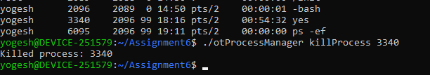

---

## List Waiting Processes

List processes that are waiting for resources.

```bash
./otProcessManager ListWaitingProcess
```

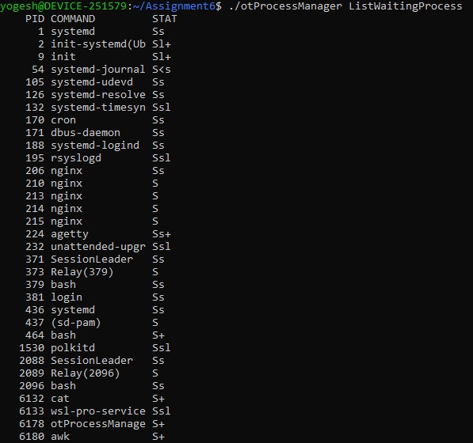

---

# Part B - Process Manager Utility

`ProcessManager.sh` is used to register and manage services.

A service is registered with a script path and an alias. After registration, the service can be started, stopped, checked, and its priority can be changed.

## Create a Service

 Create a simple service by registering a script with an alias..

    1. Create the service script
        
        touch myservice.sh
        chmod +x myservice.sh
        nano myservice.sh
    
    2. Add the following content
        
        #!/bin/bash

        while true
        do
            echo "Service is running"
            sleep 10
        done

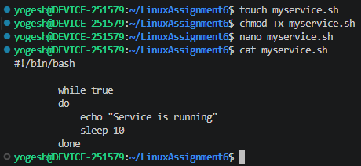

## Register a Process

Register a script as a service and assign an alias to it.

```bash
./ProcessManager.sh -o register -s <path> -a <alias>
```

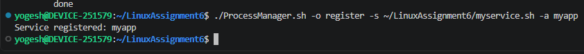

---

## Start a Process

Start a registered service using its alias.

```bash
./ProcessManager.sh -o start -a <alias>
```

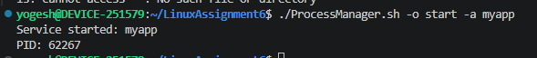

---

## Check Process Status

Check whether a particular service is running or not.

```bash
./ProcessManager.sh -o status -a <alias>
```

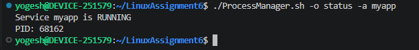

---

## Kill a Process

Stop a running service using its alias.

```bash
./ProcessManager.sh -o kill -a <alias>
```


---

## Change Process Priority

Change the priority of a registered service.

```bash
./ProcessManager.sh -o priority -p <low/med/high> -a <alias>
```

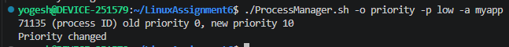

---

## List Registered Services

List the services registered with the utility.

```bash
./ProcessManager.sh -o list
```

Example output:

```text
service2
service1
service3
```

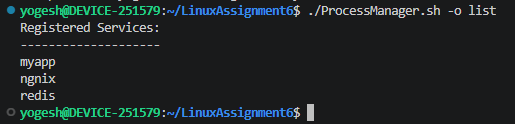

---

## Show Process Details

Show the details of processes started by the utility.

```bash
./ProcessManager.sh -o top [-a <alias>]
```

Example output:

```text
alias, PID, State, Priority, Script
```

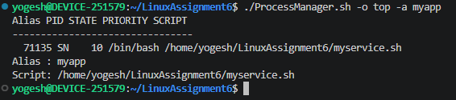

---

# Part C - Process Practice

This part is about experimenting with running processes and observing their behaviour.

## Clear a Log File of a Running Process

Clear the log file being used by a running process and observe what happens.

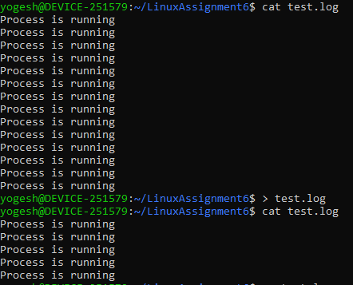

---

## Delete a Log File of a Running Process

Delete the log file of a running process and check what happens to the process.

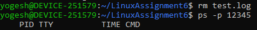

---

## Elevate the Priority of a Process

Increase the priority of a running process and observe the change.

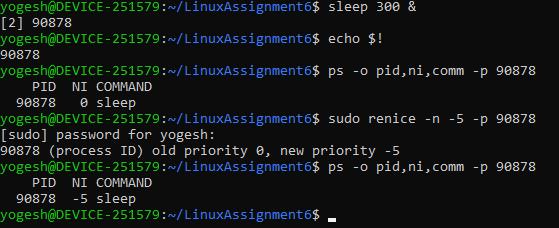

---

# Commands Covered

| Utility | Operation |
|---|---|
| `otProcessManager` | Process monitoring and management |
| `ProcessManager.sh` | Service registration and management |

---

# Concepts Practiced

- Linux processes
- Process IDs (PID)
- CPU and memory usage
- Process priority
- Process state
- Orphan processes
- Zombie processes
- Waiting processes
- Daemon services
- Process monitoring
- Starting and stopping services
- Changing process priority
- Linux log files
- Bash scripting

---

# Requirements

- Linux / WSL
- Bash shell
- Permission to manage processes where required

---

# Author

**Yogesh Indoria**

Linux Shell Scripting - Assignment 6
