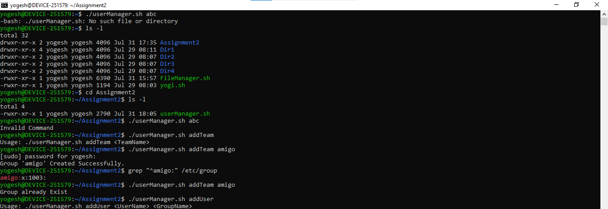
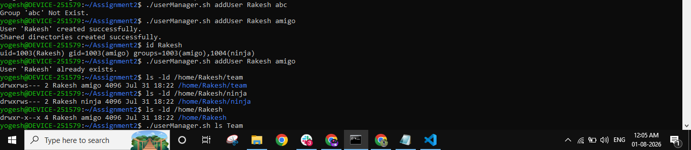
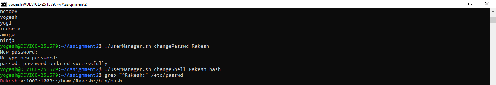
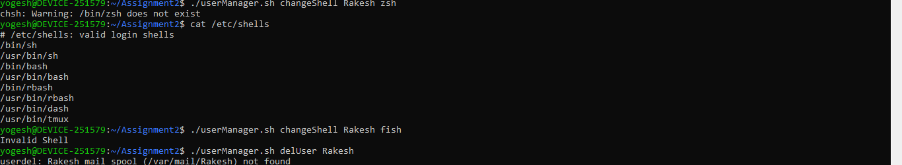
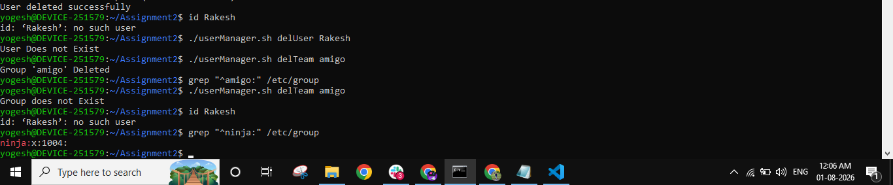
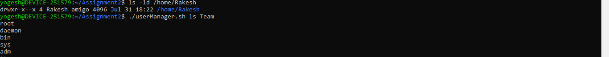

# 🐧 Linux User & Team Manager — Assignment 2

> A Bash-based command-line utility (`userManager.sh`) that simulates team-based user management on Linux — creating groups as "teams," provisioning users with controlled home-directory permissions, and giving every user shared `team` and `ninja` collaboration directories.

---

## 📌 Assignment Overview

**Problem Statement: ASSIGNMENT 2**

Create a utility, `userManager.sh`, that can:

- **Add a Team** (simulated via a Linux group) — e.g. `team1`
- **Add a User** (simulated via a Linux user) under a team — e.g. `Nitish` added to `team1`

### Constraints to be met

- A user should have **read, write, execute** access to their own home directory.
- All users of the same team should have **read and execute** access to the home directories of fellow team members.
- Others should have **only execute** permission on a user's home directory.
- Every user's home directory should contain **two shared directories**:
  - **`team`** — full access for members of the same team
  - **`ninja`** — full access for all users across every team (a global "ninja" group)

---

# 📂 Project Structure

```text
.
├── userManager.sh
├── screenshots/
│   ├── 01-setup-addteam.png
│   ├── 02-adduser-permissions.png
│   ├── 03-ls-changepasswd-changeshell.png
│   ├── 04-changeshell-invalid-deluser.png
│   ├── 05-deluser-delteam-verify.png
│   └── 06-permissions-lsteam.png
└── README.md
```

---

## ⚙️ Setup

```bash
chmod +x userManager.sh
```

Running an unrecognized command, or `addTeam` with no arguments, shows the expected usage and validation:

```bash
./userManager.sh abc          # Invalid Command
./userManager.sh addTeam      # Usage: ./userManager.sh addTeam <TeamName>
./userManager.sh addTeam amigo
```



---

## 🧑‍🤝‍🧑 Team (Group) Commands

| Command | Description |
|---|---|
| `addTeam <TeamName>` | Creates a new group (`groupadd`) to represent a team. Fails cleanly if the group already exists. |
| `delTeam <TeamName>` | Deletes a group (`groupdel`). Fails cleanly if the group doesn't exist. |
| `ls Team` | Lists all groups on the system (`cut -d: -f1 /etc/group`). |

```bash
./userManager.sh addTeam amigo
./userManager.sh addTeam amigo     # Group already Exist
./userManager.sh delTeam amigo
./userManager.sh delTeam amigo     # Group does not Exist
./userManager.sh ls Team
```

---

## 👤 User Commands

| Command | Description |
|---|---|
| `addUser <UserName> <TeamName>` | Creates a user under the given team/group, adds them to the global `ninja` group, and sets up their permissioned home directory. |
| `delUser <UserName>` | Deletes a user and their home directory (`userdel -r`). |
| `changePasswd <UserName>` | Sets/updates a user's password (`passwd`). |
| `changeShell <UserName> <bash\|zsh>` | Changes a user's login shell (`chsh`); rejects unsupported shells. |
| `ls User` | Lists all system users (`cut -d: -f1 /etc/passwd`). |

```bash
./userManager.sh addUser Rakesh abc     # Group 'abc' Not Exist
./userManager.sh addUser Rakesh amigo   # User 'Rakesh' created successfully
./userManager.sh addUser Rakesh amigo   # User 'Rakesh' already exists
```



`addUser` auto-creates the `ninja` group on first use if it doesn't already exist, then:
1. Creates the user with their primary group set to the given team (`useradd -m -g`)
2. Adds the user to the `ninja` group (`usermod -aG ninja`)
3. Creates `~/team` and `~/ninja` inside the user's home directory
4. Applies the permission model described below

---

## 🔐 Permission Model

| Path | Permissions | Purpose |
|---|---|---|
| `/home/<user>` | `751` (owner: rwx, group: r-x, others: --x) | Owner has full access; teammates can read/traverse; everyone else can only execute (traverse into subpaths they're allowed into). |
| `/home/<user>/team` | `2770`, owned by `<user>:<team>` | Full read/write/execute for the user and their team group; setgid bit keeps new files owned by the team group. |
| `/home/<user>/ninja` | `2770`, owned by `<user>:ninja` | Full read/write/execute for the user and anyone in the global `ninja` group; setgid bit for consistent group ownership. |

```bash
./userManager.sh changePasswd Rakesh
./userManager.sh changeShell Rakesh bash
grep "^Rakesh:" /etc/passwd
```



```bash
./userManager.sh changeShell Rakesh zsh    # falls back if /bin/zsh isn't installed
./userManager.sh changeShell Rakesh fish   # Invalid Shell
./userManager.sh delUser Rakesh
```



```bash
./userManager.sh delUser Rakesh    # User Does not Exist (already deleted)
./userManager.sh delTeam amigo     # Group 'amigo' Deleted
./userManager.sh delTeam amigo     # Group does not Exist
grep "^ninja:" /etc/group          # global ninja group persists
```



```bash
ls -ld /home/Rakesh/team
ls -ld /home/Rakesh/ninja
ls -ld /home/Rakesh
./userManager.sh ls Team
```



---

## ✅ Additional Features

Beyond the base problem statement, the script also implements:

- **`changeShell`** — change a user's login shell between `bash` and `zsh`, with validation for unsupported shell names.
- **`changePasswd`** — set or update a user's password interactively via `passwd`.
- **`delUser`** — remove a user and their home directory in one step (`userdel -r`).
- **`delTeam`** — remove a team/group, with existence checks before deleting.
- **`ls User` / `ls Team`** — list all system users or all groups/teams on demand.
- **Global `ninja` group** — automatically created on first `addUser` call if missing, giving every user cross-team shared access via `~/ninja`.
- **Argument & existence validation** — every subcommand checks argument count and verifies the user/group exists (or doesn't) before acting, printing a clear usage/error message otherwise.
- **Invalid command handling** — unrecognized subcommands fall through to a catch-all case instead of failing silently.

---

## 🧠 Implementation Notes

- Built with a single `case "$1" in ... esac` block dispatching on the subcommand name.
- Uses core Linux user/group utilities: `groupadd`, `groupdel`, `useradd`, `userdel`, `usermod`, `passwd`, `chsh`, `chown`, `chmod`, `grep`, `cut`, `id`.
- Group/user existence is checked via `grep "^<name>:" /etc/group` / `/etc/passwd` and `id <user>` before create/delete operations, avoiding duplicate or dangling entries.
- The setgid bit (`2770`) on the `team` and `ninja` directories ensures files created inside inherit the directory's group, keeping shared-access permissions consistent over time.
- Shell changes are limited to shells present in `/etc/shells` on the target system; `chsh` will warn if the requested shell binary isn't installed.

---

## Requirements

- Linux with `sudo` privileges (user/group management requires root)
- Bash shell (tested on Ubuntu via WSL)

---

## Author

**Yogesh Indoria**
