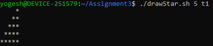
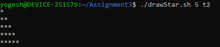
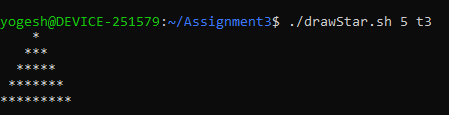
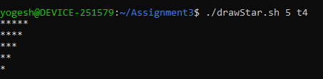
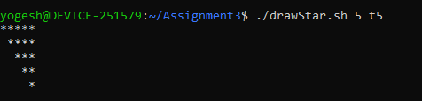
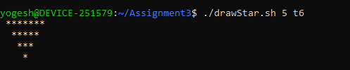
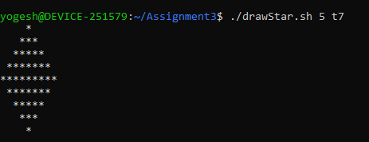
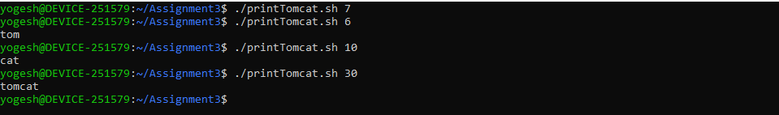

# Linux Assignment 3

This assignment is based on Bash scripting. It has two parts: printing
different star patterns and checking a number for `tom`, `cat`, or
`tomcat`.

------------------------------------------------------------------------

## Assignment Overview

### Part A - Star Pattern

Create a shell script named `drawStar.sh` which takes two arguments:

``` bash
./drawStar.sh <size> <type>
```

The first argument is the size and the second argument selects the
pattern.

The solution contains seven pattern types from `t1` to `t7`.

### Part B - Print Tomcat

Create a shell script named `printTomcat.sh` which takes one number.

The output depends on divisibility:

  Condition         Output
  ----------------- ----------
  Divisible by 3    `tom`
  Divisible by 5    `cat`
  Divisible by 15   `tomcat`

------------------------------------------------------------------------

## Project Structure

``` text
.
├── drawStar.sh
├── printTomcat.sh
├── screenshots/
└── README.md
```

------------------------------------------------------------------------

## Part A - drawStar.sh

### Usage

``` bash
./drawStar.sh 5 t1
```

The script uses the second argument to decide which star pattern to
print.

### Pattern Types

| Type | Description |
|---|---|
| `t1` | Increasing triangle |
| `t2` | Increasing triangle |
| `t3` | Centered increasing triangle |
| `t4` | Decreasing triangle |
| `t5` | Decreasing triangle with spaces |
| `t6` | Centered decreasing triangle |
| `t7` | Diamond pattern |

### Examples

``` bash
./drawStar.sh 5 t1
```


``` bash
./drawStar.sh 5 t2
```


``` bash
./drawStar.sh 5 t3
```


``` bash
./drawStar.sh 5 t4
```


``` bash
./drawStar.sh 5 t5
```


``` bash  
./drawStar.sh 5 t6

```
 

``` bash
./drawStar.sh 5 t7
```
 


The submitted solution shows the output for all seven types.

------------------------------------------------------------------------

## Part B - printTomcat.sh

### Usage

``` bash
./printTomcat.sh <number>
```

### Examples

For a number divisible by 3:

``` bash
./printTomcat.sh 6
tom
```

For a number divisible by 5:

``` bash
./printTomcat.sh 10
cat
```

For a number divisible by 15:

``` bash
./printTomcat.sh 30
tomcat
```



The script checks 15 first, then 3 and 5.

------------------------------------------------------------------------

## Bash Concepts Practiced

-   Bash scripting
-   Command line arguments
-   `if` and `elif`
-   `for` loops
-   Arithmetic operations
-   Modulo operator
-   `echo`
-   `printf`

------------------------------------------------------------------------

## Requirements

-   Linux / WSL
-   Bash shell

## Author

Yogesh Indoria

